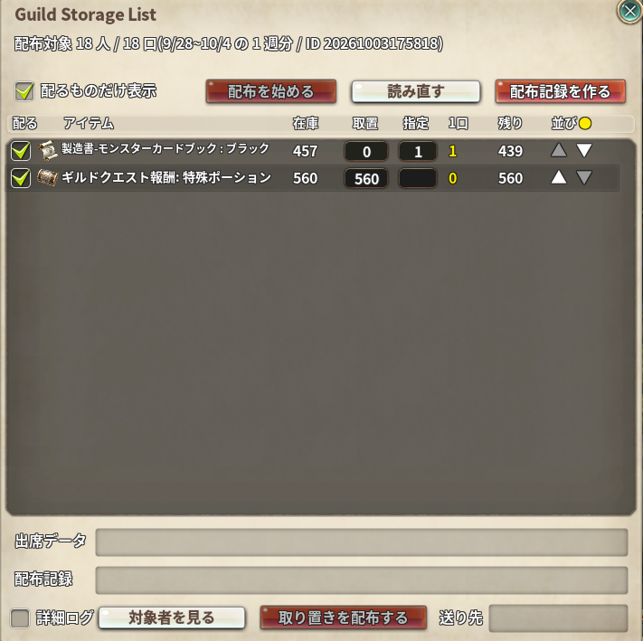
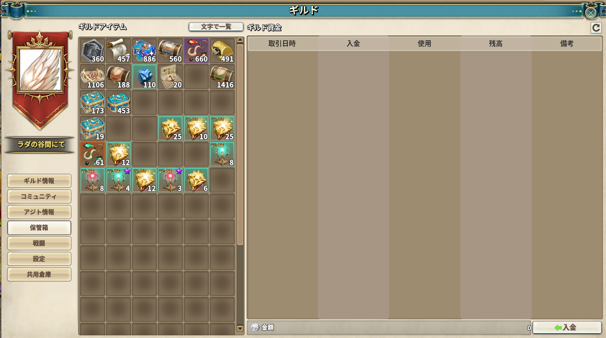
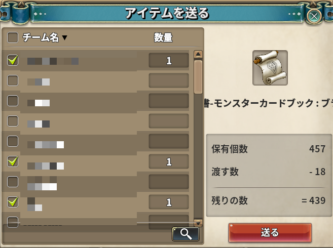
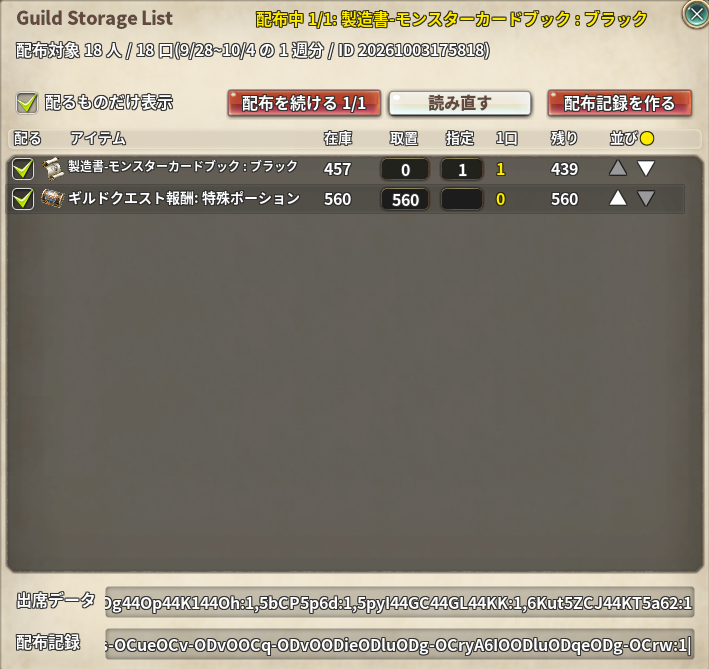

# Guild Storage List

> ギルド保管庫の中身を文字で一覧にし、出席した週の数（口数）に応じた配布数を出します。素の送付窓に対象者と個数を入れておきます

| 項目 | 内容 |
| --- | --- |
| アドオン名 | `_guild_storage_list` |
| ソース | [src/](src/)（`00_header.lua` / `guild_storage_list.lua` / `90_init.lua`） |
| 共通部品 | [shared/src/](../shared/src/)（Nexus Addons P と共有。ビルド時に `.ipf` へ入る） |
| 設定画面 | あり（一覧の窓。ギルド情報の「保管箱」タブの「文字で一覧」か、Addons Menu の「Guild Storage List」から開く） |

封鎖戦の出席管理の Bot（vc_attendance）と組み合わせて使います。出席と配布履歴はスプレッドシートにあり、
アドオンとのやり取りはコピー＆ペーストで行います（ゲーム内のアドオンはネットに出られないため）。

```text
Bot ──(出席・配布履歴から作る)──> スプレッドシート「アドオン連携」のセル
                                        │ コピーして「出席データ」に貼る
                                        ▼
                               このアドオン(一覧 → 送付)
                                        │「配布記録」をコピーして /配布記録 に貼る
                                        ▼
Bot ──> スプレッドシート「配布履歴」に 1 行足し、告知文を返す
```

## 導入方法

> **このアドオンは一般には配布していません**（Release もアドオンマネージャーの一覧もありません）。
> vc_attendance の Bot と組み合わせて使う、ギルドの配布担当向けのものです。
> `addons.json` に登録していないので、リリースの仕組み（`docs/plan_release.py`）の対象にもなりません。
> **配布するつもりがない限り `addons.json` へ足さないこと。**

1. 開発者から `_guild_storage_list-⛄-vX.Y.Z.ipf` を受け取ります（作り方は [docs/BUILD_IPF.md](../docs/BUILD_IPF.md)。
   `python docs/build_addon_ipf.py ./guild_storage_list _guild_storage_list "<出力先>" --require _guild_storage_list/_guild_storage_list.lua --encrypt`）
2. ファイル名は **`_guild_storage_list-⛄-vX.Y.Z.ipf`**（⛄ = U+26C4）のまま、ゲームの `data` フォルダへ置きます
3. ゲームを起動し、ギルド情報の「保管箱」タブを開くと「文字で一覧」ボタンが出ます

**Nexus Addons P とは別のアドオンです。** 両方入れても問題ありません
（Nexus Addons P v2.13.x までに入っていた Guild Storage List を、こちらへ移しました）。

* Nexus Addons P で使っていた設定（配るもののルール・並び・取り置きの送り先）と最後に貼った出席データは、
  初回起動時に自動で引き継がれます（チャットに「設定を引き継ぎました」と出ます）。
* **Nexus Addons P が v2.13.x のままだと、こちらは動きません**（チャットに更新を促す赤字が出ます）。
  同じ機能が 2 つ入って送付窓への入力が二重になるのを避けるためです。Nexus Addons P を v2.14.0 以降へ更新してください。

## 使い方

### 1. 出席データを貼る

スプレッドシートの **「アドオン連携」タブの A2 セル**（`gsl1|` で始まる 1 行）をコピーし、一覧の窓のいちばん下の
**「出席データ」** 欄に Ctrl+V で貼って Enter を押します。チャットに「出席データを読み込みました（◯ 週分 / ◯ 人 / ◯ 口）」と出ます。



* このセルは Bot が起動時と `/出席`・`/出席取消`・`/配布記録` のたびに作り直します。配る直前にコピーしてください。
  管理表を手で書き換えたときは、Discord で `/連携更新` を打つと作り直されます。
* 中身は「**終わっていて、まだ配っていない週**（直近 4 週まで）」の出席です。配った週は `/配布記録` で配布履歴に入り、次から外れます。
  配り忘れた週は、次に配るときに自動で一緒に入ります。
* **1 口 = 出席した週 1 つ**。同じ週に複数のボスへ出ても 1 口です。2 週分を一度に配るなら、2 週とも出た人は 2 口です。
* 貼った中身は次回も残ります（`link.txt`）。
* 名前は英数字（base64url）にしてあります。ゲーム内の入力欄は「枝」のように特定の漢字の後ろに文字が続くと
  貼れないためです。

名簿の名前とゲーム内のチーム名が違う人は、vc_attendance の `config.json` の `team_names` に
`{"名簿の名前": "チーム名"}` で書いてください。ギルドに見つからない人は窓の上に赤字で出て、送られません。

### 2. 配るものを選ぶ

ギルド情報の「保管箱」タブを開くと、見出しの右に **「文字で一覧」** ボタンが出ます。
押すと保管庫の中身がアイテム名と個数の一覧で出ます（Addons Menu の「Guild Storage List」からも開けます）。



| 列 | 内容 |
| --- | --- |
| 配る | チェックしたものだけ配ります。**最初はどれも OFF**（保管庫には配布物以外も入っているため） |
| 在庫 | 保管庫にある数（同じアイテムが複数の枠に分かれていれば合計） |
| 取置 | 配らずに残す数（食堂のぶんなど）。入力して Enter |
| 指定 | 1 口あたりに配る数。**空欄なら在庫を均等に割ります**。数を入れると、在庫がいくらあってもその数ちょうどを配ります（1 口 1 個だけ、など）。入力して Enter |
| 1口 | 1 口あたりの個数。1 人に配るのは「1 口あたり × その人の口数」 |
| 残り | 配った後に残る数（取り置きを除く） |
| 並び | ▲▼ で 1 つ前 / 後ろへ動かします |

```text
1 口あたり = 指定が空欄なら 切り捨て((在庫 - 取置) ÷ 口数の合計)、入れたらその数
1 人の数   = 1 口あたり × その人の口数
残り       = 在庫 - 1 口あたり × 口数の合計 - 取置
```

指定を入れたのに在庫が足りない（指定 × 口数の合計 が 在庫 − 取置 を超える）ときは、**数を勝手に減らさず**、
「1口」「残り」を赤字にして配りません（配布記録・「配布を始める」・送付窓の入力のどれにも載せません）。
5 個単位にしたいときは、均等割りの数を見て、その数以下の 5 の倍数を指定に入れてください。

**並べ替え**: 見出しの「アイテム」「在庫」「1口」「残り」を押すと、その列で並べ替えます
（押すたびに 昇順 ▲ → 降順 ▼ → 手動の並び）。「1口」「残り」は、配らないアイテムを常に後ろへ寄せます。
「並び」の見出しを押すと手動の並びへ戻ります（● が付いているのが手動の並び）。

**手動の並び**: ▲▼ で 1 つずつ動かせます。並べ替え中に ▲▼ を押すと、今の並びを土台にして手動の並びへ切り替わります。
保管庫から無くなったアイテムの位置も覚えておくので、また入ったときは同じ場所に出ます。
新しく入ったアイテムは末尾に付きます。配る順番と配布記録もこの並びです。

「配るものだけ表示」にチェックすると、配るものだけに絞れます。ルールと並びは保存され、次回もそのままです。

### 3. 送る

ギルド情報の「保管箱」タブを開いたまま、一覧の窓の **「配布を始める」** を押します
（保管箱タブを開いていないときは押せません）。

1. 配るアイテム（配る ON・在庫が足りる・1 口あたり 1 個以上）の 1 つ目について、素の「アイテム送る」窓が開きます。
   **対象者にチェックが入り、1 人ずつ「1 口あたり × 口数」の個数が入った状態**です（対象者以外のチェックは外れます）。
2. 中身を確かめて、**送るボタンを自分で押します**（自動では押しません）。
3. 送れると、次のアイテムの窓が開きます。一覧の窓の上に「配布中 2/6: ◯◯」と出ます。
4. 最後のアイテムを送ると「配布が終わりました」と出ます。



送付窓を × で閉じると、そこで止まります。ボタンが「配布を続ける 2/6」に変わるので、押すと同じアイテムから再開します。
保管庫のアイテムを自分で押して送付窓を開いたときも、配るアイテムなら同じように入力されます。

### 3b. 取り置きを 1 人に送る

「取置」に入れた数（食堂のぶんなど）を、決まった 1 人に送ります。窓のいちばん下の **「送り先」** に、送る人のチーム名を
入れて Enter で保存しておきます（次回もそのままです）。

ギルド情報の「保管箱」タブを開いたまま **「取り置きを配布する」** を押すと、取置が 1 以上で在庫がそれ以上あるアイテムの
「アイテムを送る」窓を、一覧の並びで順に開きます。**送り先の人にだけチェックと取り置きの数が入った状態**なので、
確かめて送るボタンを押すだけです。送ると次のアイテムへ進みます。

* 送り先が空のときや、送付窓に見つからないときは、全員の行に取り置きの数だけを入れ、チェックは入れません。
  送る人に 1 人だけチェックを入れて送ってください（2 人にチェックすると、2 人ぶん送られます）。
* 取り置きは配布記録には載りません。
* 「配布を始める」の途中では押せません。先に「配布を続ける」で終わらせてください。

### 対象者を見る

**「対象者を見る」** で、貼った出席データの配布対象者を別の窓に出します。口数の多い順に、名前・口数・週ごとの出席
（●出席 / ○欠席。左から出席データの週の順）が並びます。ギルドに見つからない人は赤字で末尾に出ます。
出席データを貼り直すと、この窓も描き直されます。

### 4. 配布記録を Discord に貼る

**「配布記録を作る」** を押すと、いちばん下の **「配布記録」** 欄に 1 行（`gsr1|` で始まる）が出ます。
**マウスでなぞって選び Ctrl+C** でコピーし（Ctrl+A は効きません）、Discord で `/配布記録` の「内容」に貼ってください。
記録に載る個数は、「配布を始める」で**送ったアイテムは送ったときの 1 口あたり**です（送った後は在庫が減っているので計算し直しません）。
まだ送っていないアイテムは、今の在庫で計算した数が載ります。
Bot がスプレッドシートの「配布履歴」に 1 行残し、告知文（何週分・1 口あたりの個数・口数ごとの名前）を
**打った人にだけ**返します。全員に知らせるときは、それをコピーして投稿してください。



* `/配布記録` は Bot が動いている時間にしか使えません。
* 打ち忘れると配布履歴に残らず、次回も同じ週を配る計算になります。
* 同じ記録を 2 回貼っても、2 回目は「記録済み」で止まります。

## しくみ

* 保管庫の中身は `session.GetEtcItemList(IT_GUILD)` から読みます。窓を開いたときと「読み直す」で
  `party.RequestLoadInventory(PARTY_GUILD)` を頼み、届いた `GUILD_WAREHOUSE_ITEM_LIST` で描き直します。
* 事前入力は素の `GUILDINVEN_SEND_INIT` に掛けています（素を呼んで窓を作らせた後、各行の
  `sendCheck` / `countEdit` を入れる）。**送信は素の `GUILDINVEN_SEND_CLICK` のまま**なので、
  残数の確認・コロニー戦中のコロニー報酬の確認・窓を開くときの権限の確認は素のとおり効きます。
* 1 口あたりの個数は、送付窓を開いた時点の保管庫全体の在庫で計算し直します。
* 「配布を始める」は、保管庫の枠を押したときと同じ素の `GUILDINFO_INVEN_ITEM_CLICK` で送付窓を開きます
  （ギルド長でなければ権限を確かめてから開く経路もそのまま）。送るボタン（`GUILDINVEN_SEND_CLICK`）の後に
  窓が閉じていれば「送れた」と見て、0.5 秒おいて次のアイテムを開きます。素の確認で止まったときは窓が開いたままなので進みません。
* 連携文字列は `gsl1|<ID>|<週の見出し,...>|<名前 b64>:<週ごとの出席 0/1>,...`、
  配布記録は `gsr1|<ID>|<アイテム名 b64>:<1 口あたり>,...|<送らなかった人 b64>,...|`（末尾の `|` はコピーで欠けても読めるように付けている）。
  Bot は配布記録の ID から、どの連携文字列（どの週・誰が何口）で配ったかを引きます。

## 保存先

| ファイル | 中身 |
| --- | --- |
| `../addons/_guild_storage_list/<AID>/guild_storage_list.json` | アイテムごとのルール（配る / 取置 / 指定）、並び（手動の並び・並べ替えの列と向き）、「配るものだけ表示」、取り置きの送り先 |
| `../addons/_guild_storage_list/link.txt` | 最後に貼った出席データ |
| `../addons/_guild_storage_list/record.txt` | 最後に作った配布記録 |
| `../addons/_guild_storage_list/stock.tsv` | 保管庫の中身（`在庫` `アイテム` の 2 列。スプレッドシートの K:L 列へそのまま貼れます） |
| `../addons/_guild_storage_list/settings.json` | 詳細ログの ON / OFF（一覧の窓の左下の「詳細ログ」） |
| `../addons/_guild_storage_list/verbose_log.txt` | 詳細ログ。不具合を報告するときに添えてください |

出席と配布履歴はスプレッドシートにあるので、この PC のファイルが消えても失われません。

## 注意

* 送付窓を開けるのはギルド長か、権限のある人だけです（素の制限）。
* **送ったアイテムを開き直しても、入力はしません**（「配布済み」とチャットに出ます）。送った後の残りを
  口数で割り直した数が入り、二重に配ってしまうのを防ぐためです。もう一度配るときは「配布を始める」から始め直してください
  （この印はクライアントを再起動すると消えます）。
* 同じアイテムが複数の枠に分かれていると、開いた枠の個数だけでは足りないことがあります。
  そのときはチャットに赤字で出ます（素の窓の「残り」も赤くなり、送れません）。
* 出席データに載るのは**終わった週だけ**です（週の最終日を過ぎたか、3 体とも誰かの出席が付いた週）。配る前に次の週の封鎖戦をしても、その週は終わるまで載りません。

## 更新履歴

<details>
<summary>更新履歴 (Guild Storage List)</summary>

* **（次回リリース）**
  * **Nexus Addons P から独立した単体のアドオンになりました。** Nexus Addons P で使っていた設定と出席データは、初回起動時に引き継ぎます。
  * **「取り置きを配布する」を足しました**。「取置」に入れた数を、窓の下の「送り先」に決めておいた 1 人へ送ります。
    「アイテムを送る」窓を順に開き、送り先の人にだけチェックと取り置きの数が入った状態にするので、送るボタンを押すだけです
    （送り先が空なら、個数だけ入れてチェックは自分で選びます）。
  * **「対象者を見る」を足しました**。貼った出席データの配布対象者を、口数と週ごとの出席つきで別の窓に出します。
  * 一覧の窓の左下に「詳細ログ」を足しました（不具合を調べるときに使います）。

</details>
