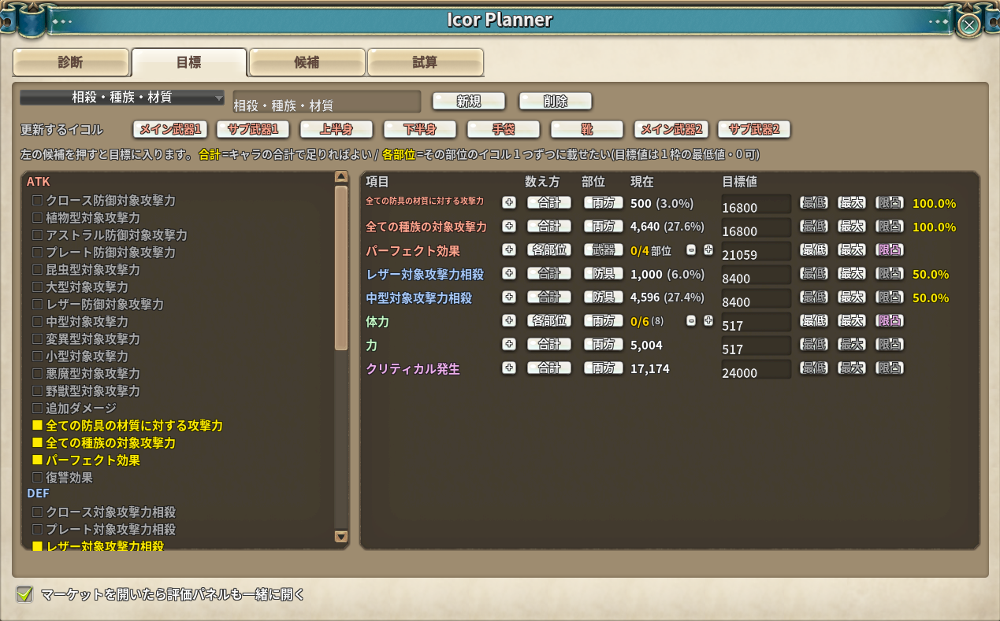
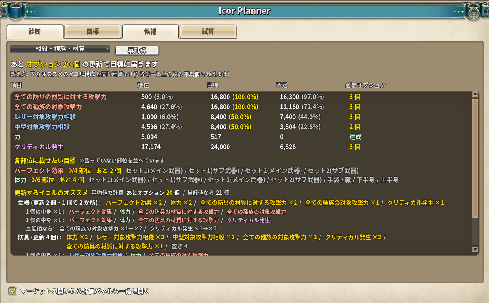
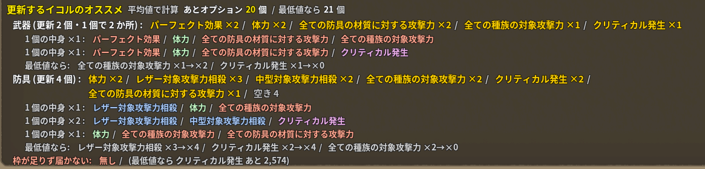
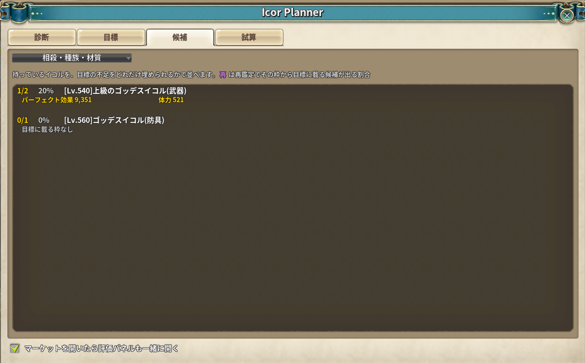
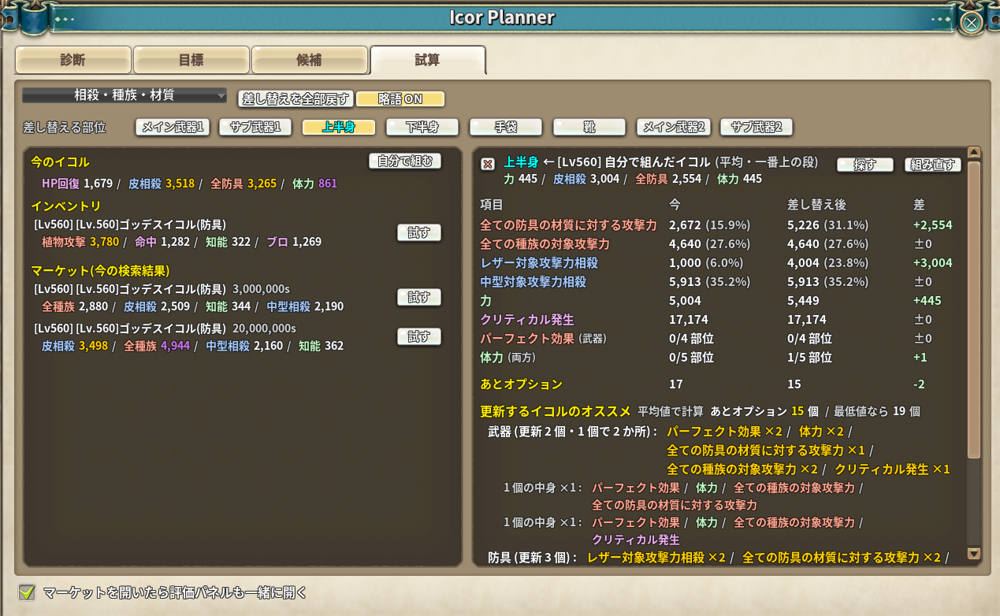
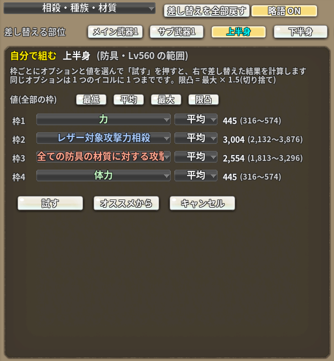
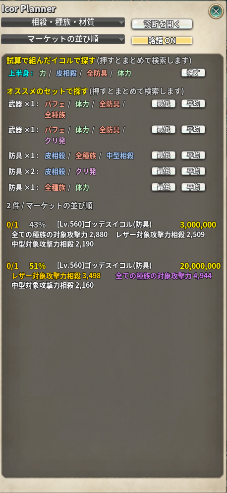

# Icor Planner

> 目標のステータスを決めて、そこへ届くまでにイコルを何個更新すればよいかを出します

| 項目 | 内容 |
| --- | --- |
| アドオン名 | `_icor_planner` |
| ソース | [src/](src/)（`00_header.lua` / `90_init.lua` / `icor_planner.lua` / `window.lua` / `market.lua`） |
| 共通部品 | [shared/src/](../shared/src/)（Nexus Addons P と共有。ビルド時に `.ipf` へ入る） |
| 設定画面 | 診断ウィンドウの中（「目標」タブ） |

## 導入方法

1. [Releases](https://github.com/pinnkoro/TOSAddon/releases) から `icor_planner-vX.Y.Z.ipf` を取得します
2. ファイル名を **`_icor_planner-⛄-vX.Y.Z.ipf`**（⛄ = U+26C4）にして、ゲームの `data` フォルダへ置きます
3. ゲームを起動すると、**Addons Menu** に「Icor Planner」の行が出ます

アドオンマネージャー（[Addon-Manager](https://github.com/MizukiBelhi/Addon-Manager)）からも入れられます。

**Nexus Addons P とは別のアドオンです。** 両方入れても問題ありません
（Nexus Addons P v2.9.0 までに入っていた Icor Planner は、こちらへ移しました）。

## 何をするアドオンか

イコルは 1 個に最大 4 枠のオプションが付き、装備 8 部位ぶんの合計がキャラの数値になります。
「クリ発と各種相殺と種族攻撃を、この値まで持っていきたい」と決めたとき、
**あと何個更新すればよいのかは、8 部位のオプションを全部書き出して足さないと分かりません**。

このアドオンは

1. 装備 8 部位のイコルオプションを読んで**目標との差**を出す
2. 差を埋めるのに**イコルが何個（何枠）必要か**を出す
3. **持っているイコル**を「目標の不足をどれだけ埋められるか」で並べる
4. **マーケットの出品**を同じ基準で評価して、横のパネルに並べる

を行います。

## 使い方

次のどちらからでも診断ウィンドウを開けます。ESC で閉じます。

* **Addons Menu** の **「Icor Planner」** の行（norisan さん系のメニューボタン。
  Nexus Addons P など、Addons Menu を持つアドオンが入っている環境で出ます）
* マーケットの **「イコル診断」ボタン**（横の評価パネルから「診断を開く」）


> **Addons Menu を持つアドオンを 1 つも入れていない場合**、入口はマーケットの
> 「イコル診断」ボタンだけになります（画面に常駐するボタンは出しません）。

### 「目標」タブ



左に候補、右に今の目標が並びます。

* **左の候補を押す**と目標に入ります（もう一度押すと外れます）
* **`数え方`** で目標の種類を切り替えます。ここがこのアドオンの肝です。

  | 数え方 | 意味 | 目標値の欄 | 例 |
  | --- | --- | --- | --- |
  | **合計** | キャラの**合計**が届けばよい。どの部位が持っていてもかまわない | 合計の目標値（0 で無効） | クリ発 / 各種相殺 / 種族攻撃 |
  | **各部位** | その部位の**イコル 1 つずつに載っていてほしい**。合計が足りていても、載っていない部位があれば未達 | 1 枠あたりの最低値（**0 でよい** = 付いてさえいれば可） | 主ステ / パフェ |

  **相殺（`Cloth_Def` / `Leather_Def` / `Iron_Def` / `MiddleSize_Def`）は合計に固定**され、
  各部位へは切り替えられません（合計でしか意味を持たないため）。

* 入力欄の右の **`最低` / `最大` / `限凸`** で、目標値の目安を入れられます。

  | 行の性格 | 動き |
  | --- | --- |
  | **各部位** | **今の最大レベルのイコル 1 枚**に載る範囲の 最小 / 中間 / 最大。対象が「両方」のときは**武器と防具の小さい方**を採ります（大きい方に合わせると、小さい方の部位ではどのイコルでも届かない目標になるため） |
  | **合計** | 灰色（何部位で分担するかは利用者次第なので、目安を出しようがありません）。ただし **全ての種族 / 全ての防具の材質** は `最大` だけが働き、**ステータスの割合が 100% になる値**を入れます |
  | **限凸** | **上限突破と見なされる値**（`最大値 × 1.5` の切り捨て − 1）。素のツールチップが紫にする線と同じです（`equip_tooltip.lua` の `DRAW_EQUIP_GODDESS_ICOR`）。「上限突破のイコルを狙う」目標をそのまま入れられます |
  | **相殺** | `最大` だけが働き、**ステータスの割合が 50% になる値**を入れます（Lv560 なら 8,400）。`最低` / `限凸` は灰色 |

  **範囲は「一番上の段」から引きます。** 見付け方は 2 通りあり、**どちらも単独では足りない**ので
  両方を見て**レベルの高い方**を採ります。

  | 見付け方 | 強い点 | 弱い点 |
  | --- | --- | --- |
  | **実物のイコル** | 素がそのイコルに合った範囲を返すので確実 | **手元に古い段しか無ければその段止まり**（540 しか持っていなければ 540） |
  | **レベルを渡して素の表を引く** | 手元に無い段も引ける | クライアントの表にその段が無ければ引けない |

  実物を探す先は次の 3 か所で、**部位ごとに一番レベルの高いもの**を使います。

  1. **装備に刺さっているイコル**（各部位の `GoddessIcorName`）
  2. **インベントリのイコル**
  3. **マーケットに並んでいる出品**（マーケットを眺めていれば、持っていなくても拾えます）

  つまり **540 のイコルを着けていても、素の表に 560 があれば 560 の範囲が出ます**。逆に、
  素の表が古くて引けない段でも、実物さえどこかにあればそちらから取れます。
  どちらから取れたかはツールチップに `手持ちのイコルから` / `素の表から` と出し、
  判定した段とあわせて `verbose_log.txt` にも残します。

  50% の値は `Lv × ITEM_ATK_POINT_MULTIPLE × 1.5 × 0.5`（`ITEM_ATK_POINT_MULTIPLE` はクライアントの
  グローバル）で出したうえで、**素の割合計算に通して答え合わせ**をし、ずれていれば素に合わせて直します。

* **各部位の行の「現在」は `載っている数/目指す数` です。** 横の **`-` / `+`** で
  **何部位まで目指すか**を変えられます。既定は**装備している部位数で、それが上限**です
  （上限より増やすことはできません）。絞っているときは `2/2(4)` のように上限を添えます。
  * 目指す数に届いていれば達成扱いになり、「あと何個」やマーケットの検索候補からも外れます
  * 右の ％ は「目指す数ぶん載せたときの合計」に、**イコル以外の分を足した値**で出します（下記）
  * 上限と同じ値に戻すと設定は消え、既定（装備している数）に従います。装備を足した後に
    分母が自然に増えるようにするためです
* 2 段目の **`更新するイコル`** で、部位ごとにイコルを「更新する（付け替える）」ものとして計算から外せます（キャラごとに保存）。
  武器は `メイン武器1` / `サブ武器1` / `メイン武器2` / `サブ武器2` と出します。
  **付け替える予定の部位**に使います。外した部位のイコルは、現在値・それ以外・達成数・
  診断の必要数のすべてで**載っていない扱い**になります（ステータス画面の値からその分を引きます）。
  「全ての種族」のようなオプションは、足される先の項目（植物型など）からも引きます。
  ボタンにカーソルを乗せると、その部位に載っているオプションが出ます。外した部位があると、
  診断タブの**オススメのイコル構成がその部位だけを組む形**に変わります（下記）
* 項目名の右の **`+`** で同じ項目をもう 1 行足せます（武器は各部位・防具は合計、のように分けるため）。
  **足した 2 行目以降は `+` の代わりに `×` が出て、その行だけ消せます**。1 行目ごと外すときは
  左の候補を押し直します（その項目の行が全部外れます）
* **`部位`** で対象を 両方 / 武器 / 防具 に切り替えます。**「各部位」のときだけ効きます**
  （「合計」はキャラの合計を見るので部位の指定に意味がなく、灰色になります）。
  **素で 1 部位にしか載らないオプションは自動で固定**され、押せません
  （`perfection` / `revenge` は武器のみ、各種抵抗や `portion_expansion` は防具のみ）
* 対象攻撃力や相殺のように**ステータス画面が ％ を出している項目**は、現在値と、
  入力した目標値の隣にも**同じ ％** が出ます（`3,488 (61.2%)` の形）。
  **イコル以外から来る分（ギルドの威厳・共用スキル・クポル・モンスターカード・アシスター・
  固定イコルの協応など・バフ）も入った ％ です。**

  | 数え方 | 右の ％ |
  | --- | --- |
  | **合計** | 入力値そのものの ％。入力値を**最終的な合計**として扱うので、イコル以外の分も含めて目指す値です |
  | **各部位** | `入力値 × 目指す部位数 + それ以外` の ％。ツールチップに `イコル 11,800 + それ以外 5,000 = 16,800` の形で内訳を出します。入力値が 0（付いていればよい）のときは出しません。**同じ項目の各部位の行が複数あるとき（武器 2 部位 + 防具 1 部位など）は、まとめて 1 つの ％ を上の行にだけ出し**、残りの行は「上と合算」と出します（行ごとに「それ以外」を足すと二重に数えるため） |

  「それ以外」は `今のステータスの値 − 装備イコルのオプション合計` の引き算です。出どころを
  1 つずつ読むのではないので取りこぼしはありませんが、**出どころ別の内訳は出せません**。
  また**今かかっているバフも含む**ので、バフが切れていると低めに出ます
* 上のドロップリストで**目標プリセット**を切り替えます。`新規` / `削除` と、
  名前の欄を書き換えて Enter で名前を変えられます

候補はグループ（`ATK` / `DEF` / `STAT` / `UTIL_ARMOR`）ごとに色分けされます。
目当てのものは次の名前です。

| 目当て | オプション名 |
| --- | --- |
| クリ発 | `CRTHR` |
| 各種相殺 | `Cloth_Def` / `Leather_Def` / `Iron_Def` / `MiddleSize_Def` |
| 全ての種族の対象攻撃力 | `AllRace_Atk` |
| 全ての防具の材質に対する攻撃力 | `AllMaterialType_Atk` |
| パフェ | `perfection`（武器のみ） |
| 主ステ | `STR` / `DEX` / `CON` / `INT` / `MNA` |

### 「診断」タブ



いちばん上に **「あとオプション N 個の更新で目標に届きます」** が出ます。
主役を「イコル何個」ではなく**オプション何個**にしているのは、作業量に直結するのがそちらだからです。

**この数と、目標の一覧の「必要オプション」の列は、下に出る組み方と同じ計算**です
（1 枠は一番上の段の平均値で数えます）。数え方は「更新するイコル」を選んでいるかで変わります。

| 目標タブの「更新するイコル」 | 数えるもの | 下に出るもの |
| --- | --- | --- |
| 選んでいる | 更新するイコルに何個載せれば届くか | 更新するイコルのオススメ |
| 選んでいない | **今のイコルを残したまま**、何枠を変えれば届くか | 今の装備から変えるなら |

以前は、選んでいないときに**全部位を組み直した理想の形との差**を数えていたため、
目標にほぼ届いていても載せ方が理想と違うだけで数が膨らんでいました（レザー相殺が 1,104 足りないだけなのに 7 個）。

| 列の表示 | 意味 |
| --- | --- |
| `2 個` | オススメの構成で、この目標のために更新するオプションの数 |
| `4 個 置いても あと 1,200 不足` | オススメでも枠が足りず届かない。置けるだけ置いても、あといくつ足りないか |
| `0 個(値を上げれば届く)` | オススメの形は今の構成で満たしているが、実際の値が少し足りない |
| 各部位の `(更新するイコルが足りず あと 2 か所)` | 更新するイコルの数では、目指す部位数に置ききれない |

**武器は「実際の部位数」と「イコルの個数」が違います。** 持ち替えで 1 個が 2 か所ぶん働くので、

* **割合・達成数は 4 部位**（セット 1・2 のメイン / サブ）で数えます
* **候補の評価（下の `％`）はイコル 2 個**で数えます（買う個数はこちらだから）

### オススメのイコル構成



**目標タブで「更新するイコル」を選んでいるとき**は、**残すイコルは今の値のまま**計算し、
**更新するイコルに何を載せれば目標に届くか**を出します（見出しが「更新するイコルのオススメ」になります）。

* 各部位の目標は、残すイコルに載っている分を満たしたものとし、足りない部位数だけを更新するイコルへ置きます
* 合計の目標は、`目標 − 今の値`（今の値は更新するイコルを外した値）を更新するイコルで埋めます
* 更新するイコルは買い替える前提なので、`(今 M)` は出さず、置いた数がそのまま「あとオプション」です
* 武器は持ち替えの表と裏（メイン武器1 と メイン武器2 など）を 1 個として数えます

どちらのときも、**イコル 1 個ずつの中身**（`1 個の中身 ×2 : 力 / クリ発 / レザー相殺 / 中型相殺`）を
並べます。個数の多いオプションから、載っている数の少ないイコルへ順に配った形です。

#### 「更新するイコル」を選んでいないとき

まず **「今の装備から変えるなら」** を出します。今のイコルを残したまま、**どの部位のどの枠を何に変えれば
目標に届くか**です。診断タブの見出しの「あとオプション」はこの数です。

```
今の装備から変えるなら  平均値で計算  あとオプション 1 個 / 最低値なら 1 個
  手袋 : ブロック → レザー対象攻撃力相殺 2,600
```

* 変えるのは **空いている枠 / 目標に無いオプションの枠 / 目標にあるが値の低い枠** だけです。
  目標にあるオプションは外しません（外すと別の目標が減るため）
* 1 枠で一番多く埋まるところから置き、同じだけ埋まるなら**枠を使わない方（値を上げるだけ）**を採ります
* **部位は 1 か所ずつ数えます。** 持ち替え側（メイン武器2 など）も別のイコルなので、変えるなら別の 1 個です
* 変えられる枠を使い切っても届かない項目は「変えられる枠では届かない」と出します

その下に、**全部位を一から組み直すなら**の理想の形を「理想のイコル構成（参考）」として出します。
**部位の種類ごとの理想の 1 形**です（今のイコルに合わせた形ではありません）。

```
理想のイコル構成(参考)  平均値で計算  理想の形との差 7 個 / 最低値なら 9 個
  武器 (2 個・1 個で 2 か所) : パーフェクト ×2(今 2) / 力 ×2(今 1) / 全ての種族 ×2(今 1) / 全ての防具 ×2(今 2)
  防具 (4 個) : 力 ×4(今 3) / クリ発 ×4(今 2) / レザー相殺 ×3(今 1) / 中型相殺 ×3(今 3) / 空き 2
    最低値なら: レザー相殺 ×3→×4
```

* `×N` はその部位のイコル N 個に載せる、`(今 M)` は今その値以上で載っているイコルの数です。
  足りている項目は緑、足りない項目は橙です
* **「理想の形との差」は目標までの数ではありません。** 目標に届いていても、今の載せ方が理想と
  違えば（別の部位に載っている / 値が平均に届かない）数が出ます
* **1 枠の値は平均**（一番上の段の `(最小 + 最大) / 2`）で計算し、**最低値**（一番上の段の最小値。
  マーケットの検索条件の下限と同じ線）で計算したときの必要数と、個数が変わる項目を添えます
* 組み方
  1. **各部位の目標を先に置きます**（目指す部位数ぶん。「両方」は 1 個で 2 か所に効く武器から）
  2. **合計の目標は `目標 − それ以外 − 1 で置いた分` を、残りの枠で埋めます。** 1 枠で一番多く
     埋まるところ（武器は 1 枠の値 × 2 か所）から置き、届いた項目はそれ以上置きません。
     目標タブの「部位」は守ります（相殺を防具にすれば武器には置きません）
  3. 全部の枠を使っても届かない項目は「枠が足りず届かない」と出します
* 守っている素の決まりは、1 個 4 枠まで・同じオプションは 1 個に 1 つまで・部位で載るオプションが
  決まっている、の 3 つです（グループの数に縛りはありません）。個数だけ決まれば、実際に 1 個ずつへ
  配る並べ方は必ず作れます
* 持ち替え側（セット 2）の武器は「今」の数に入れません（表のイコルと同じ 1 個として扱うため）

**現在値はステータス画面の値そのもの**です（装備の素の性能・他の部位・バフなども入った合計）。
イコルのオプションだけを足したものではありません。

対象攻撃力・相殺の類は、数値の隣に**ステータス画面と同じ ％** が出ます。
これは**素の関数をそのまま呼んで**いるので、ステータス画面の表示と必ず一致します。
主ステ（`STR` など）やパフェには素の側に比率が無いので、％ は出ません。


### 「候補」タブ



**インベントリのイコル**を、目標の不足をどれだけ埋められるかで並べます。

* 先頭の `2/3` は **構成**。その部位で「各部位に載せたい」と決めた目標のうち、
  そのイコルがいくつ満たしているかです。**全部そろっていれば緑**になります
* 次の `％` は **合計の目標について、1 部位ぶんの目安に対する割合**です。**100% がイコル 1 個としての平均**で、
  超えていればそれより良い、という読み方をします（カーソルを乗せると目安の計算が出ます）

  ```
  目安 = その部位のイコルに載りうる「合計」目標の目標値の合計 ÷ その部位のイコルの実効数
  割合 = そのイコルが目標に載せている値の合計 ÷ 目安
  ```

  * **残りの不足ではなく目標値で割ります。** 不足で割ると、目標に近づくほど分母が小さくなって
    数字が暴れます（クリ発の残りが 139 のとき、クリ発 1,392 のイコルが 400% になりました）。
    達成しきると分母が 0 になり、今度は全部 0% になります。目標値で割れば、
    **進み具合によらず同じ物差し**で比べられます
  * 目標値を超える分は数えません（1 枚で目標を丸ごと超えても、それ以上の意味は無いため）
  * その部位に当てはまる「合計」の目標が 1 つも無いときは `-` と出ます（0% ではありません）
  * **分母はその部位に載る目標だけ**です。`perfection` のように武器にしか載らないものを
    防具の目安へ入れると、防具の割合が不当に低くなるためです
  * **「イコルの実効数」は武器だけ 4 ではなく 2 です。** 持ち替えで 1 個が 2 か所ぶん
    働くので、買う個数はその半分で足ります。逆に、この作りでは**武器イコルに相殺を
    入れても割に合わない**ので、相殺は武器の目安から外しています

  | 色 | 割合 |
  | --- | --- |
  | 灰 | 50% 未満 |
  | 金 | 50% 以上 |
  | 緑 | **100% 以上**（1 個ぶんのノルマを満たす） |
  | 紫 | 150% 以上 |
* **行を右クリックすると、そのイコルの保護（ロック）を切り替えます。**
  保護したものは名前の前に `[保護]` が付くので、**どれを残すつもりか**が一覧の上で分かります。
  素と同じ `session.inventory.SendLockItem` を送っているので、インベントリ側の鍵表示にも反映されます
  （サーバの返事を待つため、表示は 0.4 秒後に更新されます）
* 候補の並び順には、**オプションリロールでどこまで持っていけるか**を使っています
  （目標に載っている枠が多い → 載っていないが回せば載る枠が多い、の順）。

### 振り直しの決まり（素の仕様）

**このアドオンは「オプションリロール」（選んだ 1 枠だけを振り直す方）を前提にしています**。
全オプションを一度に振り直す「再鑑定」は今は使われないため、「4 枠が同時に当たる確率」の
ような数字は出しません。

オプションリロールで出うるオプションは、素の再設定画面（`reroll_item_option.lua`）と同じく
次のとおりです。

* 候補は **そのイコルの段・部位（武器 / 防具）の全オプション**（素の `get_random_option_list`）
* そこから **同じイコルの他の枠に載っているものを外す**（素の `is_valid_reroll_option`）
* **グループ（ATK / DEF / STAT / UTIL_ARMOR）では絞られません**。命中 → 全ての種族の対象攻撃力
  のように、グループをまたいで変わります（グループは画面の色分けにだけ使われています）

| | 可否 |
| --- | --- |
| クリティカル抵抗 → クリティカル発生 | ✅ |
| 命中 → 全ての種族の対象攻撃力 | ✅（グループをまたいでよい） |
| 防具のイコルで → パーフェクト効果 | ❌ パーフェクトは武器にしか載らない |
| 枠3 にクリ発があるイコルの枠4 → クリ発 | ❌ 同じイコルに同じオプションは 2 つ載らない |

1 枠ずつ回せる前提なので、枠は 3 通りに分かれます。

* **既に目標に載っている** … 回しません（回すと今の当たりを失います）
* **載っていないが候補がある** … 回せばいずれ載ります
* **載っていないし候補も無い** … 目標のオプションが全部他の枠に載っている、
  またはその部位に載らないオプションしか目標に無いときです

### 「試算」タブ



**「この部位のイコルを、インベントリ / マーケットのこのイコルに替えたら」**を見ます。

1. 上の **`差し替える部位`** を押すと、左にその部位へ付けられるイコルが並びます
   （インベントリと、マーケットを開いていれば今の検索結果。未鑑定は外します）。
   一番上には今のイコルのオプションが出ます
2. 候補の **`試す`** を押すと、その部位を差し替えます。**差し替えは重ねられます**
   （上半身と手袋を両方替えたら、まで見られます）。差し替え中の部位は水色です
3. 右に**今と差し替え後**を並べます
   * 合計の目標 … 現在値（と ％）
   * 各部位の目標 … 載っている部位数
   * あとオプション（診断タブの見出しと同じ数）。**差し替えの前後で同じ数え方**をします。
     「更新するイコル」の部位を差し替えたときは、差し替えた後も「更新するイコル」の数え方のままで、
     差し替えたイコルで目標に届いていれば 0 個、届かなければ「届かない」と出ます
   * 差は、良くなったら緑・悪くなったら赤です
4. 右の差し替えの一覧の **`×`** でその部位だけ戻し、**`差し替えを全部戻す`** で全部戻します
5. 右の一番下に、**差し替えた後の組み方**（診断タブと同じもの）が出ます。
   試したイコルに替えたら、残りの更新するイコル（または今の装備のどの枠）に何を載せればよいかが分かります

**手持ちにもマーケットにも無い「理想のイコル」を自分で組んで試す**こともできます。



1. 部位を選ぶと、左の一番上（今のイコルの行）に **`自分で組む`** が出ます。押すと左が組む画面になります
2. 4 枠それぞれで、**載せたいオプション**と**値**をドロップリストで選びます。
   * オプションは**その部位（武器 / 防具）に載るもの**が並びます（`(空き)` で空けておけます）。
     同じオプションを 2 枠に選んだときは 1 つにまとめます
   * 値は **最低 / 平均 / 最大 / 限凸** から**枠ごとに**選べます（一部の枠だけ限凸、など）。
     どれも**一番上の段**の範囲から決めます（買うのは最新の段なので、手持ちの古い段には合わせません）。
     **限凸は `最大 × 1.5` の切り捨て**です（Lv560 武器のパーフェクトなら 14,040 → 21,060）
   * 各行の右に、使う値と範囲（`6,169 (3,702〜4,113)`）が出ます。限凸は紫です
3. 上の **`値(全部の枠)`** のボタンを押すと、4 枠の値をまとめて切り替えます
   （全部平均にしてから 1 枠だけ限凸にする、といった使い方ができます）
4. **`試す`** で差し替えて、右の結果を計算し直します。**`オススメから`** は診断タブのオススメの
   イコル構成（その部位の種類の 1 個目の中身）を入れます（まだ試しません）。**`キャンセル`** で戻ります
5. 右の差し替えの行の **`探す`** を押すと、**マーケットの条件検索にそのイコルを入れてそのまま検索します**
   （下限は試算に使った値。今の条件は消えます）。マーケットを開いてから押してください。
   **`組み直す`** で左の組む画面に戻ります

組んだイコルは、マーケットの評価パネルの一番上にも「試算で組んだイコルで探す」として並びます
（診断ウィンドウを閉じていても、マーケットを見ながら同じ条件で探せます）。

**試すイコルをオプションリロールで 1 枠だけ変えた場合**も試せます
（「このイコルを買って 1 枠リロールしたら」）。右は結果だけを出し、リロールは左で行います。

1. 右の差し替えの行の **`リロール`** を押すと、左がリロールの画面になります
2. 4 枠それぞれのドロップリストで変える先を選びます。並ぶのは素のリロールと同じく
   **そのイコルの部位に載るオプションのうち、同じイコルの他の枠と重ならないもの**です
   （グループでは絞りません。`変えない` で取り消し）。
   **1 回のリロールで変わるのは 1 枠だけ**なので、別の枠を選ぶと前の枠は `変えない` に戻ります
3. **変えた後の値**を **最低 / 平均 / 最大**（そのイコルの段の範囲から）で選びます
4. **`決定`** で右の結果を計算し直します（選んでいる途中では計算し直しません）。
   **`キャンセル`** で変えずに候補の一覧へ戻ります

右の差し替えの一覧に `リロール: 枠2 クリ抵抗 → クリ発 1,321 (平均)` のように出ます。

* 差し替え後の値は「計算しないイコル」と同じく、ステータスの値から**外すイコルの分を引いて
  付けるイコルの分を足した**ものです（「全ての〜」は足される先の項目にも足し引きします）
* **差し替えは保存しません**（その場で試すためのもの。組んだイコルも、ゲームを終えるまでの間だけ残ります）。
  マーケットの出品は、押した時点のオプションを控えます（ページを移ると出品の中身が入れ替わるため）
* 武器の持ち替え側は別の部位です（メイン武器1 を替えても、メイン武器2 は替わりません）
* 候補と差し替えの行では、オプション名を**略語**で出します（1 行に収めるため。収まらないときは縮めずに折り返します）。
  正式名は `試す` ボタンのツールチップに出ます。診断タブ（と試算タブの右下）の「今の装備から変えるなら」
  「理想のイコル構成」「更新するイコルのオススメ」と、マーケットの評価パネルのセットの行も同じ略語です。
  **診断タブ・試算タブの上、またはマーケットの評価パネルの `診断を開く` の下にある `略語 ON` / `略語 OFF` で
  正式名に戻せます**（どれも同じ設定で、保存されます）。目標の一覧（項目の列）は正式名のままです

  | 略語 | 正式名 |
  | --- | --- |
  | 全防具 / 全種族 | 全ての防具の材質に対する攻撃力 / 全ての種族の対象攻撃力 |
  | 布攻撃 / 皮攻撃 / 鎧攻撃 / 霊攻撃 | クロース / レザー / プレート / アストラル防御対象攻撃力 |
  | 布相殺 / 皮相殺 / 鎧相殺 / 中型相殺 | クロース / レザー / プレート / 中型 対象攻撃力相殺 |
  | 小型攻撃 / 中型攻撃 / 大型攻撃 | 小型 / 中型 / 大型対象攻撃力 |
  | 植物攻撃 / 野獣攻撃 / 悪魔攻撃 / 変異攻撃 / 昆虫攻撃 | 植物型 / 野獣型 / 悪魔型 / 変異型 / 昆虫型対象攻撃力 |
  | パフェ / 復讐 / 追ダメ / 追ダメ抵 | パーフェクト効果 / 復讐効果 / 追加ダメージ / 追加ダメージ抵抗 |
  | クリ発 / クリ抵 / ブロ / ブロ貫 / HP回復 | クリティカル発生 / クリティカル抵抗 / ブロック / ブロック貫通 / HP回復力 |

### マーケット



**試算タブで自分で組んだイコルがあれば、評価パネルの一番上に「試算で組んだイコルで探す」**が出ます。
`探す` を押すと、そのイコルのオプションと下限（試算に使った値）をまとめて入れて検索します。

```
試算で組んだイコルで探す（押すとまとめて検索します）
  手袋 : 力 / 体力 / レザー相殺 / 中型相殺      [探す]
```

その下に**「セットで探す」**が出ます（診断タブのオススメのイコル構成の、イコル 1 個ぶんの中身）。

```
更新するイコルのセットで探す（押すと条件をまとめて入れます）
  防具 ×2 : 力 / クリ発 / レザー相殺 / 中型相殺      [最低] [平均]
```

* **`最低` / `平均`** を押すと、カテゴリ「特殊装備強化素材」と武器 / 防具のサブカテゴリを選び、
  **条件欄を空にしてから**セットの 4 オプションと下限をまとめて入れ、そのまま検索します
* 下限は、各部位の目標だけのオプションなら目標タブの値、合計の目標があるオプションなら
  見込みの値（最低 / 平均）です。ボタンにカーソルを乗せると、オプションごとの下限が出ます

**マーケットを開くと、その横に評価パネルが自動で出ます。**
出品されているイコルを「候補」タブと同じ基準で評価し、値段を添えます。マーケットを閉じると畳まれます。

* **行を右クリックすると、素の一覧の対応する行が赤くなります**（もう一度で消えます）。
  一覧が長いときに「パネルのこれは素のどれか」を確かめるためのものです。
  素の行の名前 `ITEM_EQUIP_<添字>` を引いて `SetColorTone` しているだけなので、
  **パネルを閉じたときと一覧が入れ替わったときには必ず白へ戻します**
* **並び順はドロップリストで選べます。既定は「マーケットの並び順」**です。
  素の一覧と行が対応するので、パネルを見ながら素の行を押せます。
  「評価順」にすると、不足を埋める割合の高い順に並べ替えます
* 自動で出すかどうかは、診断ウィンドウ下部のチェックボックスで切り替えます。
  OFF にしても、マーケットの `お気に入り` の隣にある **`イコル診断`** ボタンでいつでも出せます
* パネルの上部には**オススメの検索条件**がボタンで並びます。押すと素の条件検索へ
  オプションと下限値が入り、**そのまま検索します**。同じオプションは 1 つだけ出します

  | 目標 | 下限 |
  | --- | --- |
  | 各部位（値あり） | **目標タブで入れた値**（1 枠の最低値） |
  | 各部位（0 = 付いていればよい）/ 合計 | 目安ボタンと同じ**一番上の段の最低値**（それ以上の品は見つけにくいため） |

  **武器と防具で行が分かれているとき、部位が「両方」のときは小さい方**を採ります。
  1 枚に載る値は武器の方が大きいので、武器に合わせると防具のイコルが検索に出なくなるためです。
  どこから決めた下限かはボタンのツールチップに出します
  * **「特殊装備強化素材」を開いていなければ自動で開きます**（一覧の再取得はしません）。
    既に開いていて条件欄が出ているときは開き直さないので、続けて押せば条件を積み重ねられます

**未鑑定（`NeedRandomOption`）の出品は評価できません。** 買って鑑定するまでオプションが
決まらないためで、件数だけ「未鑑定 N 件」と出します。

## しくみ

**「全ての種族」「全ての防具の材質」のような「全ての〜」は、足される先の項目の一番低い値を
現在値にします。** PC の `AllRace_Atk` はイコルなど「全ての種族」の名前で付いた分しか持っておらず、
協応（植物型 +2,070 …）や共用スキルのように**種族ごとの名前で付く分が入りません**。
ステータス画面の「植物型対象攻撃力」などは、その項目に全ての種族の分を足した値
（素の `ADD_ALL_ATK_STATUS`）なので、そちらを読めば全部入ります。一番低い項目を採るのは、
「全ての種族で目標に届いた」と言えるのがその値だからです。どの項目に足されるかの対応だけは
`g.icor_planner_all_members` に持っています（素は関数で、表として読めないため）。

**現在値は素の `STATUS_ATTRIBUTE_VALUE_NEW` と同じ経路で取ります。**
PC がそのプロパティを持っていれば `TryGetProp` + `ADD_ALL_ATK_STATUS`
（`Cloth_Atk` などへ `AllMaterialType_Atk` を、種族攻撃へ `AllRace_Atk` を足す素の処理）、
持っていなければ `GET_SPECIAL_OPTION_VALUE`（装備のイコルを足す。`perfection` / `revenge` /
各種抵抗 / `portion_expansion` がこちら）を通します。素はこの分岐を `status.lua` の
`special_option_list` で決めていますが、**あれは local で読めない**ので、
「PC がそのプロパティを持っているか」で同じ分岐をしています。

**％ は素の `get_<属性名>_ratio_for_status` をそのまま呼んで**、返ってきた文字列から
％ の部分だけを取り出しています。ステータス画面が使っているのと同じ関数（`get_percent_format`
の中身）で、計算式は `値 / (Lv × ITEM_ATK_POINT_MULTIPLE × 1.5) × 100` を 0〜100 に丸めたものです。
**この式は書き写していません**（Lv 上限が上がって係数が変わっても追従します）。
イコルのオプション名（`ADD_CLOTH`）とステータスの属性名（`Cloth_Atk`）は綴りが違うので、
対応表だけ持っています。出どころは素の `calc_property_pc.lua` の
`SCR_GET_Cloth_ATK(pc)` が `GetSumOfEquipItem(pc, "ADD_CLOTH")` を足しているところです。

**オプションごとの最小値〜最大値は、素の `shared_item_goddess_icor` から引いています。**
素はイコルのレベル（`UseLv`）・部位（`StringArg2`）・上級／下級（`NumberArg1`）から範囲を
返すので、**段が増えても直さずに追従します**。同じ関数を素の「再設定可能オプション」
（`reroll_item_option`）と Market Favorite Rebuild が使っています。

**渡すものは 2 通り用意して、レベルの高い方を採ります。** レベルだけ差し替えた仮の入れ物を
渡す書き方だけだと、**実物より古い段で頭打ちになる**ことがありました（Lv560 の防具イコルなのに
Lv540 の範囲が返っていた）。かといって実物だけを見ると、今度は**手元にある段が上限**になって
しまいます（540 しか持っていなければ 540）。そこで、装備・インベントリ・マーケットの出品から
部位ごとに一番レベルの高い実物を探しつつ、段の検出（`Icor_planner_detect_max_lv`。Lv800 から
20 刻みで下りて、最初に値が返った段）も併せて行い、**高い方**を使います。

目標に選べる候補も素の表（`get_option_list_by_group`）から作ります。レベルは決め打ちできない
ので 480 から 20 刻みで引きに行き、引けたものだけを拾います（存在しないレベルを引くと
素が nil を添字するので `pcall` で包んでいます）。

必要枠の割り当ては貪欲法です。不足の大きい目標から順に、**1 枠あたりの伸びしろが大きい部位**
へ割り当てていきます。伸びしろは `その部位で狙える最大値 − その部位に今載っている値`
なので、**既に最大値が付いている枠は数えません**。次の 2 つは素の決まりなので守っています。

* 1 つのイコルに同じオプションは 2 つ載らない（素の `is_valid_reroll_option`）
* 1 枠あたりの最大値は部位で違う（`Weapon` と `Armor` で別の表）

**マーケットの行（素の `MARKET_DRAW_CTRLSET_EQUIP`）には触りません。**
あれは Market Favorite Rebuild が掴んでおり、控えは素の関数 1 つにつき 1 本しか
持てないので、重ねると先客が黙って落ちます。こちらは `session.market` から出品一覧を
自分で読んで、自前のフレームへ並べています。そのため Market Favorite Rebuild の
ON / OFF とは無関係に動きます。

マーケットの開閉は 0.5 秒ごとに表示状態を見て追従します（同じ理由でフックを使えないため）。

## 保存先

`../addons/_icor_planner/<アカウントID>/icor_planner.json`（目標のプリセット）
`../addons/_icor_planner/settings.json`（詳細ログの ON / OFF とボタンの位置）

**Nexus Addons P に入っていた頃の目標は、初回起動のときに引き継ぎます**
（`../addons/_nexus_addons_p/<アカウントID>/icor_planner.json` があり、こちら側にまだ設定が無いときだけ）。
引き継いだらチャットに 1 行出ます。あちら側のファイルは消しません。

```json
{
  "presets": [ { "name": "相殺・種族・材質", "targets": [ { "opt": "perfection", "value": 12636, "mode": "slot", "spot": "Weapon" } ] } ],
  "chars": { "<CID>": 1 }
}
```

**目標プリセットはアカウント共通**で、どれを使うかだけキャラごとに持ちます。
複数キャラで同じ目標を使い回せるようにするためです。

**初めて開いたときの既定のプリセットは 1 つ**（`相殺・種族・材質`）で、次の目標が入っています。
数値は Lv560 の段に合わせてあります。Lv 上限が上がったら目標タブの目安ボタンで入れ直してください。

| 項目 | 数え方 | 部位 | 目標値 |
| --- | --- | --- | --- |
| 全ての防具の材質に対する攻撃力 | 合計 | 両方 | 16,800（100%） |
| 全ての種族の対象攻撃力 | 合計 | 両方 | 16,800（100%） |
| パーフェクト効果 | 各部位 | 武器 | 12,636 |
| レザー対象攻撃力相殺 | 合計 | 防具 | 8,400（50%） |
| 中型対象攻撃力相殺 | 合計 | 防具 | 8,400（50%） |
| 体力 | 各部位 | 両方 | 517 |
| 力 | 合計 | 両方 | 517 |
| クリティカル発生 | 合計 | 両方 | 24,000 |

既に `icor_planner.json` があるときは、保存済みのプリセットがそのまま使われます（既定で上書きしません）。

## 注意

* **装備していない部位は枠として数えません。** 「枠でも届きません」と出るときは、
  目標が高すぎるか、空いている部位があります。
* 診断は開いたときと `再計算` を押したときに走ります。装備を変えたら押し直してください。
* マーケットのパネルは **ESC で閉じません**（ゲーム側の `market` に連動して開閉します）。
  ここで ESC を横取りすると、本来閉じるべきマーケットが開いたまま残るためです。
* イコルの付け替えそのものは行いません。刻印ページの管理と付け替えは
  [Goddess Icor Manager](../nexus_addons_p/src/addons/goddess_icor_manager/README.md)（Nexus Addons P 収録）の役割です。

## 更新履歴

<details>
<summary>更新履歴 (Icor Planner)</summary>

* **（次回リリース）**
  * **「更新するイコル」を選んでいないときの「あとオプション」を、今の装備に足す数にしました。**
    以前は全部位を組み直した理想の形との差を数えていたため、目標にほぼ届いていても
    載せ方が違うだけで数が膨らんでいました（レザー相殺が少し足りないだけなのに 7 個など）。
    診断タブに「今の装備から変えるなら」（どの部位のどの枠を何に変えるか）を出し、
    理想の形は「理想のイコル構成（参考）」として残しています
  * **試算タブで「更新するイコル」の部位を差し替えると、あとオプションの数え方が入れ替わっていたのを直しました。**
    差し替えの前後で別の物差しの数を比べていたため、目標に届くイコルを試しても数が増えることがありました（1 → 7 など）
  * **試算タブで、理想のイコルを自分で組んで試せるようにしました。** 4 枠のオプションと値の見込み
    （最低 / 平均 / 最大 / 限凸。**枠ごと**に選べます）を選んで差し替えます。組んだイコルは `探す` でマーケットの条件検索へ
    そのまま入れて検索でき、マーケットの評価パネルの一番上にも並びます
  * 試算タブの候補と差し替えの行で、オプションが小さくなりすぎて読めなかったのを直しました。
    オプション名を略語（クリ発 / パフェ / 皮相殺 など）にし、1 行に収まらないときは縮めずに折り返します。
    診断タブの組み方（オススメ・理想の形）も同じ略語にしました。`略語 ON / OFF` で正式名に戻せます

* **v1.0.0**
  * **単体のアドオンとして配布を始めました。** Nexus Addons P v2.9.0 までは
    詰合せの中の 1 機能でしたが、こちらへ移しています。
    **Nexus Addons P とは別のアドオン**なので、両方入れても問題ありません
    （詰合せ側からは取り除いてあります）。
  * アドオンマネージャーからインストールできます。目標のステータスを決めると、
    そこへ届くまでにイコルをあと何個更新すればよいかと、武器 / 防具のイコルに
    何を載せればよいか（オススメの構成）を出します。
  * マーケットの横に評価パネルを出し、オススメの構成での検索や、買う前の試算もできます。

</details>
