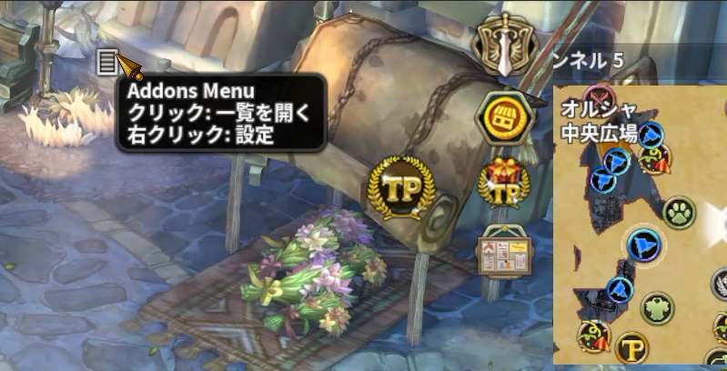
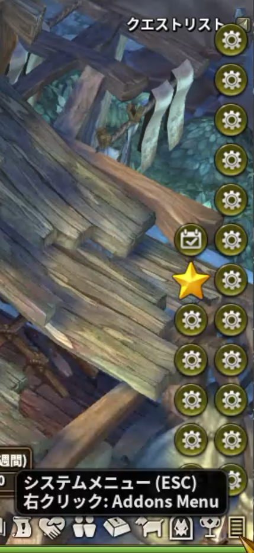
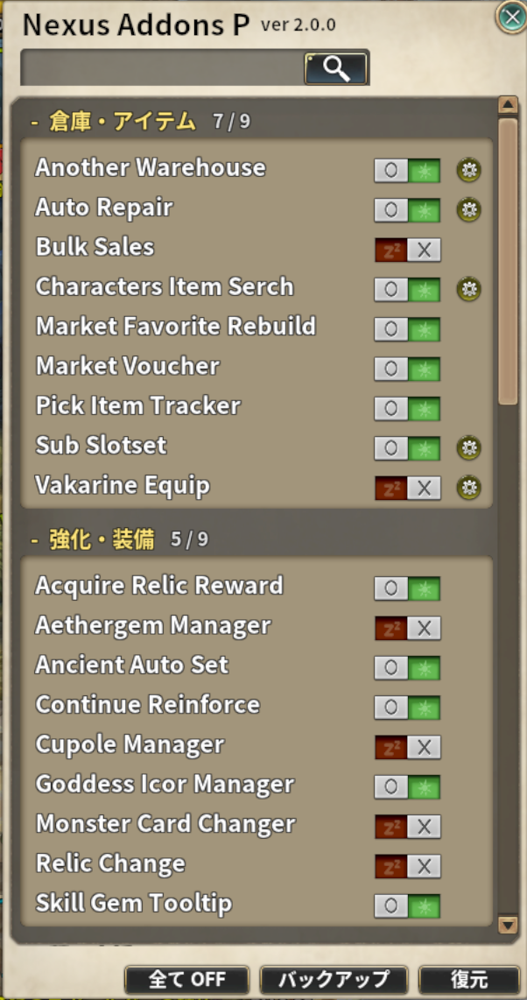
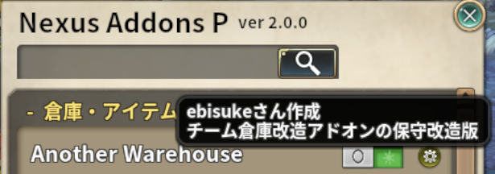
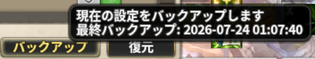
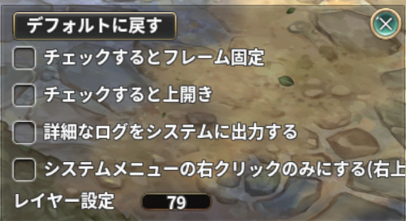
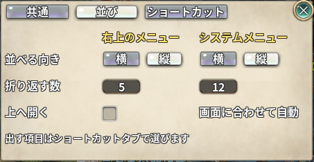
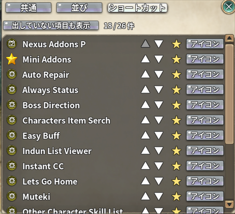
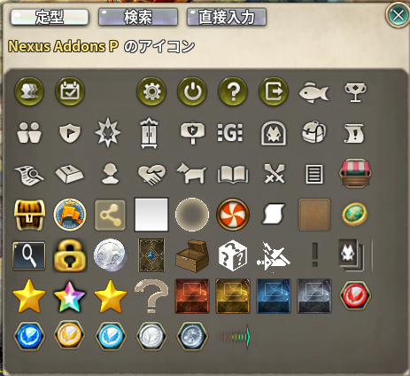

# Nexus Addons P

Tree of Savior 用アドオン **Nexus Addons P** の説明。

norisan さんの [Nexus Addons](https://github.com/ajinorisan/TOSAddon-public) を元にした派生版です。
本家 v1.1.6 以降に加えた不具合修正・新レイド対応をまとめ、**別アドオンとして独立配布**します。
アドオン名・保存フォルダ・グローバル関数名はすべて `_nexus_addons_p` 系にリネームしてあり、
バージョンは本家と独立して採番します。

40種類以上のアドオンの詰合せです。**各アドオンの詳しい使い方は、下の一覧から個別の README** を参照してください
（ゲーム内のアドオン一覧ウィンドウの `?` ボタンにも要約があります）。

ゲーム内でのメニューの開き方・アドオンの ON/OFF・設定のバックアップについては
[使い方（メニューの開き方と全体設定）](#使い方メニューの開き方と全体設定)を参照してください。

インストール方法はリポジトリ全体の [README](../README.md) を参照してください。

---

## 使い方（メニューの開き方と全体設定）

各アドオンの ON/OFF や設定は、**Addons Menu**（アドオンメニュー）から開く
**アドオン一覧ウィンドウ**でまとめて操作します。

### 1. アドオン一覧を開く

導線は 2 つあり、どちらからでも同じ一覧が開きます。

| 導線 | 左クリック | 右クリック |
| --- | --- | --- |
| **フローティングボタン**（既定は画面右上。ドラッグで移動できます） | メニューを開く | **Addons Menu の設定**を開く |
| **システムメニューボタン**（アイコン列の「system」。ESC で開くシステムメニューと同じもの。既定はコレクション（F11）の右隣ですが、UI の配置によって画面上部にも下部にもあります） | ゲーム標準のシステムメニュー（変更なし） | メニューを開く |

* 開いたメニューの中の **「Nexus Addons P」** を押すとアドオン一覧ウィンドウが開きます。
  もう一度押すと閉じます。
* システムメニュー側から開いたメニューには、末尾に **「Addons Menu の設定」** が並びます
  （こちらは右クリックが「メニューを開く」に使われているため、項目として用意しています）。

  

* 右上のフローティングボタンは、下記の設定で**消してシステムメニューの右クリックだけにする**
  こともできます。
* 開いたウィンドウは **ESC でも閉じられます**（× ボタンと同じ後始末を行います）。

### 2. アドオン一覧ウィンドウでできること

アドオンは「倉庫・アイテム」「強化・装備」「戦闘支援」「ダンジョン・コンテンツ」
「キャラクター・移動」「その他」の**カテゴリごと**に並びます。各行に、アドオン名と
次の 4 つが並びます。

| 表示 | 内容 |
| --- | --- |
| **アドオン名** | カーソルを乗せると、そのアドオンの説明がツールチップで出ます |
| **ON / OFF トグル** | そのアドオンの有効・無効を切り替えます。切り替えは即座に反映され、保存されます |
| **⚙（設定フレーム呼出し）** | 設定画面を持つアドオンだけに表示されます。押すとそのアドオンの設定画面が開きます |
| **☆（Addons Menu へ出す）** | ⚙ を持つアドオンだけに表示されます。押して★にすると、そのアドオンの設定画面を開くボタンがメニューに並びます。**右クリックでアイコンを選べます**（下記「4. ショートカットのアイコンを選ぶ」）。アドオンを OFF にしている間は薄く表示され、押せません |

#### 何が新しくなったのかを見る

更新して最初に一覧を開くと、**前回見たときから追加されたアドオンには `NEW`、
直されたアドオンには `Update` の印**が名前の右に付きます。カーソルを乗せると、
**何が変わったのか**が出ます。カテゴリを畳んでいても分かるよう、見出しにも新着の件数が
出ます。Mini Addons の設定画面にも同じ印と件数が付きます。

**Mini Addons は設定項目が増えても一覧の行の見た目は変わらない**ので、
中身に新着があるときは **`Mini Addons` の行にまとめて印が出ます**。
カーソルを乗せると、どの設定が増えた／変わったのかが一覧で出ます。

印は**一度一覧を開くと、次の起動で消えます**。開いた瞬間に消えると、どこが新しいのかを
探しに行けなくなるためです。変更の詳しい内容は、このページ下部の
[更新履歴](#更新履歴)にまとまっています。

目当てのアドオンは、次の 2 つで探せます。

| 操作 | 内容 |
| --- | --- |
| **検索窓**（タイトルの下） | アドオン名・`?` の説明文で絞り込みます。日本語でも英語名でも当たります（例: 「倉庫」「buff」「ダンジョン」）。Enter か虫眼鏡ボタンで実行し、空にして実行すると全件へ戻ります |
| **カテゴリ見出しのクリック** | そのカテゴリを折りたたみます。畳んだ状態は保存され、次に開いたときも保たれます。見出しの右の `n / m` は、そのカテゴリで ON にしている数です。**検索中は折りたたみできません**（絞り込んだ結果が畳まれた中に隠れないようにするため） |

ウィンドウの**下段**には、**全アドオンに対する一括操作**が並びます。

| ボタン | 内容 |
| --- | --- |
| **全て OFF** | すべてのアドオンを OFF にします（確認あり）。押す前に「バックアップ」を取っておくと、元の ON/OFF に戻せます |
| **バックアップ** | 現在の設定を `../addons/_nexus_addons_p/backup/<アカウントID>/` へ退避します。保存先は 1 つだけで、既にあるときは上書きの確認が出ます。ツールチップに最終バックアップ日時が出ます |
| **復元** | バックアップから設定を書き戻します（確認あり）。**上書きであって巻き戻しではない**ため、バックアップ後に増えたファイルは残ります。すべて反映するにはゲームの再起動が必要です |

### 3. Addons Menu の設定

右上のフローティングボタンを**右クリック**（またはシステムメニュー側のメニューの
「Addons Menu の設定」）で開きます。画面は **「共通」「並び」「ショートカット」の 3 つのタブ**に
分かれています。

#### 共通タブ

どこから開いても同じ、全体に効く設定です。

| 項目 | 内容 |
| --- | --- |
| **デフォルトに戻す** | 位置・レイヤーなどを初期値へ戻します |
| **チェックするとフレーム固定** | フローティングボタンをドラッグで動かせないようにします |
| **詳細なログをシステムに出力する** | 動作の詳細をチャットのシステムメッセージと `../addons/_nexus_addons_p/verbose_log.txt` に出します。**不具合を報告するときは、これを ON にして再現し、`verbose_log.txt` を添えていただけると調査が早く進みます**（既定は OFF） |
| **システムメニューの右クリックのみにする** | 右上のフローティングボタンを消します。システムメニューの右クリックは常に使えるので、これだけで運用できます |
| **レイヤー設定** | 他のウィンドウとの重なり順を数値で指定します（既定 79） |
| **初期化の速さ** | ログイン直後に 1 回で初期化するアドオンの数です（1〜12 / 推奨 4）。大きいほど早く出そろいますが、そのぶんログイン直後が重くなります。Enter で確定し、**次のログインから反映されます** |

#### 並びタブ

メニューの並べ方を、**「右上のメニュー」と「システムメニュー」で別々に**決められます。
左右に並んでいるので、どちらを触っているか見ながら設定できます。

| 項目 | 内容 |
| --- | --- |
| **並べる向き** | **横**＝横に並べて、下へ折り返します。**縦**＝縦に積んで、横へ折り返します |
| **折り返す数** | 折り返すまでの個数です（1〜30）。Enter で確定します |
| **上へ開く** | メニューをボタンの上方向へ開きます。**右上のメニューだけの設定**で、システムメニュー側は画面の端に合わせて自動で上下します |

#### ショートカットタブ

メニューに並べる項目の**順番とアイコン**を決める場所です。
**他のアドオンが Addons Menu へ登録した項目もここに出ます**（そちらはアドオン一覧に行を持たないため、
ここが唯一の管理場所になります）。

| 表示 | 内容 |
| --- | --- |
| **▲ / ▼** | メニューでの並び順を 1 つずつ動かします |
| **★ / ☆** | メニューへ出す・出さないを切り替えます（アドオン一覧の☆と同じものです）。アドオンを OFF にしている間は切り替えられません |
| **アイコン** | クリックでアイコン選択を開きます。**右クリックで既定のアイコンに戻ります** |
| **左上のボタン** | 既定では**メニューへ出している項目だけ**が並びます。いちど外した項目を戻したいときは、ここを押して「出していない項目も表示」に切り替えます |

### 4. ショートカットのアイコンを選ぶ

アドオン一覧の**☆を右クリック**、またはショートカットタブの**「アイコン」ボタン**で開きます。
タブが 3 つあります。

| タブ | 内容 |
| --- | --- |
| **定型** | よく使う候補を並べたものです。押すとその場で決まります |
| **検索** | 言葉を入れて **Enter**（または虫眼鏡ボタン）で探します。「UI アイコン」は画像名で、「スキルアイコン」はスキル名で当たります |
| **直接入力** | 一覧に無い画像名を直接指定します。実在しない名前は空白になるので、プレビューで確かめてから決められます |

これらの設定は `../addons/_nexus_addons_p/<アカウントID>/addons_menu.json` に保存されます
（「詳細なログ」「初期化の速さ」と、ショートカットの並び順・アイコンは全体設定のため
`settings.json` 側に保存されます）。

---

## アドオン一覧

各行の名前をクリックすると、そのアドオンの使い方・設定項目・保存先をまとめた README が開きます。
**分類と並び順は、ゲーム内のアドオン一覧ウィンドウと同じ**です。

### 倉庫・アイテム

| アドオン | 概要 |
| --- | --- |
| [Another Warehouse](src/addons/another_warehouse/README.md) | チーム倉庫を見やすい一覧に差し替え、自動搬出入・自動入出金・セット取り出しを追加 |
| [Auto Repair](src/addons/auto_repair/README.md) | 耐久が減ると緊急修理キットで自動修理。女神の証商店から自動補充 |
| [Bulk Sales](src/addons/bulk_sales/README.md) | 雑貨屋で同じアイテムをまとめて一括売却 |
| [Characters Item Serch](src/addons/characters_item_serch/README.md) | 全キャラのインベントリ・装備・倉庫を横断してアイテムを検索 |
| [Market Favorite Rebuild](src/addons/market_favorite_rebuild/README.md) | マーケットのお気に入り登録と検索条件の保存を追加し、オプション表示を見やすく |
| [Market Voucher](src/addons/market_voucher/README.md) | マーケットの売買履歴を記録して「売上伝票」として表示 |
| [Pick Item Tracker](src/addons/pick_item_tracker/README.md) | そのマップで拾ったアイテムと滞在時間を表示 |
| [Sub Slotset](src/addons/sub_slotset/README.md) | 追加のクイックスロットを好きな大きさ・位置に何枚でも作る |
| [Vakarine Equip](src/addons/vakarine_equip/README.md) | ヴァカリネの恩恵の判定をやり直すため、指定部位を着け直す |

### 強化・装備

| アドオン | 概要 |
| --- | --- |
| [Acquire Relic Reward](src/addons/acquire_relic_reward/README.md) | 主要都市でレリッククエストの報酬を自動受領 |
| [Aethergem Manager](src/addons/aethergem_manager/README.md) | エーテルジェム 4 個の付け替えを自動化（6 セット） |
| [Ancient Auto Set](src/addons/ancient_auto_set/README.md) | アシスターセットをキャラ毎に自動で付け替え（10 プリセット） |
| [Continue Reinforce](src/addons/continue_reinforce/README.md) | ゴッデス装備を成功するまで連続強化（回数制限・補助剤の自動選択つき） |
| [Cupole Manager](src/addons/cupole_manager/README.md) | クポル未登録キャラでも街に入ると自動で 3 体呼び出す |
| [Goddess Icor Manager](src/addons/goddess_icor_manager/README.md) | 刻印ページ × 8 部位のイコルを一覧表示し、セット単位で付け替え |
| [Monster Card Changer](src/addons/monster_card_changer/README.md) | モンスターカードのプリセットを 10 個に拡張し、倉庫との出し入れも自動化 |
| [Relic Change](src/addons/relic_change/README.md) | レリックのシアンジェム付け替えをボタン 1 つで |
| [Skill Gem Tooltip](src/addons/skill_gem_tooltip/README.md) | スキルジェムに対象スキルのツールチップを併記 |

### 戦闘支援

| アドオン | 概要 |
| --- | --- |
| [Battle Ritual](src/addons/battle_ritual/README.md) | レイド入場時に自己バフを優先度順で自動使用（ソロ限定） |
| [Boss Direction](src/addons/boss_direction/README.md) | ボスが向いている方向を足元の矢印で表示 |
| [Boss Gauge](src/addons/boss_gauge/README.md) | ボスゲージにスタン値とシールド値を追加 |
| [Debuff Notice](src/addons/debuff_notice/README.md) | 自分がボスへ与えたデバフを大きく表示 |
| [Easy Buff](src/addons/easy_buff/README.md) | メシ屋・バフ屋・修理屋での操作を自動化 |
| [Muteki](src/addons/muteki/README.md) | 切らしたくないバフだけを大きなゲージ／アイコンで表示 |
| [My Buffs Control](src/addons/my_buffs_control/README.md) | バフ欄を移動可能にして、選んだバフを非表示にする |
| [Party Icon Only](src/addons/party_icon_only/README.md) | パーティ情報を職業アイコンだけにして、クリック判定もアイコンの範囲だけに |
| [Party Marker](src/addons/party_marker/README.md) | パーティーメンバーの頭上にアイコンを表示 |
| [Quickslot Operate](src/addons/quickslot_operate/README.md) | 女神ポーションをレイドの種族に合わせて自動で差し替え。スロット保存／読込 |
| [Revival Timer](src/addons/revival_timer/README.md) | 繰り返しカウントダウンするタイマー（PT チャット通知つき） |
| [Separate Buff Custom](src/addons/separate_buff_custom/README.md) | セパレートバフフレームに好きなバフを追加。スタック数と追従表示 |

### ダンジョン・コンテンツ

| アドオン | 概要 |
| --- | --- |
| [Archeology Helper](src/addons/archeology_helper/README.md) | アーキオロジーで調べた位置をミニマップに記録。スタミナ錠の自動使用も |
| [Dungeon RP Charger](src/addons/dungeon_rp_charger/README.md) | 未知の聖域 3F でレリックポイントを自動補充 |
| [Guild Event Warp](src/addons/guild_event_warp/README.md) | 画面右上のボタンからギルドイベントのボスマップへワープ |
| [Indun List Viewer](src/addons/indun_list_viewer/README.md) | 全キャラのレイド入場回数・掃討回数を一覧表示。掃討バフの期限も警告 |
| [Indun Panel](src/addons/indun_panel/README.md) | レイド・チャレンジ等の入場を 1 枚のパネルに集約（表示セット 3 つ） |
| [Monster Kill Count](src/addons/monster_kill_count/README.md) | マップ別に討伐数・滞在時間・ドロップを記録して集計 |
| [Save Quest](src/addons/save_quest/README.md) | ワープ用クエストの NPC を消して誤完了を防止。ショートカットパネルつき |
| [Silent Velnice Ranking](src/addons/silent_velnice_ranking/README.md) | ヴェルニケで勝手に開くランキングを抑止（TAB で表示） |

### キャラクター・移動

| アドオン | 概要 |
| --- | --- |
| [Always Status](src/addons/always_status/README.md) | 選んだステータスを常時表示（10 セット・色と表示名をカスタマイズ可） |
| [Auto Map Change](src/addons/auto_map_change/README.md) | 高レベルマップへ入るときの確認ダイアログを自動で通す |
| [Auto Pet Summon](src/addons/auto_pet_summon/README.md) | キャラ毎に最後に連れていたペットを街で自動召喚 |
| [Character Change Helper](src/addons/cc_helper/README.md) | ボルタエンブレム・カード・髪飾り・エーテルジェムなどをボタン 1 つで倉庫と出し入れして着脱（3 セット） |
| [Instant CC](src/addons/instant_cc/README.md) | バラック画面を経由せずキャラクターチェンジ |
| [Job Change Helper](src/addons/job_change_helper/README.md) | 転職前の装備全解除と、脱いだ装備の着け直し |
| [Lets Go Home](src/addons/lets_go_home/README.md) | 登録したホームタウンのホームチャンネルへワープ |
| [Other Character Skill List](src/addons/other_character_skill_list/README.md) | 全キャラの錬成スキル・強化値・GearScore を一覧表示 |
| [Status Point Check](src/addons/status_point_check/README.md) | ステータスポイントがもらえるクエストの達成状況を一覧 |
| [Sub Map](src/addons/sub_map/README.md) | メンバー・ボス・宝箱・未探索エリアを重ねた小さなマップを常時表示 |

### その他

| アドオン | 概要 |
| --- | --- |
| [Ancient Monster Bookshelf](src/addons/ancient_monster_bookshelf/README.md) | **未完成のため無効**（アシスターカードの一括合成） |
| [Mini Addons](src/addons/mini_addons/README.md) | 細かい便利機能 60 種類以上の詰め合わせ（機能ごとに ON/OFF） |
| [No Check](src/addons/no_check/README.md) | 各種確認ダイアログを省略。アイテム連続使用フレームとゴミ箱フレームを追加 |
| [Tavern of Soul](src/addons/tavern_of_soul/README.md) | アイテム・バフ・スキル・モンスターの ID を逆引きする簡易検索 |
---

## ⚠️ 本家 Nexus Addons とは同時に使えません

Nexus Addons P は本家をリネームした派生版のため、**両方を同時にインストールすると競合します**。
そのため次の動作が入っています。

* **本家を検出したら、Nexus Addons P は全機能を停止します。**
  チャットに赤字で「本家を削除してください」と表示されるので、`data` フォルダから
  本家の `_nexus_addons-⛄-*.ipf` を削除して、クライアントを**再起動**してください。
  （この間、本家側は今までどおり動作します）
* **設定は自動で引き継がれます。**
  Nexus Addons P 側の設定がまだ無い状態で本家の設定が残っていれば、
  `addons/_nexus_addons/<アカウントID>/` の中身を `addons/_nexus_addons_p/<アカウントID>/` へ
  丸ごとコピーします（各アドオンの設定・Another Warehouse・討伐カウントなどを含む）。
  引き継ぎは**初回1回だけ**なので、本家を削除する前に一度ログインしておけば、
  そのままの設定で移行できます。

### 乗り換え手順

1. アドオンマネージャーから **Nexus Addons P** をインストールする（本家はまだ消さない）
2. ゲームを起動してログインする → 設定が引き継がれ、「本家を削除してください」と表示される
3. `data` フォルダから本家の `_nexus_addons-⛄-*.ipf` を削除する
4. クライアントを再起動する → 引き継いだ設定のまま Nexus Addons P が動作する

---

## 更新履歴

更新履歴 (Nexus Addons P)

* **（次回リリース）**
  * Mini Addons: **「アイテム破片化の枠を拡張し、耳飾りを細かく絞り込む」を追加しました**
    （フレーム関連、既定 OFF）。ON にすると次の 3 つが変わります。
    * **スロットが 5x5 固定でなくなります。** 設定の右の入力に列と行（それぞれ 1〜10）を
      入れて Enter で決めます（`X` が横、`Y` が縦）。窓は画面に収まる範囲で縦に伸び、
      それでも入りきらないときはスロットを小さくして収めます。破片化の実行も、
      増やした枚数のまま押せます。
    * **耳飾りの等級フィルタが 8 個になります。** これまでの「1 / 2 / 3 / 4 等級以上」から、
      **1〜7 と「8 以上」**へ分かれます（等級 = 特殊オプション 3 つのレベル合計）。
    * **「最大 Lv」で絞れるようになります。** 特殊オプション 3 つのうち**一番高いレベル**が
      Lv1〜Lv5 のどれかで絞り込めます。等級と組み合わせると、同じ 8 等級でも
      「Lv5 が付いているものだけ」を選べます。
    * フィルタは **`等級` `最大Lv` の 2 行**で、チェックボックスは数字だけです
      （何の数字かは行の見出しとツールチップに出ます）。行は素のフィルタ枠の中、
      「フィルタ | 耳飾り」の見出しの下に並びます。
* **v2.5.0**
  * Indun Panel: **設定ウィンドウをタブ（パネル / コンテンツ）に分けました。**
    ショートカットは**アイコンだけの横並びをやめ、アイコン＋名前の一覧**にしています。
    右端で見切れていて「レティーシャへ移動」を出し入れできなかったのが直り、
    どのチェックが何のボタンなのかもひと目で分かるようになりました
    （街でだけ出るものには `(都市)` と付きます）。
  * Indun Panel: **ショートカットとレイド・コンテンツの行を、設定の▲▼で並べ替えられる**
    ようにしました。よく使うものを手前に寄せられます。押すとその場でパネルも並び直します。
    順番はセット共通で、並べ替えた後に増えたものは末尾に付きます。
  * Indun Panel: 設定の**背景の選び方を変えました。**`SKIN SELECT` を押して
    コンテキストメニューから選ぶ形は、**今どの背景を使っているのかが画面のどこにも
    出ていませんでした**。`いつもの` / `黒` / `透明度高め` の 3 つを横に並べて、
    今使っているものが赤くなるようにしています（セットのボタンと同じ見せ方）。
    あわせて `背景` `表示・操作` の見出しを足し、チェックの文字から「チェックすると」を
    落として名詞止めで揃えました（`英語で表示` / `フィールドでも表示` / `フレームを固定` /
    `網掛けで表示`）。何が起きるのかの補足はツールチップに出ます。
  * Indun Panel: **アシャークを一覧から外しました。**入場できなくなったためです。
    設定の一覧にも出なくなります（保存済みの設定はそのまま残りますが、何も起きません）。
  * Indun Panel: 設定ウィンドウの**大きさをタブでも中身の量でも変えないようにしました**
    （500 × 640。1280x720 の画面にも収まります）。ショートカットの一覧もスクロールする
    枠に入れたので、全部出しても最後の行が画面の外へ落ちません。
  * Indun Panel: 設定の**コンテンツ一覧を縦 1 列＋スクロール**にし、**名前の右に
    パネルへ出るのと同じ絵**を付けました。1 列なので▲▼の上下だけで並べ替えられます。
    あわせて、ショートカットとコンテンツのどちらにも **`ON のものだけ表示`** を足しました。
    チェック済みのものだけに絞れるので、並べ替えたいものだけを並べて上下できます
    （絞っている間の▲▼は隠れている行を飛ばします）。**絞っている間にチェックを外すと、
    その行はその場で一覧から消えます**。
  * Indun Panel: **展開したパネルの右端で歯車（設定を開くボタン）が切れていた**のを
    修正しました。パネルの幅を行の長さだけで決めていたため、ショートカットを 11 個すべて
    出すと上段のほうが長くなってはみ出していました。
  * Indun Panel: **セット（SET A / B / C）のボタンをコンテンツタブの一覧の上へ移し**、
    どのチェックに効くのかを分かるようにしました。
    **セットを切り替えるたびに設定ウィンドウが画面中央へ戻っていた**のも修正しました。
  * Party Icon Only: **見出しの帯を右クリックすると「展開する / 格納する」を選べる**ように
    しました。展開すると素の見た目（名前・HP/SP・レベル・バフ欄）に戻り、
    **Mini Addons の「パーティー情報フレームを小さくする」「パーティーメンバーの場所表示」も
    展開中は普通に動きます**。アドオンを OFF にしなくても行き来できるので、「普段はアイコン
    だけ、必要なときだけ全部見る」という使い方ができます。メニューには今の状態と逆のものだけ
    が並びます。
* **v2.4.0**
  * Mini Addons: **「特性をスキル順に並べる」を追加しました**（フレーム関連、既定 OFF）。
    スキルと特性のウィンドウで、右側の特性一覧を左のスキル欄と同じ順に並べ直します。
    スキルに紐付かない特性（職業共通の強化など）は先頭、複数のスキルに関わる特性は
    一番早いスキルの位置に置きます。素の並びは特性の定義順を不安定ソートに通したもので、
    スキル欄とは無関係でした。アカウント特性（Common）のタブは変えません。
  * Another Warehouse / Mini Addons（インベントリ改造）: エーテルジェムの枠の色分けで、
    最上位の段を `"560"` と決め打ちしていたのを `g.ICOR_TOP_LV` から引くようにしました。
    **今の見え方は変わりません**（`g.ICOR_TOP_LV` は 560 のため）。次に Lv 上限が
    上がったとき、この 2 か所を直し忘れて新しい段のジェムだけ枠の色が付かない、という
    取りこぼしを防ぐためのものです。
  * Indun Panel: **設定画面をパネルとは別のポップアップにして、画面中央へ出す**ように
    しました。以前はパネルのフレームそのものを設定画面へ作り替えていたので、パネルを
    画面の端に置いていると設定も端に出ていました。あわせて中身を「Indun Panel の設定」と
    「レイド・コンテンツの表示 ON/OFF」の 2 セクションに分け、ESC でも閉じられるように
    しています。**設定を変えるとその場でパネルを描き直します**（行を消したときに前の
    描画が残って重なっていたのを直しました）。設定を閉じてもパネルの展開／折りたたみは
    そのままです。**歯車ボタンは一番右へ移しました**（畳んだ状態では歯車が出ないため、
    共通ボタンとショートカットの間にあると展開したときだけショートカットが右へずれて
    いました）。
  * Indun Panel: **チャレンジ / 分裂特異点の段(520 / 540 / 560)を、設定画面で
    個別に出し入れできる**ようにしました。チェックは設定画面のコンテンツ一覧で、
    それぞれの行の右に並びます（行そのものを非表示にしていると灰色になります）。
    使わない段を外すとその行が短くなります。
    行の段を全部外すと、見出しだけの空の行が残らないよう**その行ごと消えます**。
    既存の設定には既定 ON で補われるので、これまでどおりの表示のままです。
  * Indun Panel: **共鳴の聖所は入場まで自動で押さず、窓を開くところで止める**ように
    しました。これまでは窓を開いた 0.3 秒後に入場を押していました。嘆きの墓地・
    アシャークはこれまでどおり、押すとそのまま入場します。
  * **Party Icon Only を追加しました。** パーティ情報を「小さな見出し + 職業アイコンの
    縦一列」にします。素のパーティ情報は 1 人あたり横 700px の帯がそのまま当たり判定に
    なっていて、名前やバフ欄が出ていない余白を押してもクリックが 3D 画面へ抜けません
    でした。表示を畳むのと同時にフレームも同じ大きさへ縮めるので、**その外は素どおり
    下へ抜けます**。ウィンドウは**見出しの帯をドラッグ**して動かせます。
  * Mini Addons（パーティー情報フレームを小さくする / パーティーメンバーの場所表示）:
    **Party Icon Only が ON のあいだは何もしないようにしました。** 前者は
    「パーティー情報フレームを小さくする」が **OFF のときも** `partyinfo` を素の幅
    （700px）へ戻していて、しかも 5 秒ごとの更新から呼ばれるため、Party Icon Only が
    畳んだ直後に広げ直していました（表示は畳まれたままなのに、アイコンの右と下に
    押せる帯が現れる）。
  * Mini Addons（ヘアアクセサリーのエンチャント自動付与）: v2.3.1 で入れた修正の副作用で、
    **「ランクアップ時に停止」が効かなくなることがあった**のを直しました。ランクを控え直す
    処理が、対象を載せ替えたときだけでなく**同じ髪がランクアップしたときにも走っていた**
    ためです（0.3 秒ごとの監視が先に控えを書き換えると、ランクアップが無かったことに
    なります）。あわせて、**回している最中に別のヘアアクセへ載せ替えると、載せ替えた先に
    元から付いていたオプションで 1 回で止まる**ことがあったのも直しました。
* **v2.3.1**
  * Another Warehouse: 設定ウィンドウで**左 SHIFT + 右クリックの個数変更ができない**ことが
    あったのを直しました。登録した直後のスロットにはアイテムの控えが入っておらず
    （ウィンドウを開き直すまで入りませんでした）、その状態では何も起きませんでした。
    あわせて、**個数を 0 に変えても古い数字が残っていた**のと、右クリックの経路を
    詳細ログに出すようにしています。
  * **Lv560（EP18）の装備・イコル・エーテルジェムを「格下」として扱っていたのをまとめて直しました。**
    段を `EP17` や名前の `540` で決め打ちしていた箇所が Lv560 で取り残されていたものです。
    * Market Favorite Rebuild: 市場のオプション表示で、**Lv560 のイコルに％・最大値・色分けが
      一切付かず**、名前も「格下」の赤で出ていました。最大値は自前の表をやめて素の
      データ（レベル・部位・上級/下級）から引くようにしたので、次の段が来ても追従します。
    * Aethergem Manager: **Lv560 のエーテルジェムを枠へ入れても登録できません**でした。
    * Goddess Icor Manager: Lv560 のイコルに段の表記（`[560]`）と枠の色が付きませんでした。
    * Another Warehouse / Mini Addons（インベントリのスロット改造）: Lv560 のイコル・その
      かけら・肩・ベルトが「格下」の枠で出ていました。Lv560 のエーテルジェムにも枠が付きませんでした。
    * Character Change Helper: 倉庫のジェム一覧で、Lv560 のジェムが「LV460」と出ていました。
  * Mini Addons: ヘアエンチャントの連続付与が、**振る前から付いていたオプションを指して
    1 回で止まる**ことがあったのを直しました。停止判定はアイテムに今付いているものを読むため、
    回し始めの 1 回目と「続けますか？」で「はい」を押した直後は、まだ結果が返っていない
    状態を見て止まることがありました。**1 発も撃っていない間は希望オプションで止めない**
    ようにしています。あわせて、**別のヘアアクセに載せ替えたときにランクを控え直す**
    ようにしました（前の対象のランクが残っていたため、「ランクアップ時に停止」が ON だと
    載せ替えた直後に 1 回も回さず止まることがありました）。
  * **素のクライアント API の呼び間違いで落ちていた 4 箇所を直しました。**
    どれも関数名の綴り違いで、その処理に入った瞬間だけ落ちるものでした。
    * Character Change Helper: 武器を 4 ヶ所着けていないときの案内で落ちていました。
    * Mini Addons: 装備錬成の自動化が、目標値に届く前に黙って止まっていました。
      あわせて、**素材が尽きたときに自動継続を打ち切る**ようにしました。これまでは
      ランクが上がらなくなっても 2 秒おきに錬成を要求し続け、窓を閉じるまで止まりませんでした。
    * Ancient Monster Bookshelf（**未完成のため無効**）: カードを集めるときに落ちることがありました。
    * Market Favorite Rebuild: 市場を開かずにお気に入りを右クリックすると落ちていました。
  * Quickslot Operate: **レイドに入ってもポーションが差し替わらないことがある**のを直しました。
    差し替えの判断はこれまで**入場ダイアログを通ったときだけ**成立していたため、
    パーティリーダーに飛ばされた・入り直した・レイドの中で再ログインした場合は
    一度も差し替わりませんでした。**マップからも種族を判断する**ようにしています。
    あわせて、Lv560 の 3 マップ（偽りの輝翼 / 堕落した審判の翼 / 共鳴の聖所）と
    テルハルシャのマップが対象から漏れていたのも直りました
    （対象マップの一覧を手書きせず、対応レイドの一覧から自動で作るようにしたためです）。

* **v2.3.0**
  * **Lv560 の新コンテンツに対応**しました。
    * Indun Panel: 「偽りの輝翼」「堕落した審判の翼」「共鳴の聖所」の行を追加しました。
      前の 2 つはレイドで、掃討（ACLEAR）と入場券の USE も使えます。まだ HARD が
      無いコンテンツなので、HARD ボタンは出しません（実装されたら出るようにしてあります）。
    * Indun Panel: チャレンジモードと分裂特異点に **Lv560 の段**を足しました。
      あわせて、**削除された Lv540 の PT ボタンを外し**、PVP マインのショップで買える
      入場券が Lv560 用に差し替わったのに合わせて、PVP の USE ボタンを Lv560 の段へ
      移しました（今までは Lv560 の券を買って Lv540 へ入ろうとしていました）。
      段が 3 つになったぶん、チャレンジ / 分裂を表示しているとパネルが横に広がります。
    * Indun Panel: **共鳴の聖所の入場回数が表示されない**のを直しました（入場券で入る
      ダンジョンの回数を、ゲーム本体と同じ引き方で読むようにしています）。
    * Indun List Viewer: 「偽りの輝翼」「堕落した審判の翼」を一覧に追加しました。
    * Quickslot Operate: 新しいダンジョンでも属性に合わせたポーションへ差し替えます。
    * Indun Panel: ショートカットに**サウレショップ**を追加しました（既定で表示されます）。
    * Auto Repair: 補充する緊急修理キットを **Lv560（サウレの証商店）**のものに切り替えました。
    * Mini Addons: 「各種コインを取得時に自動で使用します」が**サウレのコイン**にも効くようになりました。
  * 新クラス（エクゼキューター / ファナティクス）は、クラス一覧をゲームから読む作りなので
    そのまま表示されます。アドオン側の変更はありません。
  * Vakarine Equip: **バフ自動削除の判定を軽く**しました。バフが付くたびに設定した
    バフを 1 件ずつ照合していたのを、一発で引くようにしています。レイドなどバフの
    通知が集中する場所で効きます（実測で 1 秒あたり 10 件を超えます）。
    あわせて、チェックを外したバフの記録が設定ファイルに残り続けていたのを直しました
    （次回の起動で自動的に片付きます）。
  * Save Quest: **設定ファイルに意味のない記録が溜まり続けていた**のを直しました。
    クエスト一覧を開くたびに、保存していないクエストまで記録していました
    （次回の起動で自動的に片付きます）。保存やショートカットの内容は変わりません。

* **v2.2.3**
  * My Buffs Control: バフリストの画面を Mini Addons のバフ一覧と同じ形に揃えました。
    **「全部表示」「全部非表示」ボタン**を足してあり、まとめて切り替えられます。
    対象は**いま一覧に出ているぶんだけ**なので、検索で絞ってから押せばその分だけが
    変わります（絞り込まずに「全部非表示」を押すと全部消えます）。
    切り替えた結果は**その場でバフ欄へ反映されます**。チェック 1 つを切り替えたときも
    同じで、今までは次にそのバフが付き直すまで見た目が変わりませんでした
    （街ではすべて表示する仕様なので、街にいる間は変わりません）。
  * My Buffs Control: **バフリストが ESC で閉じられなかった**のを修正しました。

* **v2.2.2**
  * Mini Addons（ヘアアクセサリーのエンチャント自動付与）: **希望オプションが付いて出る
    「続けますか？」で「はい」を押しても、連続付与が 1 回で止まってしまう**のを修正しました。
    「魔法付与の結果が返らないため連続付与を止めました」と出て、10 秒待たされていました。
    回し始めた時点で希望オプションが既に付いている髪（＝チェックを多く付けているとき）だと
    毎回この形になります。
  * My Buffs Control: **レイドなどバフの通知が集中する場所で、一瞬とても重くなる**
    のを修正しました。今までは「いったんバフ欄に描いてから、非表示のものを消す」
    という後追いの作りで、非表示のバフ 1 個につきバフ欄の並べ直しが 2 回走っていました。
    **非表示のバフは最初から描かない**ようにしたので、この並べ直しが 0 回になります。
    実測で、レイド中のバフ通知は 1 秒あたり 10 件を超えます。
  * My Buffs Control: **レイドに入った直後に一瞬固まる**のを軽くしました。
    街ではすべてのバフを表示するので、入場時は非表示にしたバフが全部出ている状態から
    始まります。それを 1 個ずつ消していたため、バフ欄の並べ直しが「非表示にした数 ×
    2 回」走っていました。**一度まとめて消してから、表示するものだけ並べ直す**ように
    したので、非表示にした数がいくつでも並べ直しは 1 回で済みます。
    あわせて、街から持ち込んだ非表示のバフが入場直後に一瞬映ることも無くなりました。
  * My Buffs Control: **非表示にしたバフが、街の外でそのバフを受け直すと表示に戻って
    しまう**のを修正しました。非表示の設定が保存ファイルから消えていたためです。
    ※ すでに非表示にしていたバフは一度だけ表示に戻ることがあります。
    その場合はお手数ですが設定画面のバフリストで外し直してください。
  * My Buffs Control: 設定画面のバフリストで検索するたびに、設定ファイルを
    書き直していたのをやめました。
  * My Buffs Control: **バフの設定ファイルが 3816 行（40KB）まで膨らんでいた**のを、
    **非表示にしたバフだけを書く**ようにしました（普通は数件〜数十件）。
    今までは「表示するバフを全部書き出す」作りで、起動のたびにその全件を読み込み、
    初めて見たバフを受けるたびに書き足していました。
    **非表示にしていたバフはそのまま引き継がれます**（初回の起動時に自動で書き換わります）。
  * Muteki: **登録していないスキルを使うと、そのたびに内部でエラーになっていた**
    のを修正しました。エラーの報告は 1 回だけしか出ない作りなので気付きにくく、
    その裏でバフの検出が動かなくなっていました。

* **v2.2.1**
  * Job Change Helper: インベントリの「装備を全部外す」ボタンで、**ペット（コンパニオン）も
    外す**ようにしました。今までは転職画面から使ったときだけ外していました。
    「着ける」で装備を着け直すと、**外したペットも呼び戻します**（召喚のクールタイムが
    残っているときは明くのを待ってから出します）。
    鷹（Falconer の召喚）は装備ではないので、今までどおり触りません。
  * Nexus Addons P: **アドオンのウィンドウの上をクリックすると、その入力が裏の画面へ
    抜けてしまう（キャラクターが歩き出す・敵を選ぶ）ことがあったのを修正しました**。
    ボタンやスロットの無い余白を押したときだけ起きるので分かりにくく、Indun Panel の
    ほか 25 個ほどのウィンドウが同じ作りでした。Indun Panel では設定の
    「チェックするとフレームを固定」を入れている場合だけ、展開表示の広い部分が
    まるごと抜けていました（固定は**動かさない**だけの設定に直しました）。
    常時表示の HUD やマーカー、ツールチップは今までどおり裏に通します。

* **v2.2.0**
  * Nexus Addons P: **新しく足した機能や直した機能が分かるようになりました**。
    アドオン一覧と Mini Addons の設定で、前回見たときから追加された項目には `NEW`、
    直された項目には `Update` の印が付きます。**カーソルを乗せると何が変わったかが出ます**。
    カテゴリの見出しには新着の件数が出ます。**Mini Addons の設定が増えたときは、
    一覧の `Mini Addons` の行にまとめて印が出ます**
    （印は一度一覧を開くと**次の起動**で消えます。開いた直後に消えると、
    どこが新しいのか探せなくなるためです）。
  * Another Warehouse: **倉庫からアイテムを取り出した後、一覧が更新されないことが
    あったのを修正しました**。マウスがスロット以外（ボタンなど）に乗っている状態で
    アイテムが減るとエラーになり、一覧の作り直しまで届いていませんでした。
  * CC Helper: **搬出でカードの着け直しまで自動でできるようになりました**。
    設定画面（インベントリの歯車ボタン）の「MCC 連携」の隣にボタンが増え、
    **搬出のときに着けるカードプリセットをセットごとに選べます**。指定すると、
    倉庫から足りないカードを取り出して装備するところまで自動で行います。
    `なし` にすると従来どおり、カードプリセット画面が開くだけで着け直しは手動です
    （Monster Card Changer が ON のときだけ出ます）。
    搬出ボタンの右クリックで `Set2` を選べば Set2 に紐づけたプリセットが着きます
  * Monster Card Changer: **動作後にカード画面を自動で閉じるかを選べるようになりました**。
    カードプリセット画面に `終了後に閉じる` チェックが増えました（既定は ON で従来どおり）。
    **外すと開いたまま残る**ので、カードがどう入れ替わったかを確かめられます。
  * Monster Card Changer: **動作中は操作できないようになりました**。`SAVE` / `EQUIP` /
    `REMOVE`・プリセットの選択・色の保護チェックが、処理が終わるまで押せなくなります
    （押しても無視されるだけだと「反応がない」と見えて連打を招くため）。
  * Monster Card Changer: **保護している色が画面で分かるようになりました**。
    赤・青・紫・緑のチェックボックスに「保護」のラベルが付き、チェックを入れると
    **ラベルが黄色になり、その色の 3 枠が灰色になります**。
  * Monster Card Changer: **カードスロット画面の「プリセット」ボタンを押し直したとき、
    カード装着の窓ごと閉じてしまうのを修正しました**。プリセット画面だけが閉じます。
  * Monster Card Changer: **カードの着脱まわりの不具合をまとめて修正しました**。
    * **紫や青のカードが、色の違う枠に装備されることがあったのを修正しました**。
      空いている枠を飛ばして詰めたリストを適用していたため、空き枠のぶんだけ後ろの
      カードが前の色の枠へずれ込んでいました。**12 枠すべてを埋めていた場合は
      この症状は出ません**
    * **色の保護チェックが効いていなかったのを修正しました**。チェックした色のカードも
      `REMOVE` で外れ、`EQUIP` でも上書きされていました。これからはチェックした色は
      そのまま残ります
    * **`REMOVE` で外したカードが倉庫に入らないことがあったのを修正しました**。
      取り外してから 1 度だけしか手元を見ていなかったため、サーバーからの戻りが
      間に合わないと 1 枚も預けずに終わっていました。戻ってくるまで待つようにしました
    * **プリセットの 2 番目以降を選んでも反映されないことがあったのを修正しました**。
      選び直してから 1 秒以内に `EQUIP` を押すと、1 つ前に選んでいたプリセットが
      適用されたり、倉庫から 1 枚も出さずに適用されたりしていました。
      **プリセット 1 のままだと中身が変わらないため気付けない**症状でした
    * **ゲーム標準のカードプリセットを勝手に書き換えなくなりました**。以前は画面を開いたり
      プリセットを選び直すたびに標準の**プリセット 1 番と 5 番**を上書きしていました。
      これからは `EQUIP` / `REMOVE` を押したときに**1 番だけ**を作業用に使います
  * Mini Addons: **スキル錬成を、希望のスキルが出るまで自動で回せるようになりました**
    （「自動処理関連」の「スキル錬成を希望スキルが出るまで回せるように」を ON にすると使えます）。
    スキル錬成の窓のタイトルに「高度な設定」ボタンが増え、そこで**欲しいスキルと
    その最低レベル**・リピート回数を決められます。回している間は素の「スキル錬成」ボタンが
    「停止」になって残り回数が出ます。希望のスキルが候補に出たところで止まって確認を出します
    （そのまま素の「変更」で確定できます）。設定には名前を付けて保存できます
  * Mini Addons: **ヘアアクセの魔法付与で、チェックした希望オプションが効かないことが
    あったのを修正しました**。一覧のチェックが内部の記録に届かない場合があり、その項目は
    画面上チェックが付いていても**当たっても止まらない**状態になっていました。
    **この修正より前に保存したプリセットは、その項目が抜けたまま保存されている
    可能性があります。**心当たりのあるプリセットは、読み込んでチェックを確かめてから
    同じ名前で上書き保存し直してください

* **v2.1.0**
  * **フィールドボスのお知らせが、日本語 / 英語で表示されるようになりました**。
    バウバス出現・討伐のお知らせと、イベントのフィールドボス出現・討伐のお知らせが、
    言語を問わず韓国語のまま出ていました。あわせて、バウバスの討伐のお知らせを
    取りこぼさないよう判定を広げています
  * **マーケットの名前の色分けと EP13 ショップの一覧が、韓国語クライアントでも
    正しく出るようになりました**（表示のみの修正です）
  * **Market Voucher: ログインが速くなりました**。取引記録を
    `market_voucher_log.txt` と `market_voucher.json` の 2 か所へ同じ内容で保存し、さらに
    **ログインのたびに全件を読み直して書き戻していた**のをやめ、txt 1 本にまとめました。
    記録を読むのは売上伝票を開いたときだけになります（取引の多い人ほど効きます。
    派生元の実測では 1,360 件で 5.2 秒かかっていました）。
    **アドオンを OFF にしている場合は何も読み書きしません**
  * **Market Voucher: 「ログ削除」が退避してから消すようになりました**。
    消す前に `market_voucher_log.txt.bak` へ退避します（退避できなかったときは削除しません）。
    売上伝票は新しい 200 件までを表示し、それ以上あるときはその旨を出します
  * **Another Warehouse: チーム倉庫の TAKE SET が空で開く問題を直しました**。旧
    Another Warehouse から設定を引き継いだ場合にセットが 0 個のままになり、右クリックしても
    `Slot Setting` が空で、**ゲーム内からは元に戻せない**状態になっていました。
    次のログインで 10 セットが自動で揃います（既に作ってあるセットはそのまま残ります）
  * **アドオンの設定画面を Addons Menu へ並べられるようになりました**。アドオン一覧の各行に
    ☆が付き、押すと右上のメニューとシステムメニュー右クリックの一覧に、その設定画面を開く
    ボタンが並びます（☆の右クリックでアイコンを選べます）。設定画面を持たないアドオンには
    ☆が付きません。OFF にしているアドオンの☆は薄く表示され、押せません
  * **並べたボタンのアイコンを選べるようになりました**。タブが 3 つあります。
    **定型**（システムメニューのアイコンやゲームの各種ボタンなど）、
    **検索**（言葉を入れると「UI アイコン」と「スキルアイコン」に分けて候補が出ます）、
    **直接入力**（画像名を打つと下にプレビューが出て、実在するか確かめられます）
  * **一部のアドオンの設定画面が、アドオン一覧を開かずに開けるようになりました**。
    Auto Repair / Boss Direction / Battle Ritual / Characters Item Serch / Easy Buff /
    Instant CC / Lets Go Home / My Buffs Control / Revival Timer / Save Quest / Sub Map の
    設定画面は、一覧の右隣に出す作りだったため**一覧を開いていないと中身が空の窓**に
    なっていました。一覧を開いていないときは画面の中央に出ます
  * **Addons Menu の設定画面がタブに分かれました**（共通／並び／ショートカット）。
    「並び」では右上のメニューとシステムメニューの一覧について、**縦に積むか横に並べるか**と
    **何個で折り返すか**を別々に決められます（既定はこれまでと同じ見た目です）。
    「ショートカット」では、他のアドオンが Addons Menu へ登録した項目も含めて、
    **▲▼ で並び順を変えられます**。アイコンの変更と、出す／出さないの切り替えもここでできます。
    一覧には**今 Addons Menu に出ているものだけ**が並びます
    （外した項目を戻したいときは、上の「出していない項目も表示」を押してください）
  * **ログイン直後のアドオン初期化を速くできるようになりました**。Addons Menu の設定画面
    「共通」タブに **「初期化の速さ」** が増え、1 回あたりに初期化するアドオン数を
    **1〜12（推奨 4）** で指定できます。既定の 4 で、全アドオンが有効になるまでの待ち時間は
    **約 2.5 秒 → 約 0.65 秒**になります（従来は 1 に相当する速さでした）。
    大きくするほど速く終わりますが、そのぶんログイン直後の動作が重くなります。
    変更は次のログインから反映されます
  * **検索窓が、文字を打つたびに検索し直すようになりました**（ゲーム本体のインベントリ検索と
    同じ動きです）。**Enter を押さなくても絞り込まれ、文字を消せばそのまま元の一覧へ戻ります**。
    従来は Enter か虫眼鏡ボタンを押すまで反映されず、元へ戻すのに「空にして Enter」の 2 手が
    必要でした。Enter と虫眼鏡ボタンは今までどおり使えます。
    対象は アドオン ON/OFF 一覧／Another Warehouse／Battle Ritual／Characters Item Serch／
    Mini Addons（設定画面・バフ一覧）／MUTEKI／My Buffs Control／Separate Buff Custom／
    Vakarine Equip の検索窓です
    （Tavern of Soul はゲーム内データ全体を引く検索で、1 文字ごとに走らせると重すぎるため
    従来どおり Enter で検索します）
  * **検索窓に文字が入っているときだけ、虫眼鏡ボタンの左隣に「×」が出るようになりました**。
    押すと入力が消えて元の一覧に戻ります。上の検索窓すべてに付きます
    （Tavern of Soul の「×」は検索前の状態に畳みます）
  * Another Warehouse: **虫眼鏡ボタンを押すと検索が解除されてしまうのを修正しました**。
    ボタン自身の文字（空）を検索語として使っていたためです
  * Another Warehouse: 検索したときにタブが切り替わったものと見なされ、
    **入力した文字が消えてしまうのを修正しました**

* **v2.0.1**
  * Sub Map: **ボスやモンスターのアイコンが表示されなくなっていたのを修正しました**
    （チャレンジモードのボス位置を含む）。内部のメッセージ配信が、クライアントから
    渡される 5 個目の引数（モンスターの位置情報）を落としていたためです
  * ON/OFF 一覧で **Tavern of Soul のカテゴリを「ダンジョン・コンテンツ」から「その他」へ
    移しました**（データベース検索のアドオンなので）

* **v2.0.0**
  * アドオンの **ON/OFF 一覧を作り直しました**。**検索窓**（アドオン名や説明文で絞り込み）と
    **カテゴリごとの折りたたみ**を追加し、縦スクロールに対応しました。カテゴリの中は
    アドオン名のアルファベット順に並びます。従来は 2 列 25 行の固定表示で、
    画面の大部分を覆ううえ 50 個までしか並べられませんでした
  * ON/OFF ボタンにカーソルを合わせたとき、どのアドオンのものか名前が出るようにしました
  * 一括操作（全て OFF / バックアップ / 復元）を**ウィンドウの下段へ移しました**。
    この 3 つがウィンドウの幅を決めてしまい、一覧の右側に大きな余白ができていたためです
  * アドオンの説明を、右端の `?` ボタンではなく**アドオン名にカーソルを乗せる**と
    出るようにしました（`?` ボタンは廃止）。読んでいる場所とカーソルを合わせる場所が
    離れていたためです
  * Mini Addons: **設定画面で折りたたみや検索をすると、一覧が毎回先頭までスクロールして
    戻ってしまっていたのを修正しました**。スクロール位置の取得に、クライアントに存在しない
    関数を使っていたためです

* **v1.7.1**
  * Mini Addons: **「魔法付与をしやすくする」で、目標ランクを指定していても、その
    ランクへ届いた瞬間に止まらずリピート回数や手持ちのスクロールを使い切るまで
    回り続けることがあったのを修正しました**。届いた時点で画面側の目標表示が
    「ランク指定なし」に戻るため、停止の判断材料が消えていました
  * Mini Addons: 「魔法付与をしやすくする」で、確認ダイアログの「続ける」を押した
    直後の 1 回だけ、「演出を待たずに実行」の取りこぼし防止が効いていなかったのを
    修正しました
  * Mini Addons: 右クリックメニューの項目を差し替える処理で、差し替え対象の文言を
    ゲームから引けなかった場合に、メニューの項目が「キャンセル」も含めて全部
    消えてしまう可能性があったのを修正しました

* **v1.7.0**
  * Mini Addons: 「魔法付与をしやすくする」を、**ゲーム標準の「設定」ボタンとは別の
    「高度な設定」ボタン**から開く形に変えました（標準の「設定」の左隣に追加）。
    標準の「設定」ボタンはゲーム本来の動作に戻ります
  * Mini Addons: 「魔法付与をしやすくする」に**プリセット**を追加しました。
    希望オプション・目標ランク・リピート回数・「演出を待たずに実行」をまとめて
    保存／読込できます。保存を押すと名前を訊かれ、同じ名前があれば上書きします
    （個数の上限はありません）。保存したときより低いランクのアイテムに読み込んだ場合、
    そのランクでは付かないオプションは自動で除外します
  * Mini Addons: 「魔法付与をしやすくする」の希望オプション一覧をスクロールできる
    ようにしました。項目が多いとウィンドウが画面の高さを超えて、下のリピート回数や
    Cancel が画面外へ出てしまっていました
  * Mini Addons: 「魔法付与をしやすくする」に**「ヘアアクセを乗せたら自動で開く」**を
    追加しました（高度な設定ウィンドウ内のチェック）。この設定は保存されます
  * Mini Addons: 「魔法付与をしやすくする」で、リピート回数を空欄にしたまま実行すると
    いつまでも止まらなかったのを修正しました。空欄のときは `0`（＝1 回だけ。
    ゲーム標準の入力欄と同じ扱い）を入れ直して、画面にもその値を表示します
  * Mini Addons: 「魔法付与をしやすくする」のリピート回数の初期値を、手持ちの
    スクロール数から **`0`（＝1 回だけ）** に変えました。何気なく押しただけで
    手持ちを使い切ってしまう形だったためです。全部使いたいときは、隣に追加した
    **ALL ボタン**で手持ちの数を入れてください
  * Mini Addons: 「魔法付与をしやすくする」のオプション設定ウィンドウで、
    ボタンや入力欄が無い余白をクリックすると背後の露店などが反応してしまうのを
    修正しました
  * Mini Addons: **「魔法付与をしやすくする」で、ゲーム標準の「ランクアップ時に停止」
    チェックボックスが効いていなかった不具合を修正しました**。チェックの ON / OFF に
    関わらず必ずランクアップで止まっていました。チェックを外せば、ランクが上がっても
    そのまま回り続けます
  * Mini Addons: **「魔法付与をしやすくする」で、リピート回数に極端に大きな数を入れると
    動かなくなることがあったのを修正しました**。ゲーム標準の入力欄と同じく `0`〜`9999` の
    範囲に制限しています
  * Mini Addons: 「魔法付与をしやすくする」で、**リピート回数が手持ちの魔法付与スクロールより
    多いときに、使い切った後もしばらく無反応になってから止まっていたのを修正しました**。
    使い切った時点で終了し、その旨をお知らせします
  * Mini Addons: **「魔法付与をしやすくする」で、希望オプションが付いて確認ダイアログが
    出ているのに、余分にもう 1 回付与されて当たりが消えることがあったのを修正しました**。
    サーバの応答が遅れたときに、まだ結果が返っていない 1 発と重ねて撃っていました。
    応答が返らない場合は撃ち直さず、連続付与を止めてお知らせします
  * Mini Addons: 「魔法付与をしやすくする」の連続付与を、**1 秒ごとに撃つ形から
    「結果が返ったら次を撃つ」形に変えました**。待ち時間が減って速くなるうえ、
    回線が遅いときに結果を待たずに次を撃って希望オプションを見逃す、という
    取りこぼしも起きなくなります
  * Mini Addons: 「魔法付与をしやすくする」のオプション設定ウィンドウに
    **「演出を待たずに実行」** チェックボックスを追加しました。
    ON にすると 1 回あたり 0.5 秒ほど速くなりますが、ゲーム標準の付与演出と重なって
    見た目が乱れます（希望オプションの判定は変わりません）。既定は OFF で、
    ウィンドウを開くたび OFF に戻ります
  * Mini Addons: 「魔法付与をしやすくする」のオプション設定ウィンドウに、
    **目標ランクを選ぶドロップリスト**を追加しました（リピート回数の左側）。
    ランクを選ぶとそのランクへ届くまで回し続け、途中のランクアップや希望オプションでは
    止まりません。ランクを選んでいる間は上の希望オプションのチェックが灰色になって
    押せなくなります（「ランク指定なし」に戻せば、チェックした内容を保ったまま元に戻ります）。
    選べるのは今のランクより上だけです（ウィンドウを開くたび「ランク指定なし」に戻ります）
  * Mini Addons: 「魔法付与をしやすくする」で、**オプション設定ウィンドウを開いたまま
    ヘアアクセや魔法付与スクロールを入れ替えたとき、新しい対象に合わせて内容を
    作り直す**ようにしました。これまでは入れ替える前のオプション一覧と目標ランクが
    残ったままでした
  * Mini Addons: 「魔法付与をしやすくする」で、目標ランクを指定している間は
    ゲーム標準の「ランクアップ時に停止」チェックも灰色にして押せなくしました
    （指定中はそちらの設定を見ないため）。「ランク指定なし」に戻すか
    ウィンドウを閉じると元に戻ります
  * Mini Addons: 「魔法付与をしやすくする」で、**止まらずにランクアップしたときに
    希望オプションの一覧をそのランク向けに作り直す**ようにしました。移動速度や
    全スキルなど B・A ランクでしか付かないオプションは、これまで一覧に出ないままでした
    （チェック済みの項目とリピート回数はそのまま引き継ぎます）
  * Mini Addons: 右クリックメニュー（チャット・パーティー・ギルド・フレンド・
    他プレイヤー）を、ゲーム標準の処理をそのまま呼んだうえで「どこでもメンバーインフォ」の
    項目を足す形に変えました。これまでは標準の処理と同じ内容を書き写して持っていたため、
    クライアント側が更新されるとメニューの内容が古いまま取り残されるおそれがありました。
    メンバーインフォの項目は、これまで「キャンセル」の下に出ていたものが上に出ます
  * Mini Addons: **「チャンネル表示のズレを修正(日本語版)」を OFF にしていると、
    チャンネル選択ウィンドウの現在チャンネル欄が空になっていた不具合を修正しました**
    （既定は OFF なので、この項目を触っていない方はすべて対象でした）。
    OFF のときはゲーム標準の表示に戻ります
  * Mini Addons: 「パーティー情報フレームを小さくする」を OFF にしても、
    パーティー情報ウィンドウの幅が標準より狭いままになっていた不具合を修正しました
  * Save Quest: ショートカット一覧のアイコンを右クリックしても何も起きなかったのを修正し、
    クエスト欄のアイコンと同じ設定メニューが開くようにしました
  * Ancient Monster Bookshelf: カードスロットに、実体の無い関数を指したままの
    マウス移動イベントが割り当てられていたのを削除しました（動作は変わりません）
  * Mini Addons: **露店キャラを右クリックしたときのメニューから「見比べる」が
    消えていた不具合を修正しました**（「どこでもメンバーインフォ」が OFF のとき。
    既定は OFF なので、この項目を触っていない方はすべて対象でした）
  * Mini Addons: **パーティー情報の右クリックメニューから「詳細情報を見る」が
    消えていた不具合を修正しました**（同上。ON のときは従来どおり
    メンバーインフォの項目に置き換わります）
  * Mini Addons: 幽体離脱・幻影の対象をクリックすると、本来出ないはずの
    露店キャラ用メニューが出ていた不具合を修正しました
  * Mini Addons: ギルドメンバーの右クリックメニューで、オフラインの団員が居ても
    「解散」が出ることがあったのを修正しました
  * Mini Addons: 拡張ギルドアジトでギルドメンバーを右クリックしても
    「ギルドマスター委任」が出なかった不具合を修正しました
  * Mini Addons: チャット内のリンクとエモーティコンの整形を、ゲーム標準の処理に
    任せるようにしました。これまでは同じ処理を書き写して持っていたため、
    クライアント側が更新されると表示が古いまま取り残されるおそれがありました
    （見た目は従来どおりです）

* **v1.6.0**
  * Mini Addons: **「ヘアアクセサリーのエンチャント自動付与を使いやすく」で、
    希望のオプションにチェックを入れても連続エンチャントが止まらない不具合を修正しました。**
    チェックを拾う処理が呼ばれておらず、チェックの内容に関わらずリピート回数を
    撃ち切るまで回り続けていました。リピート回数の入力欄の表示更新も直っています
  * Mini Addons: **「ヘアアクセサリーのエンチャント自動付与を使いやすく」を OFF にしていると、
    エンチャントの OK ボタン 1 回で付与が 2 回行われていた不具合を修正しました**（既定は OFF です）
  * Mini Addons: 「ヘアアクセサリーのエンチャント自動付与を使いやすく」を ON から OFF へ切り替えたあと、
    ゲーム標準のオプション設定ウィンドウが開かないように見えていた不具合を修正しました
    （本アドオンのウィンドウが閉じずに重なったままになっていました）。
    あわせて、このとき素材スロットとオプション一覧まで一緒に消えてしまい、
    標準のウィンドウが空の状態で開いていたのも直しています
  * Mini Addons: バフ一覧の保存形式を切り替えたあとも古い形式のファイルが残っており、
    読み込みに一度でも失敗すると**切り替え当時のバフ設定に巻き戻り、
    それ以降の変更が失われる**おそれがあったのを修正しました（変換後は古いファイルを削除します）
  * 全体: バックアップの復元で、保存形式を切り替える前に取ったバックアップを戻しても
    設定が反映されない不具合を修正しました（Always Status / Another Warehouse / CC Helper /
    Indun List Viewer / Mini Addons のバフ一覧 / Other Character Skill List が対象です）
  * Mini Addons: クエスト表示を出したときに Indun Panel の再配置が行われない不具合を修正しました
  * CC Helper / Indun Panel: 内部で使う更新処理の停止指定が誤っていたのを修正しました（挙動の変化はありません）
  * 全体: **ESC キーでウィンドウが閉じない不具合を修正しました。**
    * これまで ESC で閉じられたのは 4 アドオンの一部のウィンドウだけで、
      **ほとんどの設定画面は ESC を押しても無反応**でした。
      Always Status / Another Warehouse / Archeology Helper / Auto Repair /
      Battle Ritual / Boss Direction / CC Helper / Characters Item Serch /
      Easy Buff / Instant CC / Lets Go Home / Market Favorite Rebuild /
      Market Voucher / Monster Kill Count / Muteki / My Buffs Control /
      No Check / Quickslot Operate / Revival Timer / Save Quest /
      Separate Buff Custom / Status Point Check / Sub Map / Sub Slotset /
      Tavern of Soul / Vakarine Equip / Aethergem Manager / Indun Panel の
      設定画面・一覧ウィンドウが ESC で閉じるようになります。
      **Nexus Addons P 本体のアドオン一覧ウィンドウ**も ESC で閉じます
      （× ボタンと同じく、そこから開いた各アドオンの設定画面も一緒に畳みます）。
      重なっているときは、これまでどおり**一番手前の 1 枚だけ**が閉じます。
    * Addons Menu の設定画面まわりの取りこぼしも修正しました。
      手前のウィンドウを ESC で閉じたときに設定画面まで一緒に消えていたのと、
      設定画面を ESC で閉じると同時にゲームのシステムメニューが開いてしまうのを直しています。
    * **ESC の 1 回目が空振りする**問題も直しました。
      アイコン一覧（システムメニュー右クリック）が項目を押した後も残っていたため、
      開いたウィンドウを閉じようとした ESC が先にその一覧へ使われていました。
      項目を押したら一覧を畳むようにしています。
    * Easy Buff: 設定画面を開くとプリセット 1 の名前欄にカーソルが入っていたのをやめました。
      入力欄にカーソルがあると ESC の 1 回目がその解除に使われ、
      **閉じるのに 2 回**必要になっていたためです。
    * Market Favorite Rebuild: ESC を押すと**マーケットごと閉じる**ようになります
      （お気に入りウィンドウも一緒に畳まれます）。以前は閉じるのに 3 回必要でした。
    * ゲームのウィンドウに貼り付いて開く一部のパネル（Bulk Sales / Ancient Auto Set /
      Another Warehouse の倉庫本体など）は、これまでどおり親のウィンドウと一緒に閉じます。
  * Guild Event Warp: **ギルドアジトへのワープボタンを追加しました。**
    封鎖戦の 3 つの左隣（一番左）に、黒背景のアイコンで並びます。
    ギルド活動 UI の「アジトへ移動」と同じ処理を呼ぶので、
    確認ダイアログなしでそのままアジトへ移動します（アジトは専用マップのため、
    封鎖戦のようなチャンネル 1 への自動切り替えは行いません）。
  * Mini Addons: **最初のログイン時に数秒フリーズする不具合を修正しました。**
    * バフ表示の設定（パーティー情報のバフ一覧）で「全部 OFF」を押すと、
      ゲーム内の全バフぶんの記録が保存され、次回以降のログインで
      **その読み込みだけに約 5 秒**掛かっていました（実機で 5247ms）。
      保存形式を読み込みの速いものに変えて、待ち時間が出ないようにしています。
    * 設定の中身と使い方は変わりません。**移行は自動**で、
      これまでの設定はそのまま引き継がれます。
      ただし**移行が走る 1 回目のログインだけは、これまでどおり数秒掛かります**
      （2 回目以降は掛かりません）。
    * バフ一覧の「バックアップ」で取った控えも同じ形式に変わります。
      移行前に取った控えからも、これまでどおり復元できます。
    * 調査用に、初期化の内訳を詳細ログへ出すようにしました。
      設定画面の「詳細なログをシステムに出力する」が ON のときだけ、
      起動 1 回につき 3 行出ます。

* **v1.5.1**
  * Mini Addons: **BGM プレイヤーボタンの右クリック（Sound Play/Mute）が効かない不具合を修正。**
    * ゲーム側の音量が 0 のときに初めて押すと「元の音量 = 0」を憶えてしまい、
      以後は何度押しても 0 を書き戻すだけで**音が二度と戻らない**状態になっていました。
      憶えるのは 0 より大きい値だけにし、憶えていないときは何もせずその旨を出します。
    * ミュートの切り替えで落ちても記録が残らなかったので、**詳細ログに出す**ようにしました
      （押した時点の音量・切り替え後の音量・音量 API の有無）。
    * ボタンが見つからないときに落ちて、**マップ移動ごとの初期化の残り
      （エフェクト設定の復元・ヴァカリネ通知・チャンネル一覧など）を道連れにしていた**のを修正。

* **v1.5.0**
  * Vakarine Equip: **街以外のすべてのマップで装備を着脱してしまう不具合を修正。**
    `チェックするとJSRで作動` を ON にすると、マップの判定を丸ごと飛ばしてしまい、
    フィールドや旧ダンジョンでも着脱が走っていた。
  * Vakarine Equip: **「チェックするとJSRで作動」をやめて、作動する場所を
    すべてチェックボックスで選べるようにしました。**
    設定画面に「自動で作動する場所」が増えます。
    * **JSR（ボス協同戦）** / **WBR（週間ボスレイド）** / **インスタンスダンジョン** /
      **ヴェルニケ** / **未知の聖域 3F** / **分裂** / **フィールド** /
      **その他のダンジョン** の 8 種類
    * 既定値は**これまでの動作をそのまま再現**しています（分裂・フィールド・
      その他のダンジョンだけ OFF）。更新しても作動する場所は変わりません
    * 旧「JSR で作動」は**実際には何も効いていませんでした**。ボス協同戦は
      インスタンスマップなので、チェックの ON/OFF に関わらず作動していたためです。
      今後は**チェックを外せば本当に作動しません**
    * 判定はマップ ID の直書きではなく `Keyword` で行います
      （ボス協同戦 = `FieldBossMap` / 週間ボスレイド = `WeeklyBossMap`）。
      通常のレイドは `IsRaidField` なので巻き込みません
  * Vakarine Equip: **インベントリが開いたまま残る不具合を修正。**
    対象の部位を 1 つもチェックしていない場合はそもそも開かず、チェックはあるが
    その部位を装備していない場合も閉じるようにした。
    なお手動で実行したときに部位が 1 つも選ばれていない場合は、黙って何も起きないと
    分かりにくいので、システムメッセージで理由を知らせる。
  * Quickslot Operate: **ジョイスティック用のクイックスロットバーが消える不具合を修正。**
    ポーションの差し替え中にジョイスティック用のバーを隠して戻していたため、
    ポーションが見つからず途中で終わったときなどに戻し忘れ、次にマップを移動するまで
    キーボード用のバーが出たままになっていた。**ジョイスティック用のバーには一切触れない**
    ようにしたので、消えることがなくなった。あわせて、キーボード用のバーも
    **まず出さずに差し替えてみて、反映されなかったときだけ出す**ようにした。
    実機で確かめたところ**一度も出す必要が無かった**ので、ジョイスティックモードで
    ポーションを切り替えても、もう画面に何も出ません
    （キーボード操作の人は元からバーが出ているので、こちらも一切触りません）。
    差し替えの前後でバーの表示状態を**実際に見てから元に戻す**ので、
    ジョイスティックモードでキーボード用のバーを出している人のバーを
    消してしまうこともなくなった（以前は「元は非表示だったはず」と決め打ちしていた）。
    バーの**透明度には触れません**（設定した透明度が不透明に書き換わることがありません）。
  * Dungeon RP Charger: **未知の聖域3F に一度入ると、そのあとずっと 3 秒ごとの
    自動補充が動き続ける不具合を修正。** 聖域を出ても、設定を OFF にしても、
    途中でエラーが出ても止まらず、同じエラーを 3 秒ごとに黙って繰り返していた。
    聖域の外に出たとき・設定を OFF にしたとき・エラーが出たときに止めるようにした
    （エラーの内容は `debug_log.txt` に残す）。設定が OFF のときは、聖域に入っても
    そもそも動き出さない。
  * Quickslot Operate: **対象外のマップでも 3 秒ごとの監視が動き続けるのをやめた。**
    街や普通の狩り場では何もしないまま次のマップ移動まで回り続けていたので、
    差し替えるものが無いと分かった時点（約 15 秒）で止めるようにした。
    次のマップに移動すれば従来どおり監視し直す。
  * **OFF にしているのに動いてしまうアドオンを 5 つ修正。**
    * Monster Kill Count: OFF でも**マップに入るたび討伐記録のファイルと設定ファイルを
      書き込み**、拾得の購読と 1 秒ごとのタイマーまで動いていた。OFF なら記録も購読も
      畳むようにした（貯めた記録そのものは消さない）。
    * Pick Item Tracker: OFF でも**マップを移動するたびに枠が 1 秒ほど表示され**、
      裏で拾得を数え続けていた。OFF なら表示も集計もしない。
    * Characters Item Serch: OFF でも**インベントリボタンの右クリックを奪い**、
      ツールチップに案内を出しながら押しても無反応だった。OFF では右クリックを
      奪わず、ツールチップも元に戻す。
    * Market Voucher: OFF でも**市場の売買記録を保存し続けていた**。OFF では記録しない。
      買い注文と受け取りの動作そのものは従来どおり（このアドオンが肩代わりしているため）。
    * Boss Direction: **矢印が出ている状態で OFF にすると、矢印が消えずに残っていた。**
      OFF にした時点で片付けるようにした。マップを移動したときに前のマップの矢印が
      残るのも、あわせて直している。
    * Party Marker: OFF にしても**目印を消すだけでタイマーが止まらず**、
      クライアントを落とすまで 0.5 秒ごとにパーティ一覧を見続けていた。
      OFF にした時点で止めるようにした。
    * Separate Buff Custom: OFF でもバフ枠の位置を動かしていたのをやめた。
  * Monster Kill Count: **記録が消える不具合を 2 つ修正。**
    * 記録をファイルへ書き出す処理が、**メモリ上の最新の集計ではなくファイルの
      古い内容をそのまま書き戻していた**ため、OFF にした瞬間とマップ移動のたびに、
      直前の自動保存（約 60 秒ごと）から後の討伐数・拾得・滞在時間が失われていた。
    * **チャレンジモードの集計が出たあと、同じマップに居る間ずっと討伐数も滞在時間も
      数えなくなっていた**（エラーも出ないので気付けなかった）。
  * Market Voucher: **市場で買えない／受け取れなくなることがある不具合を修正。**
    このアドオンは購入と受け取りの処理そのものを肩代わりしているため、
    記録を作る途中で失敗すると、そのまま購入も受け取りも実行されずに終わっていた
    （ボタンを押しても無反応になる）。記録が失敗しても取引は必ず行うようにした。
  * Quickslot Operate: **差し替えの準備でつまずくと、3 秒ごとに黙って失敗し続ける**
    不具合を修正。エラーを `debug_log.txt` に残し、5 回続けて失敗したときだけ止める
    （1 回で諦めると、バーがまだ組み上がっていないだけのときに、そのマップで
    二度と差し替わらなくなる）。また、**パーティリーダーに飛ばされた・再入場した・
    レイドの中で再ログインした場合に、約 15 秒で自動差し替えを諦めてしまう**のもやめた。
    RSHIFT を押している間のサーバへの保存要求も、必要のない分を減らして半分にしている。
  * Quickslot Operate: **アドオン一覧からも設定を開けるようにした。**
    これまで設定はクイックスロットバー上の `QSO` ボタン（右クリック）だけにあり、
    このボタンはキーボード用バーの一部なので、**ジョイスティックモードでは
    バーごと隠れて設定に一切たどり着けませんでした**（RSHIFT の ON/OFF も
    スロットセットの保存・読込も）。一覧の歯車ボタンから同じメニューを開けます。
    メニューには「スロットセット読込」も追加したので、`QSO` ボタンの左クリックに
    しか無かった項目もここから使えます。
  * Mini Addons: **バフ一覧に「全部ON」「全部OFF」「バックアップ」「復元」を追加。**
    全部ON / 全部OFF は**いま一覧に出ているバフだけ**が対象なので、検索で絞り込んでから
    まとめて切り替えられます。バックアップはチェック状態の控えを 1 つ持ち、
    復元でいつでも書き戻せます（控えが無いときは何もしません）。
  * Instant CC: **個別版を入れていないのに「競合する古いアドオンが検出されました」と
    出て勝手に OFF にされる不具合を修正。** Instant CC は他のアドオンから使えるように
    自分の名前を公開しており、競合検出がそれを「古い個別版」と取り違えていました。
    キャラクターを切り替えた直後に起きます。
    ※ この不具合で OFF にされていた場合、**アドオン一覧から ON に戻してください**。
  * Market Favorite Rebuild: **お気に入りが一度に全部消えるのを防ぐ歯止めを入れた。**
    ウィンドウを開くと空きスロットが埋め直される作りのため、設定の読み込みに失敗した
    直後に開くと、次の保存でお気に入りが丸ごと空になって**元に戻せません**でした。
    **設定の読み込みに失敗している間**と、2 件以上あったものが一度に 0 件になる保存を
    見送ります（1 個ずつ消していく操作はこれまでどおりです）。
    設定を読めずに既定値で始めたときも、ログに残すようにしました。
    ※ 初回起動などで設定ファイルがまだ無いときは、これまでどおり普通に保存できます。
  * Vakarine Equip: **OFF のまま設定画面を開くとエラーになる不具合を修正。**
    設定ボタンは ON/OFF に関わらず出ているのに、OFF のときはキャラクターごとの
    設定の器が作られていなかったため、既定（OFF）のまま最初に設定を開くと落ちていた。
  * Characters Item Serch: OFF のとき、**他のアドオンが使っているインベントリボタンの
    右クリックまで奪ってしまう**のをやめた。書き戻すのは自分が書き換えたときだけにする。
  * Pick Item Tracker: 街で**空の枠が出たまま残る**ことがあるのを修正。
    あわせて、**OFF → ON と切り替えても集計を消さない**ようにした（以前は 0 に戻っていた）。
  * Dungeon RP Charger: 一度エラーが出ると、そのあと聖域に居る間ずっと自動補充が
    止まったままになるのをやめた（遺物を装備し直しても戻らなかった）。
    5 回続けて失敗したときだけ止める。
  * Vakarine Equip: 週間ボスレイドの判定が、**名前の似た別のマップにも当たりうる**
    書き方だったのを修正。設定画面が開かなくなる可能性のあった箇所もあわせて直した。
    **`11227`（分裂）は、以前は「チェックするとJSRで作動」を ON にしていると
    着脱が走っていたが、今後は走らない**（インスタンスの対象から元々外してあるマップのため）。
  * 内部: **「OFF なら畳む」の判定を各アドオンから core へ集約した。**
    これまではアドオンごとに手で書く決まりだったため守り漏れが起きており、
    上記の Party Marker と Boss Direction がその実例だった。

* **v1.4.0**
  * Mini Addons: **設定画面を作り直した。** カテゴリのボタンを押して別ウィンドウを開く方式をやめ、
    すべての設定を 1 枚のスクロールする一覧にまとめ、「チャット関連」などの見出しで区切って表示する。
    **検索窓を追加**し、設定名・説明文（日本語 / 韓国語 / 英語）で絞り込めるようにした。
    項目の分類も見直し、どのセクションにも当てはまらないものだけを末尾の「その他」に置いた。
    セクションの見出しをクリックすると、その配下をまとめて折りたたむ / 開く（次に開いたときも保つ）。
    ウィンドウのタイトルからバージョン表記を外し、`New!` の表示も外した。

* **v1.3.0**
  * Mini Addons: **決闘の申し込みを自動で受ける機能を追加**（自動処理関連 / 既定は OFF）。
    通常の決闘と古代の決闘の両方に効く。楽器演奏中は従来どおり受け付けない。
  * 本体: **他のアドオンと同時に使うと Mini Addons / Market Favorite Rebuild が
    動かないことがあるのを修正。** 配布ファイルが 2 本に分かれており、その読み込み順が
    入れ替わると片方を読み込めず、この 2 つだけが丸ごと無効になっていた。読み込み順は
    同居するアドオンの顔ぶれで変わるため、Nexus Addons P 単体では起きず、他のアドオンとの
    組み合わせや起動のたびに出たり出なかったりしていた。**配布ファイルを 1 本にまとめて、
    この問題が起きないようにした。**
  * 本体: **アドオンの読み込みが途中で止まったときに知らせるようにした。**
    一覧には並ぶのに ON にしても何も起きない、という分かりにくい状態になっていた。
    起動時にメッセージを 1 回出す。どこまで読み込めたか（`stage=`）も一緒に出るので、
    そのまま報告に使える。
  * 本体: **一部のアドオンだけ無反応になったときに、原因がログで分かるようにした。**
    アドオンの定義そのものを読み込めていない場合、これまでは成功も失敗もログに残らず、
    設定が OFF なのと見分けが付かなかった。
  * 本体: **アドオンの読み込みが最後まで終わったかを詳細ログに出すようにした。**
    読み込みは 0.1 秒ごとに 2 個ずつ進むため、一覧の末尾にあるアドオンほど遅れて有効になる。
    「特定のアドオンだけ効かない」ときに、途中で止まっているのか単に遅いだけなのかを
    見分けられる。
  * Market Favorite Rebuild: **マーケットに「お気に入り」ボタンが出ないことがあるのを修正。**
    ボタンはマーケットを開いた瞬間にしか作られなかったため、読み込みが終わる前に開くと、
    開いたまま待っても出なかった（開き直せば出る）。初期化時と買/売モードの切り替え時にも
    作るようにした。
  * Market Favorite Rebuild: 初期化の途中（キャラ名や保存先の取得）で失敗すると、
    その起動ではマーケットのイベントを受け取れず**ボタンが一切出なくなっていた**のを修正。
    起動のたびに出たり出なかったりする原因になっていた。
  * Market Favorite Rebuild: 出品した直後にキャラクターを変えると、**別のキャラクターの
    出品履歴に取引 ID が書き込まれてしまう**のを修正。以後その行の状態が正しく更新されなくなっていた。
  * Market Favorite Rebuild: 個別版の Market Favorite Rebuild を併用しているとき、
    まとめ版側が畳まれる際に**個別版の「お気に入り」ボタンまで消していた**のを修正。
  * Market Favorite Rebuild: キャラクター名を取得できなかったときに、**直前のキャラクターの
    出品履歴が「出品なし」に書き換わってしまう**のを修正。名前が取れないときは、その起動では
    出品履歴を保存しないようにした（他の機能は従来どおり動く）。
  * 本体: 詳細ログの一部（アドオンの定義が見つからない等）が、**ログを ON にしたあとでは
    二度と出ない**ことがあるのを修正。ログイン直後に一度だけ出す行が、OFF の間に
    「出力済み」として消費されていた。
  * Market Favorite Rebuild: 設定ファイルの中身が欠けていると、マーケットを開くたびに
    エラーになってボタンが出なくなっていたのを修正（足りない項目を既定値で補うようにした）。
  * Market Favorite Rebuild: 機能を OFF にしたときに、マーケットへ足した
    「お気に入り」ボタンも消えるようにした（押しても何も起きないボタンが残っていた）。
  * Characters Item Serch: **所持シルバーが常に 0 と表示されていたのを修正。**
    読み込んだ行の列を 1 つずれた位置で見ていたため、シルバーの行が一度も一致していなかった。
  * Characters Item Serch: **`+` や括弧を含む語で検索すると空振りしていたのを修正。**
    検索語が Lua のパターンとして解釈されていたので、文字どおりの一致に変えた。
  * Characters Item Serch: 検索時に行ごとの小文字化をやめて、**検索を軽くした**
    （アイテム名は保存時から小文字なので、変換しなくても一致する）。
    これに伴い、キャラ名やカテゴリ名を**大文字小文字を変えて**検索したときは
    一致しなくなった（アイテム名の検索は従来どおり大文字小文字を区別しない）。

* **v1.2.0**
  * 本体: **ESC を押してもシステムメニューが開かないことがあるのを修正。** アドオン側が
    ESC の割り込み先を握ったままになると、閉じるウィンドウが無いので何も起きず、
    ESC が効かなくなっていた。マップ移動時に割り込み先を必ずゲームへ戻すようにした。
  * 本体: **詳細ログを ON にすると ESC の反応が鈍くなっていたのを修正。** ログ出力は
    1 行ごとにファイル書き込みとチャット表示を行うため、ESC のように必ず通る経路に
    置くと重くなる。ESC 経路からログ出力を外した。
  * Addons Menu: **システムメニューからも開けるようにした。** システムメニュー
    （コレクション F11 の右隣＝ESC で開くもの）を**右クリック**すると、アドオンの一覧が
    その隣に縦に並ぶ。左クリックは従来どおりシステムメニューが開く。一覧の一番下には
    設定ボタンが並ぶ。従来の Addons Menu ボタンもそのまま使える。
  * Addons Menu: **設定に「システムメニューの右クリックのみにする」を追加。** ON にすると
    画面上の Addons Menu ボタンを消せる（導線はシステムメニューの右クリックに一本化）。
  * Addons Menu: **一覧の項目をもう一度押すと閉じる**ようにした（設定画面と
    Nexus Addons P の一覧）。

* **v1.1.1**
  * Quickslot Operate: ズメイの種族を**造物 (Paramune) から野獣 (Widling) に修正**。
    ズメイ入場時に野獣の女神ポーションへ差し替わらなかったのを直した。
  * Quickslot Operate: **差し替えが毎回エラーで落ちていたのを修正。** ポーション判定用の
    テーブルを作る処理がマウスオーバー用の初期化の中にしか無く、先に差し替えが走ると
    未作成のまま参照して失敗していた。
  * Quickslot Operate: **マップ移動での差し替えが動かなかったのを修正。** 監視タイマーから
    さらに遅延実行を挟んでいた部分が実行されていなかったため、直接呼ぶようにした。
  * Quickslot Operate: **クイックスロットに女神ポーションを 1 つも置いていない場合、
    マップ監視を止める**ようにした。差し替える対象が無いので、3 秒ごとの監視が
    最後まで空振りし続けていた。マップを移動すれば再開するので、後からポーションを
    置いた場合も次のマップ移動から効く。
  * Quickslot Operate: **マップに入った直後、持っていないポーションに差し替えてしまう
    ことがあったのを修正。** 所持品の読み込みが間に合っていないと「どちらも未所持」と
    判断してしまい、旧シリーズを持っている人のスロットに新シリーズを書き込んで
    空にしていた。数回ぶん待ってから確定させるようにした。
  * Quickslot Operate: 差し替えの判断材料（入場ダイアログのダンジョン ID・マップ ID・
    判定した種族・所持していたポーション）を詳細ログに出すようにした。
    未登録のレイドマップに居るときは、そのマップ名と ID も出す。
    ギルドイベントのマップで「種族を特定できない」と誤ったログが出て、
    未登録レイドの検出まで潰していたのも直した。

* **v1.1.0**
  * **Mini Addons を追加。** ちょっとした便利機能の詰合せ（norisan さん作）を同梱した。
  * **Market Favorite Rebuild を追加。** マーケットのお気に入り登録と検索の強化
    （ebisuke さん作 / norisan さん改造）を同梱した。
  * 上記 2 つは**個別アドオンとしても配布されている**ため、個別版を入れたままでも
    壊れないようにした。個別版が見つかった場合は同梱版を自動で無効化し、
    「古いアドオンが検出されました」の案内を出す（既存アドオンと同じ扱い）。
  * 上記 2 つの設定の保存先を、他のアドオンと同じ
    `../addons/_nexus_addons_p/<AID>/` に統一した（`mini_addons.json` /
    `mini_addons_buffs.json` / `market_favorite_rebuild.json`）。
    設定のバックアップ／復元の対象にもなる。
  * 個別版から乗り換えたときに設定が引き継がれるようにした。
    初回だけ個別版の設定ファイルを上記の場所へコピーする
    （既に自分側の設定があるときは何もしない）。
  * 上記 2 つがフォルダ作成やコピーで**コマンドプロンプトの黒い窓を一瞬出していたのを解消**した。
  * 本家 Nexus Addons からの設定引き継ぎでも、黒い窓を出さないようにした。
    フォルダごとコピーする代わりに、設定のバックアップと同じ仕組みで 1 ファイルずつ写す
    （討伐数の記録があるときだけ、そのフォルダ作成で 1 回だけ出る）。
  * **同じゲームイベントを複数のアドオンが使うと、片方が動かなくなる問題を修正。**
    イベントの購読は 1 つしか登録できない仕様のため、後から登録した側が先の登録を
    上書きして、負けた側の機能がエラーも出さずに停止していた。
    購読を 1 本にまとめ、そこから各アドオンへ配る方式に変更した。
    （Mini Addons では初期化そのものが動いておらず、設定ボタンがメニューに出ない、
    多くの機能が無反応、といった形で出ていた）
  * **同梱した 2 つで、同じゲームイベントが 2 回配られていたのを修正。**
    Mini Addons / Market Favorite Rebuild が本体とは別に自前の登録簿を持っていたため、
    本体が既に差し替えたゲーム関数をもう一段差し替えてしまい、1 回の操作で購読側の処理が
    2 回走っていた（インベントリを開く・チャットの受信・ダンジョン入場のダイアログなど）。
    登録簿を本体へ寄せて 1 回に戻した。
  * Mini Addons / Market Favorite Rebuild: 設定の保存先を決めるタイミングを、
    アカウント ID が確実に取れる初期化時まで遅らせた。読み込み時点では取れないことがあり、
    その場合はこの後ろに並ぶアドオン（Market Favorite Rebuild 全体）の定義が
    丸ごと失われる可能性があった。
  * **Mini Addons の初期化が途中で止まると、そのまま二度と復旧しなかったのを修正。**
    別配布のアドオン（クポルポーション）を入れていない環境では初期化の途中でエラーになり、
    そこから先（機能の大半を組み立てる部分）が丸ごと走らないまま「完了」扱いになっていた。
    エラーの箇所を直したうえで、途中で転んだときは次の機会にやり直すようにした。
  * **Mini Addons を有効にすると、システムメッセージが全部黄色くなっていたのを修正。**
    赤いエラー表示や他アドオンの色付きメッセージも塗り替えていた。
  * **設定でアドオンを OFF にしても止まらなかったのを修正**（Mini Addons /
    Market Favorite Rebuild）。OFF にしてもウィンドウが残り、機能も動き続けていた
    （再起動するまで戻らなかった）。OFF で自分の登録とウィンドウを片付けるようにした。
    ※ チャット枠の改造などゲーム側の画面に加えた変更は、元に戻すには再起動が必要。
  * **設定画面でアドオンを ON にすると、無関係なアドオンの機能が次のマップ移動まで
    止まることがあったのを修正。** 同じゲーム機能に複数のアドオンが割り込んでいるとき、
    後から入り直した側が先に入っていた側を外してしまっていた。
  * マップやチャンネルの移動後に、ゲームからの通知が届かなくなる可能性があったのを修正。
    移動のたびに購読を張り直すようにした。
  * **Mini Addons: マップ移動のたびに一部の初期化が失敗していたのを修正。**
    移動直後はアドオンのウィンドウがまだ作り直されておらず、そこへ触って
    エラーになっていた（毎フレーム処理の再開やクエスト表示の制御などが止まっていた）。
  * **No Check: インベントリを閉じるたびに内部エラーが出ていたのを修正。**
  * アドオンの処理がエラーで止まったとき、記録が `debug_log.txt` に残るようにした
    （これまでは詳細ログを ON にしていないと何も残らなかった）。同じ箇所の繰り返しは
    1 回だけ記録する。
  * Mini Addons: 設定画面・サブ画面・ランキング画面の右上 ✕ ボタンが、
    マウスを乗せても反応しなかったのを修正（クリックでは閉じられていた）。
    ボタンのスキンを `None` にしたうえで画像を文字として埋めていたため、
    ホバーや押下の見た目を持つスキンごと消えていた。他のウィンドウと同じく
    画像を直接指定する形に揃えた。
  * Mini Addons: 設定画面・サブ画面・ランキング画面を **ESC キーでも閉じられる**ようにした。
    他のアドオンと同じ ESC スタックに積むので、重ねて開いていても
    手前の 1 枚だけが閉じる。
  * **Mini Addons: OFF のまま一覧の歯車（設定）を押すとエラーになり、空のウィンドウだけが
    残っていたのを修正。** 導入直後は OFF が既定なので必ず踏む状態だった。
    ON にしていないときは案内を出すだけにした。
  * **Mini Addons: OFF にしてもチャンネル表示のウィンドウが数秒後に復活していたのを修正。**
    ゲーム側のメニューに仕掛けた 2 秒ごとの更新処理が後片付けの対象から漏れており、
    消したそばから作り直していた。チャンネル表示だけを OFF にした場合も同様に片付く。
  * **Mini Addons: 一部のシステムメッセージが理由もなく消えていたのを修正。**
    他アドオンの読み込み通知を消す判定が記号を特殊扱いしてしまい、
    「t is loaded」のような無関係な 1 文字のメッセージまで巻き込んで消していた。
  * **Market Favorite Rebuild: キャラクターを切り替えた後にマーケットへ出品すると
    エラーになっていたのを修正。** 出品履歴の保存先がログイン時のキャラクターぶんしか
    用意されておらず、切り替え後に販売一覧を開いたときも同じ理由で止まっていた。
  * **Monster Kill Count / Pick Item Tracker / Battle Ritual / CC Helper /
    Silent Velnice Ranking: 条件を満たさない場所へ移動した後も、ゲームからの通知を
    受け取り続けていたのを修正。** 討伐数では、街に戻った後に経験値を得るとエラーになり、
    拾ったアイテムが直前のフィールドの記録に混ざっていた。
  * **Monster Kill Count: 数えないフィールド（自分とのレベル差が大きいマップ、
    ギルドコロニー、混雑チャンネルなど）へ移った後も討伐数を数え続け、そのキルが
    直前に居たマップの記録へ混ざっていたのを修正。** 街に戻ったときだけ後片付けしており、
    これらの「数えないフィールド」では素通りしていた。
  * **他のアドオンにゲーム機能を奪われると、こちらの割り込みが復旧しなくなっていたのを修正。**
    連鎖しない形で差し替えられた場合、次のマップ移動でも入り直さず、
    その機能がゲームを再起動するまで止まったままになっていた。
  * **同じゲーム機能に本体と同梱アドオンの両方が割り込んでいる場合（チャットの受信処理など）、
    上記の割り込み復旧で片方が外れたまま黙って止まることがあったのを修正。**
    復旧のときに手前の割り込みを取りこぼしていた（Mini Addons のチャット整形が効かなくなる等）。
  * ゲームクライアント側に無い関数へ割り込もうとしたとき、2 回目以降に自分自身を
    「元の関数」として控えてしまい、呼び出しが無限に自分へ戻る可能性があったのを修正。
  * **個別版からの設定引き継ぎに失敗したとき、チャットで知らせるようにした。**
    これまでは詳細ログ（既定 OFF）にしか残らず、利用者からは設定が黙って
    初期化されたようにしか見えなかった。
  * No Check: 「操作を終了しました」の表示が、環境によっては黙って出なくなる書き方に
    なっていたのを直した（出せなかった場合は詳細ログに残す）。

* **v1.0.3**
  * **Characters Item Serch: OFF にしてあるのに、倉庫やチーム倉庫を閉じるたびに
    `[CIS] ...保存を中止しました` のメッセージが出ていたのを修正。**
    OFF のときは倉庫・インベントリの記録自体を行わないようにした
    （記録は ON の間だけ更新されるので、OFF の間に動かしたアイテムは ON に戻して
    倉庫を開き直すと反映される）。
  * **Characters Item Serch: チーム倉庫が検索に出なくなっていたのを修正。**
    情報を取得できないアイテムが 1 件でもあると倉庫まるごと記録を中止する動作だったため、
    その 1 件の巻き添えで全体が記録されていなかった（実機ではチーム倉庫 298 件のうち 1 件）。
    取得できなかったアイテムはアイテムの種類の名前で記録するようにして、
    残りを巻き添えにしないようにした。個人倉庫も同じ扱いにしている。
  * Indun List Viewer / Other Character Skill List / Bulk Sales: ウィンドウを閉じる ✕ ボタンを
    左上から**右上**へ移動（他のウィンドウと同じ位置に揃えた）。
  * **ESC で開いているウィンドウが一度に全部消えていたのを、一番手前の 1 枚だけ閉じるように変更。**
    対象は Indun List Viewer / Other Character Skill List / Goddess Icor Manager。
    これらを開いている間は ESC をアドオン側で受け取るので、**ウィンドウを閉じるときに
    チャットが消えたりシステムメニューが開いたりしなくなる**（全部閉じれば ESC はゲームへ戻る）。
    Other Character Skill List のキャラ詳細は本体より手前扱いで、ESC では先に詳細だけが閉じる
    （本体を ✕ で閉じたときは今までどおり一緒に閉じる。このとき詳細が閉じずエラーになっていたのも修正）。
    ※ Indun Panel は常時表示のため対象外（ESC で畳む従来の挙動のまま）だが、
    手前に上記のウィンドウが開いているときは畳まれなくなった。
  * 上記 ESC まわりの細かい不具合を追加で修正:
    * Goddess Icor Manager を ESC で閉じるとき、状況によって閉じ切れずウィンドウが
      残ることがあったのを修正（自分のウィンドウを先に閉じるようにした）。
    * ESC を素早く 2 回押しても 2 枚目が閉じず空振りすることがあったのを修正
      （手前を閉じてすぐ下を閉じる連打が効くようにした）。
    * ウィンドウを 1 枚閉じた直後のごく短い間、Indun Panel を ESC で開閉できなく
      なっていたのを修正。
  * アドオン一覧に「全て OFF」「バックアップ」「復元」のボタンを追加。
    「全て OFF」は登録アドオンをまとめて無効にする（確認あり）。
    「バックアップ」は現在の設定（`../addons/_nexus_addons_p/<AID>/` 配下すべて）を
    `../addons/_nexus_addons_p/backup/<AID>/` へ退避し、「復元」でそこから書き戻す。
    バックアップは 1 つだけ保持し、上書き前に取得日時を確認する（日時はボタンの
    ツールチップにも出る）。復元は上書きで、退避後に増えたファイルは消さない。
    復元後は反映しきらない設定があるため、ゲームの再起動を案内する。

* **v1.0.2**
  * Monster Kill Count: **「Map Reset」が今いるマップでは効かなかった不具合を修正。**
    記録ファイルは消えても集計がメモリに残っており、しばらくすると元の数値が書き戻っていた。
    別マップをリセットしたときに、消したはずのマップが「マップ情報」の一覧に残る問題も修正。
  * Monster Kill Count: 通ったマップが増えるほど「マップ情報」を開くのが重くなる問題を改善
    （一覧を出すたびに全マップの記録ファイルを読み直していたのをやめ、記録が空のマップは
    一覧の対象から外すようにした）。記録のあるマップが一覧から消えることはない。
  * Characters Item Serch: アイテム情報を取得できず保存を見送ったときに、その旨を
    チャットに表示するようにした。これまでは何も出ないまま検索結果が前回のままになるため、
    倉庫の中身と食い違っていても気付けなかった。
  * 詳細ログ: `verbose_log.txt` を開けなかったとき、次回以降が追記扱いになり
    前回起動分のログに書き足されることがあったのを修正。
    「中身は常に今回の起動分だけ」を保つ（不具合報告にそのまま添付できるようにするため）。

* **v1.0.1**
  * Muteki / Pick Item Tracker / Monster Kill Count / アドオンメニュー:
    **ESC キーを押すと表示が消えてしまう**不具合を修正。フレームの土台にしていた
    `chat_memberlist` がゲーム側で「ESC で閉じる」対象（`hideable="true"`）だったのが原因で、
    他のアドオンと同じ `notice_on_pc` 由来に変更した。ESC での非表示は内部の表示状態に
    反映されないため、これまでは次に表示が更新される（アイテムを拾う等）まで戻らなかった。
    メニューボタンは他のアドオンと同じフレーム名を共有しているため、そちらが先に古い定義で
    作っていた場合は、ログイン時に消えない定義へ作り替えるようにもした。
  * Monster Kill Count: **討伐数が一切記録されていなかった不具合を修正。** マップ別の記録を
    保存するフォルダが、旧 klcount アドオンからの移行があるときしか作られておらず、
    新規利用者では保存に毎回失敗していた。
  * Monster Kill Count: **「マップ情報」を開くと討伐数と滞在時間が 0 に戻ってしまう不具合を修正。**
    アイテムを 1 つも拾わなかったマップが「記録なし」と判定され、記録ファイルが
    空の内容で上書きされたうえ一覧からも消えていた。討伐しただけのマップも一覧に出る。
  * Monster Kill Count: 新しく通ったマップが「マップ情報」の一覧に出てこない不具合を修正
    （一覧の元になるマップ一覧が初回起動時にしか作られていなかった）。
    併せて、記録ファイルが古い形式だと設定ボタンが無反応になる不具合も修正。
  * アドオンメニュー: 設定画面の「デフォルトに戻す」「チェックすると上開き」「レイヤー設定」で
    メニューの見た目が変わらなかった不具合を修正（既存フレームを破棄せず作り直そうとしていた）。
    他のアドオンが先にメニューボタンを作っていた場合に、レイヤー変更と位置固定が
    エラーになる不具合も併せて修正。
  * Monster Kill Count: 設定ファイルの内容が欠けていると、アドオンが何も言わずに
    停止してしまう不具合を修正（足りない項目を既定値で補うようにした）。
  * Characters Item Serch: 個人倉庫を閉じたときのアイテム情報保存が一度も動いていなかった不具合を修正
    （フック名 `WAREHOUSE_CLOSE` の先頭にシングルクォートが混入していた）。
    併せて、アイテム情報を 1 つでも取得できなかった場合は、欠けたまま上書きせず
    前回の内容を残すようにした（一部のアイテムが検索から消えるのを防ぐため）。
  * Auto Pet Summon: 設定のキャッシュ判定が別名の変数を見ており、街に入るたび設定ファイルを
    読み直していた不具合を修正。初めて使うキャラクターへキャラチェンジしたときに
    そのキャラの設定が作られず、自動召喚が動かなくなる不具合も併せて修正。
  * アドオン一覧: 登録リストに説明文（翻訳）が無いアドオンがあると一覧フレームごと開けなくなる問題を修正。
    説明が無い場合はアドオン名を表示するようにした。
  * アドオンメニュー: 設定画面（メニューボタンを右クリック）に
    **「詳細なログをシステムに出力する」** を追加。チェックを入れると、初期化したアドオンと
    マップ種別の判定結果をシステムメッセージに出す（不具合報告用。既定は OFF で従来どおり）。
    初期化の行は**有効にしているアドオンのみ**（エラーは無効なものも出す）。
    同じ内容を `addons/_nexus_addons_p/verbose_log.txt` にも書き出すので、
    そのまま不具合報告に添付できる（ログインのたびに作り直すので、中身は常に今回の起動分だけ）。
  * アドオンメニュー: メニューの位置・レイヤー設定の保存先を、他の設定と同じ
    `addons/_nexus_addons_p/<アカウントID>/` 配下へ移動（初回起動時に旧
    `addons/norisan_menu/settings.json` から自動で引き継ぐので、設定し直す必要はない）。
  * 内部改善: 毎フレーム走るフレーム表示チェックの処理を軽くした（マップ種別の取得結果を
    マップ単位でキャッシュし、毎フレームのテーブル生成と文字列連結をやめた）。表示の挙動は変わらない。
    マップ種別を取得できなかった場合はキャッシュせず、取得できるようになった時点で拾い直すため、
    ロード中などに一時的に取得できなくても、そのマップに居る間ずっと判定が壊れることはない。

* **v1.0.0**
  * 本家 Nexus Addons から独立した派生版として、`nexus_addons_p` の名前で配布を開始。
    アドオン名・保存フォルダ・グローバル関数名をすべて `_nexus_addons_p` 系にリネームし、
    バージョンは本家と独立して v1.0.0 から採番。
  * 本家と同時にインストールされている場合、Nexus Addons P 側の機能をすべて停止して
    本家を優先し、チャットで本家の削除を案内するようにした（本家側の動作は壊さない）。
  * 初回起動時、Nexus Addons P 側の設定が無く本家の設定が残っていれば自動で引き継ぐようにした。

  以下は本家 v1.1.6 以降に加えた変更（本家でいう v1.1.7〜v1.1.13）をまとめたもの。

  * Indun Panel / Indun List Viewer / Quickslot Operate: 新レイド「ズメイ」対応。
  * Indun Panel: ログイン時に採掘場(傭兵団)ショップを開いて PVP_MINE 購入可能数を同期していた処理を、
    **パネル展開時の遅延同期**に変更（セッション中1回・完了後に再描画）。これにより、機能を OFF にしていても・
    使っていても**ログイン時に一瞬ウィンドウが開いてインベントリが閉じる不具合**を解消。
    同期でインベントリが閉じた場合は自動復元。
  * Indun Panel: パネルをドラッグで移動しても、閉じる/展開/再ログインで**位置が初期位置に戻る不具合**を修正
    （位置保存ハンドラが「固定」側の分岐に付いていたのを「移動可」側に修正）。
  * Indun List Viewer: 掃討バフお知らせにズメイを追加。新規／旧設定移行ユーザーでレイドが表示されない不具合を修正。
  * Indun List Viewer: ハードモードを持たないレイド向けに nil ガードを追加（新ダンジョンでハードモード不在時のエラーを防止）。
  * Indun List Viewer: ハードモードのないレイド構成で「Hard」ラベルの位置がずれる不具合を修正。
  * Other Character Skill List: 都市入場毎にキャラが消える不具合を修正し、表示をバラック1/2/3ごとにグループ化
    （各バラック内はバラックの並び順どおり）。従来の system_option 基準ではなくバラック名簿基準で整理
    （yoma16版 new_nexus_addons v1.0.6 由来）。※順番の記録には各バラック(1,2,3)へ一度ずつログインが必要。
  * Other Character Skill List: 都市外から設定フレームを開いた際に開けない不具合を修正
    （データ遅延ロード＋描画を pcall で保護。yoma16版 v1.0.5 由来）。
  * Character Change Helper: 装備セットプリセット（3セット）を追加し、コピー/保存をセット単位に刷新
    （yoma16版 v1.0.3/v1.0.4 由来）。
  * Character Change Helper: セット構造が未初期化のキャラでセット切替/セット選択メニューがエラーになる不具合を修正。
    コピー設定の移行時にキー衝突でデータを失う不具合を修正。
  * Guild Event Warp: 画面右上のボタン（ドラグーン／アラクネ姉妹／バウバス）からボスマップへ移動できない不具合を修正
    （削除済みの内部関数呼び出しを、封鎖線ランキングの「移動」と同じ処理に置換）。
  * Guild Event Warp: ボスマップへのワープに移動可否チェックを追加（PVP／レイヤー変更／ダンジョン／レイド地域では不可）。
  * Guild Event Warp: 未知/インスタンスマップでワープ可否チェックがエラーになりワープ機能全体が止まる不具合を修正
    （マップ種別取得の nil ガード）。
  * Auto Repair: 修理キットのアイテム ID 修正（Lv.540→Lv.550）。キットが検出されず繰り返し購入する不具合を修正。
  * Another Warehouse: 設定変更が保存されない不具合を修正。
  * Aethergem Manager: `settings.set` の nil ガードを追加（yoma16版 v1.0.2 由来）。
  * 内部処理: 設定ファイルの保存/読み込みを堅牢化。書き込みをテンポラリファイル経由（tmp + rename）にして破損耐性を向上し、
    保存時の差し替え（rename）失敗を検知して成功と誤報しないよう修正。読み込み時は `.tmp` の内容をデコード成功後に
    差し替えるよう順序を修正し、壊れた一時ファイルを正規ファイルへ昇格させて設定を失う不具合を防止
    （差し替え処理を `atomic_replace` に共通化）。
  * 内部処理: ソースを機能ごとに `nexus_addons_p/src/**` へ分割し、`docs/bundle_from_src.py` で連結ビルドする方式に移行。

---

## このフォルダの構成

| パス | 内容 |
| --- | --- |
| `src/**` | **source of truth**。編集はここで行う（`core/` + `addons/` + ビルド定義） |
| `src/addons/<key>/` | アドオン 1 つぶん。`<key>.lua`（実装）と `README.md`（使い方）が入る |
| `_nexus_addons_p/` | 配布 bundle の置き場。`.lua` 2 本は生成物（`.gitignore` 済み）、`.xml` は手書き |
| `_nexus_addons_p-⛄-vX.Y.Z.ipf` | 配布物。アドオンマネージャーが取得する実体 |

ビルド手順は [../docs/BUILD_IPF.md](../docs/BUILD_IPF.md)、ソース分割の設計は
[../docs/REFACTOR_SPLIT_DESIGN.md](../docs/REFACTOR_SPLIT_DESIGN.md) を参照。

---

## クレジット

* 元アドオン: [Nexus Addons](https://github.com/ajinorisan/TOSAddon-public) (norisan)
* 一部の修正の取り込み元: [yoma16/tos-addon](https://github.com/yoma16/tos-addon)
* 個別アドオンの原作者は、ゲーム内ヘルプおよび元リポジトリの記載を参照してください。
