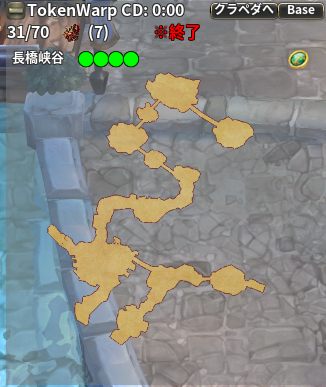
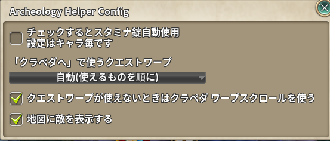

# Archeology Helper

> アーキオロジー用アドオン

| 項目 | 内容 |
| --- | --- |
| キー | `archeology_helper` |
| ソース | [archeology_helper.lua](archeology_helper.lua) |
| 設定画面 | あり（パネル左上の `＋`/`−` を右クリック） |

## 何をするアドオンか

アーキオロジー（考古学）の発掘は「遺物が**遠く／近く**にあるようです」という調査結果を頼りに探すため、
どこを調べたか分からなくなりがちです。素の全体マップにも調査の輪が出ますが、**直近 3 回ぶん**だけで、
マップを移ると消えます。

このアドオンは、調べた位置を**全体マップと同じ大きさの輪**でミニマップ上に記録し続け、
残りを絞り込めるようにします。あわせて**スタミナ錠の自動使用**と
**トークンワープでの対象マップ移動**も提供します。

## 使い方

ON にすると、画面上部に**対象マップのミニマップを並べたパネル**が出ます。
対象マップが 1 つの依頼（Lv530 以上の新しい依頼）では地図を大きく、3 つの依頼では 3 枚並べて出します。



| 要素 | 内容 |
| --- | --- |
| マップ名と `●●●●` | 発掘の進捗（緑が掘り終えた地点の数。新しい依頼は 4 地点） |
| ミニマップ | 調べた位置の輪。現在地は矢印、**今いるマップの敵は素のミニマップと同じ印**で表示。**行ったことのない所も含めたマップの全体図**を出す |
| 各マップ右上のトークンアイコン | クリックで**そのマップへトークンワープ**。使えないときは灰色 |
| `TokenWarp CD` | トークンワープの残りクールダウン |
| `n/70` | 依頼の試行回数と上限（上限は探査回数のオプションで増える） |
| アイテムアイコンと個数 | 依頼の受諾に使う**遺物探査許可証**の所持数。0 なら赤 |
| `※進行中` / `※終了` | 依頼の状態（全地点を掘ったか、試行回数を使い切ると終了） |
| `クラペダへ` ボタン | 依頼の NPC が居る**クラペダへ戻る**。トークンワープは使わない（下の「クラペダへ戻る」） |
| `Base` ボタン | パネルを既定位置（`670, 70`）に戻す |
| 左上の `＋` / `−` | 左クリックで**折りたたみ／展開**、右クリックで**設定** |

パネルはドラッグで移動でき、位置は保存されます。

### 輪の読み方

調べるたびに、調べた位置を中心に輪を描きます。輪の大きさは素の全体マップと同じで、
**遺物は輪の線の近くにある**、という読み方です。中央の番号は何回目の調査かを表します。

色はチャットに出る調査結果（「遺物は〇〇にあるようです」）の距離の段階で変わります。

| 調査結果 | 色 |
| --- | --- |
| はるか遠く | 赤 |
| かなり遠く | 濃い橙 |
| 遠く | 橙 |
| 少し遠く | 金 |
| 近く | 黄 |
| かなり近く | 水色 |
| すぐ近く | 白 |

調査結果は**チャットの文言ではなくゲームから届く座標と距離**で拾うので、言語に関係なく動きます。

### クラペダへ戻る

依頼を受けられるのはクラペダの NPC だけです。トークンワープは次の対象マップへ飛ぶのに取っておきたいので、
`クラペダへ` ボタンは**トークンワープを使わず**、次の順に試します。

1. **クエストワープ**（設定で選んだクエスト。既定は「自動」で、使えるものを上から順に）

   | クエスト | 使えるとき |
   | --- | --- |
   | `91055`（`TOSHERO_TUTO_01`） | 受注可能（開始 NPC へ飛ぶ） |
   | `72165`（`MASTER_QUARRELSHOOTER1`） | 完了可能（完了 NPC へ飛ぶ） |

2. **クラペダ ワープスクロール**（ClassID `640073`。設定で OFF にできる）
3. どれも使えなければ `トークン以外でクラペダへ戻る方法がありません` と表示します。

## 設定

パネル左上の `＋` / `−` を**右クリック**すると開きます。



| 項目 | 既定値 | 説明 |
| --- | --- | --- |
| チェックするとスタミナ錠自動使用（設定はキャラ毎） | OFF | スタミナが 1 以下になると**スタミナ錠（ClassID `640009`）を自動使用**する |
| 「クラペダへ」で使うクエストワープ | 自動 | 自動（使えるものを順に）/ 各クエスト / 使わない |
| クエストワープが使えないときはクラペダ ワープスクロールを使う | ON | OFF にするとスクロールを使わない |
| 地図に敵を表示する | ON | 今いる対象マップの地図に、視界内の敵を素のミニマップと同じ印で出す |

ON にしていると、街に入ったときにスタミナ錠が **10 個以下**なら
`スタミナ錠が残り少ないです` と通知します。

## しくみ

* 依頼の受諾（`ARCHEOLOGY_MISSION_ACCEPT_RESULT` が `SUCCESS`）で記録をリセットします。
* 調査結果は `ARCHE_SEARCH_RESULT` で受け取ります（素の全体マップが輪を描くのと同じメッセージ）。
  **調査の対象の地点が変わったら**、前の地点を探した輪は消します。
* `TARGETSPACE_PRECHECK` で発掘ポイント（`ActorType` `155003`）に触れたことを検出し、
  そのマップの発掘数を +1 して、マップの輪をクリアします。
* 対象マップすべてで全地点を掘ると `全てのMAPの発掘が完了しました` と表示し、記録をリセットします。
* 対象マップ・地点の数・試行回数の上限は、素の `shared_archeology` から引きます。
* 敵は `MON_MINIMAP` / `MON_MINIMAP_END` で受け取ります（素のミニマップと同じメッセージ）。0.5 秒ごとに位置を追い、居なくなった敵は消します。
* スタミナ自動使用は 2 秒間隔でチェックし、**使用は 10 秒に 1 回まで**に制限しています。
* 地図は霧の掛かっていない全体図を `world.PreloadMinimap` で読み込んで出します。読み込みが間に合わないときは、踏破した所だけの図を仮に出して、読み込めたら差し替えます。

## 保存先

`../addons/_nexus_addons_p/<アカウントID>/archeology_helper.json`

```json
{
  "count": 0,
  "is_archeology": false,
  "marker_ver": 2,
  "map_info": { "<マップ名>": { "get_count": 0, "target_key": "...",
    "markers": [ { "wx": 0, "wz": 0, "draw": 1500, "color": "FFFFA500", "count": 1 } ] } },
  "x": 670, "y": 70,
  "<CID>": { "sta_check": 0 }
}
```

輪はワールド座標で保存されるので、**ログアウトしてもマップを移っても探索の記録は残ります**。
2026-10 の刷新より前の形式の記録は読み込み時に捨てます。

## 注意

* 対象マップは**アカウント側のプロパティ**（`archeology_map_1`〜`3`）から取得します。
  依頼を受けていないと空のパネルになります。
* 発掘ポイントに触れると、そのマップの輪は**すべて消えます**（次の地点を探し直すため）。
* 本家 Nexus Addons など、同名の旧初期化関数（`ARCHEOLOGY_HELPER_ON_INIT`）を持つ
  アドオンが読み込まれている場合は、競合を避けるため初期化をスキップします。
