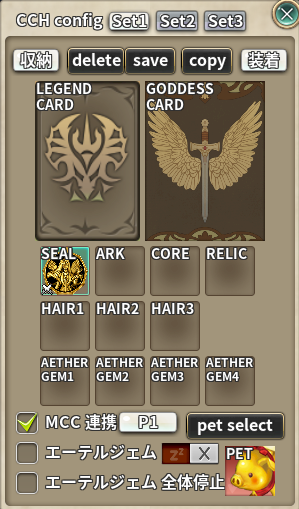

# Character Change Helper (CCH)

> 各種装備をインベントリのボタンで倉庫から出し入れして着脱をします

| 項目 | 内容 |
| --- | --- |
| キー | `cc_helper` |
| ソース | [cc_helper.lua](cc_helper.lua) |
| 設定画面 | あり（インベントリの歯車ボタン） |

## 何をするアドオンか

**キャラクターをまたいで使い回す装備**（ボルタエンブレム・アーク・カード・髪飾り・エーテルジェムなど）を、
キャラチェンジのたびに手で外して倉庫へ入れ、次のキャラで取り出して着け直す——
この往復をボタン 1 つで済ませます。

扱う枠は 14 種類です。

| キー | 内容 |
| --- | --- |
| `seal` / `ark` / `core` / `relic` | ボルタエンブレム / アーク / コア / レリック |
| `leg` / `god` | レジェンドカード / ゴッデスカード |
| `hair1` / `hair2` / `hair3` | 髪飾り 3 枠（オプションとランクも記録） |
| `gem1`〜`gem4` | エーテルジェム 4 個 |
| `pet` | ペット |

**セットは 1 キャラにつき 3 つ**（Set1〜Set3）持てます。

## 使い方

### 1. 何を持ち運ぶか登録する

1. 街でインベントリを開き、追加された**歯車ボタンを左クリック**して設定画面を開く。
2. 上部のタブで編集するセット（`Set1`〜`Set3`）を選ぶ。
3. **インベントリのアイテムを右クリック**すると、種類に応じた枠へ自動的に登録されます。
   （エーテルジェムは空いている枠へ順に入ります）
4. ペットは `pet select` ボタンから選びます。



### 2. 倉庫との出し入れ

**チーム倉庫を開く**と、倉庫ウィンドウ（とインベントリ）にボタンが 2 つ増えます。

![インベントリに増えた搬入・搬出の矢印ボタン。カーソルを乗せると「[CCH] 装備を外して倉庫へ搬入します」のツールチップが出る](images/02-buttons.png)

| ボタン | 動作 |
| --- | --- |
| **搬入（`in` 矢印）** | 装備をすべて外して**倉庫へ預ける** |
| **搬出（`out` 矢印）** | 倉庫から取り出して**装着する**。**右クリックでセットを選んでから実行** |
| チェックボックス | 動作が終わったら倉庫とインベントリを自動で閉じる |

設定画面の `収納` / `装着` ボタンからも同じ操作ができます
（倉庫を開いていないと `倉庫を開いてください` と出ます）。

### 3. 他のキャラへ設定をコピーする

| ボタン | 動作 |
| --- | --- |
| `save` | **今のセットをコピー元として保存**する |
| `copy` | 保存したコピー元を選んで、今のキャラへ適用する |
| `delete` | 保存したコピー元を消す |

コピー元は `<CID>_set<セット番号>` のキーで、**セット単位**で保存されます。

## 設定

| 項目 | 単位 | 説明 |
| --- | --- | --- |
| エコモード（歯車ボタンを右クリック） | 全体 | ON にすると**レジェンドカードの着脱を省略**して処理を短縮する。ON のときはボタンに赤い `eco` が出る |
| MCC 連携 | キャラごと | **Monster Card Changer** と連携し、モンスターカードの出し入れも一緒に行う（MCC が ON のときだけ表示） |
| カードプリセット（`P1` / `なし` ボタン） | **セットごと** | 搬出のときに**着け直すカードプリセット**を選ぶ。`なし` にすると従来どおり、カードプリセット画面が開くだけで着け直しは手動（MCC 連携が ON のときだけ表示） |
| エーテルジェム | キャラごと | エーテルジェムも着脱の対象にする |
| （エーテルジェムの ON/OFF トグル） | キャラごと | ON にすると、エーテルジェム着脱の前に確認ダイアログを出す |
| エーテルジェム 全体停止 | 全体 | **全キャラで**エーテルジェム関係の動作を止める |
| 倉庫の自動クローズ | 全体 | 動作終了後に倉庫とインベントリを閉じる |

## 処理の流れ（搬入）

1. モンスターカード画面を開き、**ゴッデスカードを外す**
2. ボルタエンブレム / アーク / コア / レリック / 髪飾り / ペットを外す
3. （エコモードが OFF なら）**レジェンドカードを外す**
4. 外したものを**倉庫へ預ける**
5. （エーテルジェムが ON なら）エーテルジェムを外して倉庫へ預ける
6. （MCC 連携が ON なら）モンスターカードの処理を実行
7. 終了

搬出はこの逆順です。各段階は 0.1〜0.2 秒間隔の更新スクリプトで進みます。

搬出の最後は MCC 連携の設定で分かれます。

| カードプリセットの指定 | 搬出したときの動き |
| --- | --- |
| `P1`〜`P10` | **そのプリセットの内容へカードを入れ替えるところまで自動で行う**（倉庫が開いていれば足りないカードは倉庫から取り出す） |
| `なし` | カードプリセット画面を開いて終わる。どれを着けるかは `EQUIP` を押して自分で選ぶ |

指定は**セットごと**なので、搬出ボタンの右クリックで `Set2` を選べば、Set2 に紐づけた
カードプリセットが着きます。MCC 側で保護した色のカードは、ここでも外れず上書きもされません。

## 保存先

`../addons/_nexus_addons_p/<アカウントID>/cc_helper.lua`

```lua
return {
  ver = 1.3,
  etc = { eco = 0, agm_stop = 0, wh_close = 0,
          copys = { ["<CID>_set1"] = { setnum = 1, items = { ... } } } },
  ["<CID>"] = {
    name = "...", agm = 0, agm_check = 0, mcc = 0, current = 1,
    sets = { [1] = { mcc_preset = 0,
                     items = { seal = { iesid = "", clsid = 0,
                                        option = "", rank = "", image = "" }, ... } },
             [2] = {...}, [3] = {...} },
  },
}
```

**JSON ではなく Lua 形式**で保存します。`cc_helper.json` や、旧 `cc_helper` アドオンの
`<アカウントID>_copy.json` があれば移行します。

## 注意

* **街（`City`）でしかボタンが出ません。**また、出し入れには**チーム倉庫を開いている必要**があります。
* **Another Warehouse が動作中は実行できません**（`[AWH]が作動中です` と表示されます）。
* 処理中はカード画面・倉庫・インベントリが自動で開閉します。途中で操作しないでください。
* 派生版では、装備セットプリセット（3 セット）の追加、セット構造が未初期化のキャラで
  セット切替がエラーになる不具合、コピー設定の移行時にキー衝突でデータを失う不具合を
  修正済みです（v1.0.0）。
