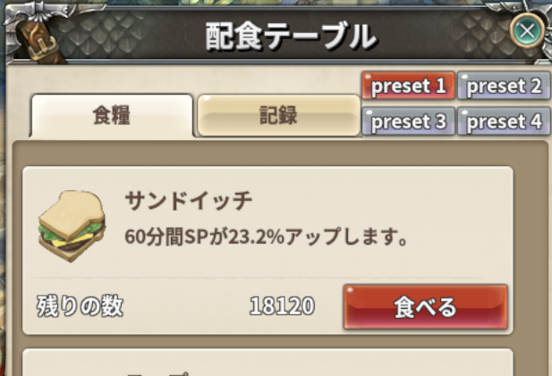

# Easy Buff

> 各種商店でバフ自動付与

| 項目 | 内容 |
| --- | --- |
| キー | `easy_buff` |
| ソース | [easy_buff.lua](easy_buff.lua) |
| 設定画面 | あり（アドオン一覧の歯車ボタン） |
| 原作者 | Kiicchan さん |

## 何をするアドオンか

**メシ屋・バフ屋・修理屋（スクワイア）**の店を開いたときの操作をまとめて自動化します。
店ごとに動きが違うので、以下で分けて説明します。

## メシ屋（食事バフ）

店を開くと、**4 つのプリセットボタン**が追加されます。選択中のプリセットは赤いボタンです。



* ボタンを押すと、**今かかっている食事バフを全部外してから**、
  そのプリセットでチェックした料理を順に食べます（0.6 秒間隔）。
* 設定でプリセットを 1 つ選んでおくと、**店を開いた時点で自動的にそれを実行**します。
  食べ終わると店のウィンドウは自動で閉じます。
  **どのプリセットを自動実行するかはキャラごとに選べます**（プリセットの名前と料理は全キャラ共通）。
  赤いボタンは、今のキャラで自動実行するプリセットです。

外す対象の食事バフ ID は `4021` / `4022` / `4023` / `4024` / `4087` / `4136` です。

料理は 6 種類（サンドイッチ・スープ・ヨーグルト・サラダ・BBQ・シャンパン）から選べます。

**ギルドメンバー限定の店**（共有設定の店）にギルド外から入った場合は、
`ギルドメンバーのみに食事提供のお店です` と表示してウィンドウを閉じます。

## バフ屋

店を開くと、対象のバフ（ID `358` / `359` / `360` / `370`）を**自動で 4 種類すべて購入**します。

* すでに全部かかっていて**残り時間が 60 分を超えている**場合は、
  * 「バフ掛け直し確認」が OFF → そのまま買い直す
  * ON → `バフをかけ直しますか？` と確認する
* 購入後、かかっていないバフがあれば**最大 3 回まで再購入**を試みます。
  それでも駄目なら `バフの購入に失敗しました` と表示します。
* 完了すると店のウィンドウを閉じます。
* 店の在庫が足りない場合は `お店のバフアイテムが足りません` と表示して何もしません。

## 修理屋（スクワイアの装備修理）

修理ウィンドウを開くと、**修理費が最も安い装備を 1 つだけ自動で選んで修理**します。

修理後、装備メンテナンスのバフ（`3127` 魔法 / `3128` 機敏 / `3129` 防御）が付いていれば
`<バフ名> バフを有効化` を通知とチャットに出します。

「修理屋フレームを自動で閉じます」が ON なら、そのままウィンドウとインベントリを閉じます。

## 装備メンテナンス（他人のスクワイア）

**他人**の装備メンテナンスウィンドウが開いたときだけ、

1. 設定で自動実行に選んだプリセット（**キャラごと**。既定は preset 1 = すべて）の部位にチェックを入れる
2. 実行ボタンを押す
3. `装備メンテナンス自動付与中 フレームを閉じればキャンセルします` と表示
4. 5.5 秒後にウィンドウを閉じる

を自動で行います。自分のスクワイアでは何もしません。

* 設定で自動実行のプリセットを**全部外したキャラ**（または選んだプリセットの部位が全部外れている）では、何も選ばず実行もしません。
* 選んだ部位がその店で 1 つもメンテナンスできない（武器のメンテナンスの店で防具だけを選んでいる等）ときは、
  `Easy Buff: 装備メンテナンスで選ぶ部位がこの店にありません` と表示して実行しません。
途中でウィンドウを閉じると `packet.StopTimeAction` でキャンセルされます。

## 設定

アドオン一覧（メニューボタン → アドオン一覧）の歯車ボタンから開きます。


| 項目 | 既定値 | 説明 |
| --- | --- | --- |
| メシ屋のプリセット名（4 つ） | `preset 1`〜`4` | **Enter キーで確定** |
| プリセットの選択チェック | プリセット 1 | チェックしたものが「店を開いたら自動実行」の対象。全部外すと自動実行しない。**キャラごとに覚える**（タイトルの右に今のキャラ名が出る） |
| 料理チェック（プリセットごとに 6 個） | すべて ON | そのプリセットで食べる料理 |
| バフ掛け直し確認（残り1時間以上） | OFF | ON にすると確認ダイアログを出す |
| 修理屋フレームを自動で閉じます | OFF | ON にすると修理後にウィンドウを閉じる |
| 装備メンテナンスのプリセット名（5 つ） | `preset 1`〜`5` | **Enter キーで確定** |
| 装備メンテナンスのプリセットの選択チェック | プリセット 1 | 他人の装備メンテナンスで自動実行するプリセット。全部外すと自動実行しない。**キャラごとに覚える** |
| 部位チェック（プリセットごとに 8 個） | すべて ON | そのプリセットで選ぶ部位（右手・左手・右手(サブ)・左手(サブ)・上着・下衣・手袋・靴） |

## 保存先

`../addons/_nexus_addons_p/<アカウントID>/easy_buff.json`

```json
{
  "food_presets_name":  { "1": "preset 1", ... },
  "food_presets_check": { "1": { "1": 1, "2": 1, "3": 1, "4": 1, "5": 1, "6": 1 }, ... },
  "food_check": 1,
  "char_food_check": { "<キャラの CID>": 3, ... },
  "confirm_check": 0,
  "repair_check": 0,
  "maint_presets_name":  { "1": "preset 1", ... },
  "maint_presets_check": { "1": { "RH": 1, "LH": 1, "SHIRT": 0, ... }, ... },
  "char_maint_preset": { "<キャラの CID>": 2, ... }
}
```

`char_food_check` がキャラごとの自動実行プリセットで、`0` は「自動実行なし」です。
まだ設定画面で選んでいないキャラは `food_check`（キャラごとの選択を入れる前の設定）に従います。

`char_maint_preset` がキャラごとの装備メンテナンスの自動実行プリセットで、`0` は「自動実行なし」、
無いキャラは `1` です。部位のキーは `RH` / `LH` / `RH_SUB` / `LH_SUB` / `SHIRT` / `PANTS` / `GLOVES` / `BOOTS`。

2.13.0〜2.15.0 の `char_maint_check`（キャラごとの部位）は、最初の読み込みでプリセットへ移して消します。
すべて選択のキャラは `1`、全部外したキャラは `0`、それ以外は同じ部位のプリセットを `2`〜`5` に作って割り当てます
（同じ部位のキャラは同じプリセットにまとめ、空きが尽きたら `1`）。

## 注意

* **自動実行は店を開いた最初の 1 回だけ**です。同じ店で続けて実行したいときは
  プリセットボタンを押してください。
* 食事バフは**いったん全部外してから**かけ直します。残り時間の長いバフも消えます。
* 本家 Nexus Addons など、同名の旧初期化関数（`EASYBUFF_ON_INIT`）を持つ
  アドオンが読み込まれている場合は、競合を避けるため初期化をスキップします。
