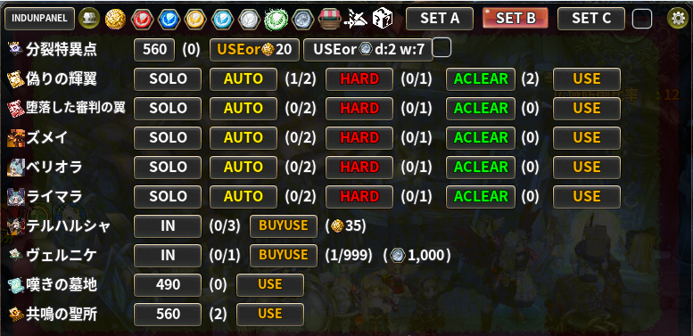
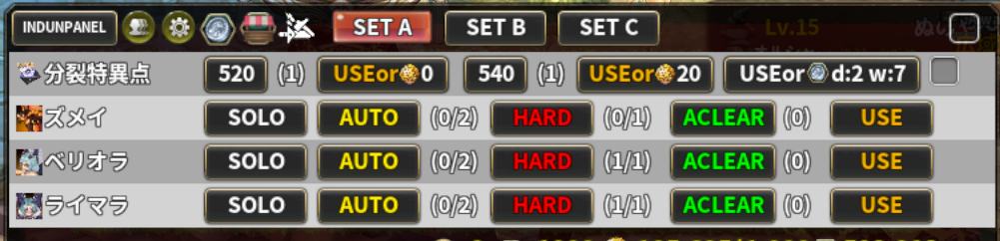

# Indun Panel

> チャレンジやレイドに入る支援パネルを表示します

| 項目 | 内容 |
| --- | --- |
| キー | `indun_panel` |
| ソース | [indun_panel.lua](indun_panel.lua) |
| 設定画面 | あり（パネルの歯車ボタン。**画面中央にポップアップで開きます**） |

## 何をするアドオンか

**その日に回るコンテンツへの入場を 1 枚のパネルにまとめた**アドオンです。
レイド・チャレンジ・分裂特異点・ボス協同戦などの入場ボタンに加えて、
各種ショップやマーケットへのショートカット、入場券の所持数、
チャレンジマップの日替わりスケジュールまで表示します。

## 使い方

ON にして街に入ると `INDUNPANEL` ボタンが出ます。

| 操作 | 動作 |
| --- | --- |
| **左クリック** | パネルを展開／折りたたむ |
| **右クリック** | **常時展開**にして開く（展開したまま固定） |
| ドラッグ | 移動（位置は保存されます） |

展開すると、選択中のセットで表示 ON にしたコンテンツが並びます。
各行にはアイコン・名前・入場回数・**入場券の所持数**が出て、
クリックでそのコンテンツへ入場できます。



### 共通ボタン

パネルの左側には常に次のボタンが並びます。

| ボタン | 左クリック | 右クリック |
| --- | --- | --- |
| バラックアイコン | **Indun List Viewer** を開く（無効なら Instant CC / 通常のバラック移動） | **Other Character Skill List** を開く |

展開すると、右端に次の 2 つが付きます。

| ボタン | 左クリック |
| --- | --- |
| チェックボックス | 常時展開の ON/OFF |
| 歯車 | 設定画面を開く |

歯車を**一番右**に置いているのは、畳んだ状態では歯車が出ないためです。共通ボタンと
ショートカットの間に挟むと、展開したときだけショートカットが 30px 右へずれます。

### ショートカットボタン

設定でチェックしたものが並びます。

| アイコン | 行き先 |
| --- | --- |
| `tos` | TOS イベントショップ |
| `gabija` / `vakarine` / `rada` / `jurate` / `austeja` / `saule` | 各女神ショップ（所持コイン数がツールチップに出ます）。サウレだけは**素にショップボタンの画像が無い**ため、コインの画像を使っています（素の `minimized_certificate_shop_button` はアウステヤの絵のままサウレの商店を開きます） |
| `pvp_mine` | 傭兵団ショップ |
| `market` | マーケット |
| `craft` | 装備加工 |
| `leticia` | レティーシャへ移動 |

### 表示セット（SET A / B / C）

**表示するコンテンツの組み合わせを 3 セット**持てます。
パネル上のセット名ボタンで切り替え、設定画面ではセット名を右クリックして改名できます。

「レイドの日」「チャレンジの日」など、曜日ごとに回るものを分けておく使い方を想定しています。



## 対応コンテンツ

| キー | 表示名 |
| --- | --- |
| `challenge` | チャレンジ（ソロ 520 / ソロ 540 / ソロ 560 + PT 560） |
| `singularity` | 分裂特異点（520 / 540 / 560） |
| `light_uriel` | 偽りの輝翼（ハードは未実装） |
| `dark_uriel` | 堕落した審判の翼（ハードは未実装） |
| `zmei` | ズメイ |
| `belliora` | ベリオラ |
| `laimara` | ライマラ |
| `ledania` | レダニア |
| `neringa` | ネリンガ |
| `golem` | ゴーレム |
| `merregina` | メレジナ |
| `slogutis` | スローガティス |
| `upinis` | ウピニス |
| `roze` | ロゼ |
| `falouros` | ファロウロス |
| `reservoir` | プロパゲーター |
| `jellyzele` | ジェリージェル |
| `delmore` | デルムーア |
| `giltine` | ギルティネ |
| `memory` | 焔の記憶 |
| `telharsha` | テルハルシャ |
| `bernice` | ヴェルニケ |
| `wailing` | 嘆きの墓地 |
| `zawra` | 共鳴の聖所（ザウラ） |
| `ashaq` | アシャーク |
| `jsr` | ボス協同戦 |

レイドは **ハード / ソロ / 自動** の 3 通りの入場に対応し、
掃討バフを持っている場合はその回数も表示します。
**ハードがまだ実装されていないレイド**（偽りの輝翼 / 堕落した審判の翼）では
HARD ボタンを出しません。実装されたら出るようにしてあります。

チャレンジと分裂特異点は **Lv 帯（段）ごとに横並び**です。Lv 上限が上がって段が増えると
そのぶんパネルが横に広がるので、**設定画面の「表示する段(Lv)」で使わない段だけを外せます**
（その行の段を全部外すと、行ごと消えます）。
Lv560 の入場券は TOS イベントショップと傭兵団ショップの両方で買えます
（傭兵団ショップの売り物は Lv560 用に差し替わっており、Lv540 用はもう買えません）。

入場券で入るパーティダンジョン（嘆きの墓地 / アシャーク / 共鳴の聖所）は、
Lv ボタンで入場ウィンドウを開き、`USE` ボタンで入場券を使います。
**共鳴の聖所だけは、ウィンドウを開くところで止めます**（入場は自分で押してください）。
ほかの 2 つはこれまでどおり、押すとウィンドウを開いた 0.3 秒後に入場まで進みます。

`ボス協同戦` を表示にしていると、サーバー時刻に応じて
ゲーム側のフィールドボスタブを自動で切り替えます（12:05 より前なら前半、以降は後半）。

### チャレンジマップのスケジュール

チャレンジの行にあるアイコンをクリックすると、**日替わりのチャレンジマップ一覧**が出ます。
基準日（初めて自動チャレンジマップに入った日）からの経過日数で計算しています。

## 設定

パネルの歯車ボタンから開きます。**パネルとは別のウィンドウ**として画面中央に出るので、
パネルを画面の端に置いていても設定は読みやすい位置に出ます。ESC でも × と同じように
閉じられます。

設定を変えると**その場でパネルを描き直します**（パネルは設定を開いている間も裏に出たまま
なので、変更がすぐ反映されます）。閉じても**展開／折りたたみの状態は変わりません**。

中身は 2 つのセクションに分かれています。

* **Indun Panel の設定** … 位置・セット・背景・ショートカット・表示まわり
* **レイド・コンテンツの表示 ON/OFF** … 行ごとの表示（＋チャレンジ / 分裂特異点の段）

| 項目 | 既定値 | 説明 |
| --- | --- | --- |
| `BASE POS` | — | パネルを既定位置（`665, 30`）に戻す |
| セット名ボタン | SET A/B/C | 左クリックで編集対象を切替、**右クリックで名前を変更** |
| `SKIN SELECT` | いつもの | 背景を `いつもの` / `黒` / `透明度高め` から選ぶ |
| ショートカットのチェック（10 個） | すべて ON | ショートカットボタンを出すかどうか |
| チェックすると英語表示に変更します | OFF | コンテンツ名を英語（内部キー）で表示する |
| チェックするとフレームを固定 | OFF | ドラッグ移動を禁止する |
| チェックするとフィールドで表示 | OFF | **街以外でもパネルを表示する** |
| チェックすると網掛け表示 | OFF | 入場できない行に網掛けをかける |
| 段のチェック（チャレンジ / 分裂特異点の行の右にある 520 / 540 / 560） | すべて ON | **その段のボタンを出すかどうか**。外した段は描かれないぶん、行が短くなります。**その行の段を全部外すと行ごと消えます**（見出しだけの空の行が残らないようにするため）。**その行そのものを非表示にしていると数字が灰色**になります（段を触っても何も出ないため）。段の設定はセットとは無関係で、SET A/B/C 共通です |
| コンテンツごとのチェック | すべて ON | 選択中のセットで表示するかどうか |

## 保存先

`../addons/_nexus_addons_p/<アカウントID>/indun_panel.json`

```json
{
  "etc": { "challenge_ticket": "month", "always_open": 0, "singularity_check": 0,
           "skin_name": "chat_window_2", "en_ver": 0, "x": 665, "y": 30, "move": 0,
           "use_set": "set_a", "challenge_map": 0, "base_date": "",
           "shading": 0, "field_mode": 0, "toscoin": 0 },
  "cols": { "tos": 1, "gabija": 1, ... },
  "set_names": [ { "set_a": "SET A" }, { "set_b": "SET B" }, { "set_c": "SET C" } ],
  "set_a": { "challenge": 1, "zmei": 1, ... }, "set_b": {...}, "set_c": {...},
  "tiers": { "challenge": { "lv520": 1, "lv540": 1, "lv560": 1 },
             "singularity": { "lv520": 1, "lv540": 1, "lv560": 1 } }
}
```

`tiers` のキーが `lv520` のように接頭辞付きなのは、**`"520"` のような数字だけの文字列を
JSON の object キーにすると、実装によっては配列と取り違えられる**ためです。

新しいダンジョンが追加されたときは、読み込み時に**既存の設定へ「表示 ON」で補完**します。
Lv 上限が上がって段が増えたときも同じで、増えた段は既定 ON で補われます。
初回のみ、旧 `indun_panel` アドオンの
`../addons/indun_panel/<アカウントID>/settings.json` から引き継ぎます。

## 注意

* 既定では**街（`City`）でしか表示されません。**フィールドでも出したい場合は
  「チェックするとフィールドで表示」を ON にしてください。
  インスタンスマップとヴェルニケ（`8022`）では常に非表示です。
* 入場回数の記録は **Indun List Viewer** と共有しています（そちらが OFF でも記録は行われます）。
* 派生版での主な修正:
  * 新レイド「ズメイ」対応（v1.0.0）
  * ログイン時に採掘場ショップが一瞬開いてインベントリが閉じる不具合を解消。
    PVP_MINE の購入可能数の同期を**パネル展開時の遅延同期**（セッション中 1 回）へ変更（v1.0.0）
  * **ドラッグで移動しても位置が初期位置に戻る不具合**を修正（v1.0.0）
