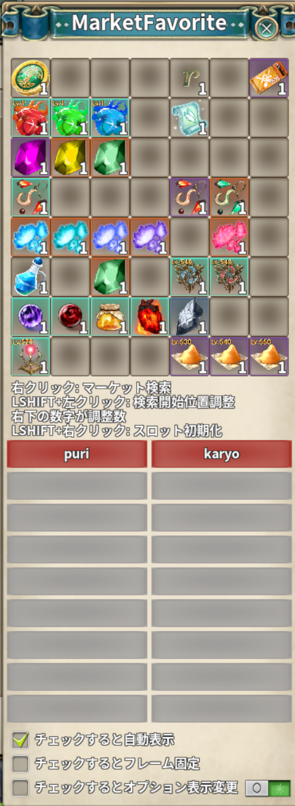
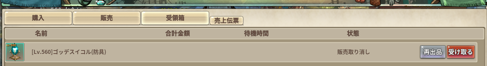

# Market Favorite Rebuild

> マーケットのお気に入り登録と検索条件の保存を追加し、オプション表示を見やすくする

| 項目 | 内容 |
| --- | --- |
| キー | `market_favorite_rebuild` |
| ソース | [market_favorite_rebuild.lua](market_favorite_rebuild.lua) |
| 設定画面 | なし（お気に入りウィンドウの中に設定項目があります） |

> **個別配布版を入れている場合はそちらが優先されます。**
> norisan さんが個別に配布している Market Favorite Rebuild を同梱したものです。
> 個別版が入っていると、アドオン一覧でこちらを ON にできません
> （二重に動いてマーケット画面を壊し合うため）。使い分けはどちらか一方だけにしてください。

## 使い方

ON にして**マーケット（取引所）を開く**と、画面内に **`お気に入り`** ボタンが追加されます。
押すとお気に入りウィンドウが開きます。

### お気に入り

* 登録枠は **56 スロット**です。
* 登録したアイテムはボタンとして並び、押すとそのアイテムの検索に移動します。

### 検索条件の保存

検索条件（カテゴリとオプションの組み合わせ）に名前を付けて保存できます。

| 操作 | 内容 |
| --- | --- |
| **左クリック** | 保存した条件を呼び出します |
| **右クリック** | 保存した条件を消します |

まだ何も入っていない枠は灰色で、`保存されたオプションはありません` と出ます。

### 受領箱の再出品

受領箱で **「販売取り消し」の行にだけ**、「受け取る」の左隣に **再出品** ボタンが出ます。
売れずに戻ってきたものを、出品したときと**同じ単価・個数・販売期間**を入れた状態にします。
単価を打ち直さずに済ませるためのものです。

**出品はしません。登録ボタンを押す手前で止まります。** 出し直す値段はそのときの最低価格を
見てから決めたいので、最後の判断は残してあります。

| 段 | 動き |
| --- | --- |
| 押したとき | まず受け取ります（素の「受け取る」と同じ）。銀貨は減らないので確認は挟みません |
| 届いたら | 販売タブへ切り替え、アイテムを登録枠へ入れて、**前と同じ単価・個数・販売期間**を入れます |
| その後 | 最低価格が画面に出るので、値段を見直してから自分で **登録** を押します |
| 届かなかったとき | 販売タブの入力はせず、その旨をシステムメッセージで伝えます（インベントリが一杯などの場合） |

登録枠へ入れるところは素の「インベントリのアイテムを左クリック」と同じ経路を通します。
最低価格の問い合わせもその中で走るので、値段を決める材料が画面に出ます。

出品したときの条件は `sell_items` の控えから取ります。**控えが無い出品には出ません**
（別のキャラから出した / この機能を入れる前に出した、など）。出なかった理由は
`verbose_log.txt` に残ります。

控えとの突き合わせは、まずアイテムの GUID で行います。**まとめ置きできるアイテム
（ポーションなど）は GUID が変わる**ため、束から切り出して出品したものは戻ってきた時点で
別の GUID になっています。その場合だけ、同じアイテム（`clsid`）の控えで代用します。
**同じアイテムの控えが 2 件以上あって値段が違うときは、どれか決められないのでボタンを
出しません**（黙って別の値段で出し直すほうが害が大きいため）。値段・個数・販売期間が
全部同じなら、どれを使っても結果が変わらないので出します。受け取った後も同じ理由で、
インベントリでは GUID → 同じアイテムの順に探します。

控えは、出品中のものと受領箱に並んでいるものは必ず残し、**行き先の分からないものは
新しいほうから 30 件**残します。**「今この瞬間の受領箱に居ない」だけで捨てません**。
取り消してから受領箱へ届くまでには間があり、その隙に受領箱の一覧が更新されると、
まだ届いていない控えを消してしまうためです（実機で踏みました）。

ボタンの隣に出るツールチップと、「受け取る」のツールチップには、登録日・販売期間・
販売単価・販売個数が出ます。**単価と個数は 3 桁ごとに区切って表示します**。

### ウィンドウ内の設定

| 項目 | 内容 |
| --- | --- |
| **チェックすると自動表示** | マーケットを開いたときに、お気に入りウィンドウも自動で開きます |
| **チェックするとフレーム固定** | ウィンドウをドラッグで動かせないようにします |
| **チェックするとオプション表示変更** | 検索結果のオプション表記を、読みやすい形へ差し替えます |
| **MAX 数値表示** | 上のオプション表示で、そのオプションの最大値を併記します |

## しくみ

* マーケット画面へのボタン追加（`Market_favorite_rebuild_attach_market_btn`）は、
  `OPEN_DLG_MARKET` だけでなく**初期化時と買／売モードの切り替え時にも**通します。
  初回ロードは全アドオンを分割実行するためこのアドオンは最後（実測で `GAME_START` の約 5 秒後）に
  初期化され、それより前にマーケットを開くと `OPEN_DLG_MARKET` を取り逃がすためです。
* 追加するコントロール名には接頭辞を付けています。個別版も同じ `market` フレームへ
  同名のボタンを足すので、素の名前のままだと互いのボタンを掴んで壊し合います。
* 出品中アイテムの控えは**キャラクター単位**（`sell_items[ログイン名]`）で持ちます。
* **オプションの最大値は素の `shared_item_goddess_icor.get_option_value_range_icor` から引きます。**
  レベル（`UseLv`）・部位（`StringArg2`）・上級/下級（`NumberArg1`）で決まる範囲を素が持っているので、
  こちらで表を抱えません。以前は Lv540 の最大値を書き写した表を持っていて、
  **Lv560 のイコルには％も最大値も色分けも付きませんでした**。突破の閾値も素と同じ
  `floor(最大値 × 1.5) - 1` で判定します。
* 名前の色分け（格下＝赤 / 上級＝オレンジ）は**アイテムの `UseLv`** で見ます。最上位の段は
  `core/00_header.lua` の `g.ICOR_TOP_LV` 1 箇所にあり、Lv 上限が上がったらそこだけ直します。

## 保存先

`../addons/_nexus_addons_p/<アカウントID>/market_favorite_rebuild.json`

お気に入り（`items`）・保存した検索条件（`searchs`）・ウィンドウの位置と表示設定・
出品中アイテムの控え（`sell_items`）が入ります。

> 個別版は `../addons/market_favorite_rebuild/<アカウントID>/settings.json` に置くため、
> **設定は共有されません**。

## 注意

* **お気に入りが空のままウィンドウを開いても、既存の登録は失われません。**
  設定の読み込みに失敗したときは既定値で始めますが、その状態では保存を止めます
  （空の内容で上書きして登録を失わないための歯止めです）。
  読み込みに失敗した場合は `verbose_log.txt` に記録されます。
