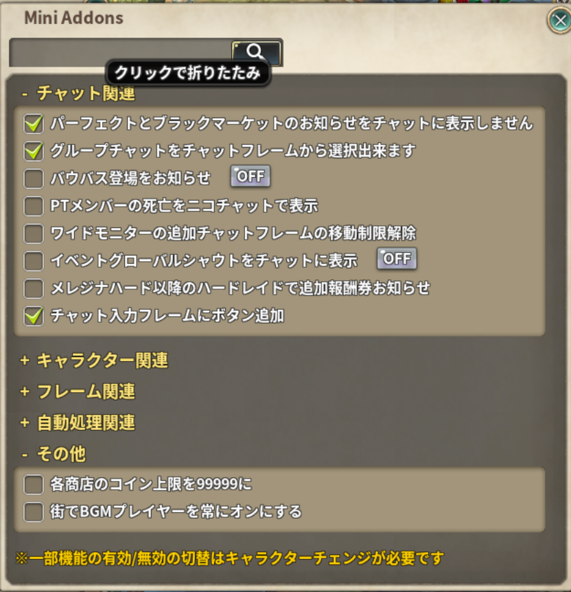

# Mini Addons

> 細かい便利機能の詰め合わせ。機能ごとに ON / OFF できる

| 項目 | 内容 |
| --- | --- |
| キー | `mini_addons` |
| 作者 | norisan（個別版を同梱したもの） |
| 設定画面 | **アドオン一覧の歯車ボタン**から開く（アドオン一覧の ON/OFF とは別） |
| 保存先 | `../addons/_nexus_addons_p/<アカウントID>/mini_addons.json`（バフ一覧は `mini_addons_buffs.lua`） |

設定画面は 1 枚のスクロールする一覧で、上部の検索窓で絞り込めます。
**セクションの見出しをクリックすると畳めます**（畳んだ状態は保存されます）。

## 機能の一覧

機能ごとにフォルダを分けてあります。名前をクリックすると、その機能の使い方としくみが開きます。

| フォルダ | 内容 |
| --- | --- |
| [settings/](settings/README.md) | 設定項目の定義・設定画面・設定ファイルの読み書き |
| [lifecycle/](lifecycle/README.md) | 起動とマップ移動のたびの初期化、フレームの更新スクリプト |
| [chat/](chat/README.md) | チャットフレームの改造・グループチャット・システムメッセージの間引き |
| [quest/](quest/README.md) | クエストリストの非表示・デイリークエストの別窓・トークンワープの残り時間 |
| [inventory/](inventory/README.md) | インベントリの改造・イコルステータス検索・コインの自動使用 |
| [weekly_boss/](weekly_boss/README.md) | 週間ボスのダメージ報酬・ビルドランキング・報酬の自動受け取り |
| [hair_enchant/](hair_enchant/README.md) | ヘアアクセサリーの魔法付与を、目標を決めて回せるようにする |
| [skill_reroll/](skill_reroll/README.md) | スキル錬成を、希望スキルが出るまで回せるようにする |
| [buff_list/](buff_list/README.md) | PT メンバーのバフを、バフごとに表示 / 非表示 |
| [party/](party/README.md) | PT 情報フレームのリサイズとメンバーの現在地 |
| [channel/](channel/README.md) | チャンネル切替フレームと表示のズレ修正 |
| [event_notice/](event_notice/README.md) | イベントシャウト・バウバス登場・追加報酬券のお知らせ |
| [context_menu/](context_menu/README.md) | 右クリックメニューへメンバーインフォなどを足す仕掛け |
| [sound/](sound/README.md) | BGM プレイヤー・ミュート切り替え・スキル連打音 |
| [misc/](misc/README.md) | 1 ファイルに収まる細かい機能（25 ファイル） |

## ファイルの構成

このアドオンは**大きな 1 本の Lua を機能ごとの断片へ分けた**ものです。
断片は bundle 生成時に**そのままの順で連結**されます。

| ファイル | 位置 | 内容 |
| --- | --- | --- |
| [mini_addons.lua](mini_addons.lua) | 先頭 | `do` の開始・版履歴・`local g` などの共有宣言・`g.*` ヘルパ |
| （各フォルダ） | 中ほど | 機能ごとの実装 |
| [footer.lua](footer.lua) | 末尾 | フレーム生成・`g.frame_suffixes`・teardown・`mini_addons_on_init`・`end` |

## 断片を足す / 動かすときの注意

* **並び順を決めるのは [build_manifest.json](../../build_manifest.json) だけ**です
  （ファイル名に数字は振っていません）。並びは
  [docs/tests/test_core.lua](../../../../docs/tests/test_core.lua) の `[25]` が固定しているので、
  意図して変えたときは一覧も一緒に直します。
* **トップレベルの `local` を、その利用側より後ろへ動かさないこと。** 参照がグローバル読み
  （= `nil`）に化けます。**エラーにならない**ので、動かすときは `local` と利用箇所を同じ断片に
  まとめ、実機で該当機能を通して `verbose_log.txt` を確認してください
  （CLAUDE.md「修正したら詳細ログを出して、実機のログで確認する」）。
* **トップレベルの `local` を増やしすぎないこと。** bundle 全体が 1 つのチャンクとして
  読まれるので、Lua(LuaJIT)の「1 つの関数につきローカル変数 200 個まで」に既に近い所に
  います。超えると `main function has more than 200 local variables` で**まとめ版ごと
  読み込めなくなる**（特定の機能だけが壊れるのではない）ので、機能ごとの内部関数は
  1 つのテーブルにまとめてください（例: [skill_reroll/core.lua](skill_reroll/core.lua) の
  `local skill_reroll = {}`）。
* **断片単体は構文として不完全**です（全体が `do ... end` で囲まれ、`g` などを断片間で共有する）。
  構文チェックは連結後の bundle に対して行います（`sh docs/tests/syntax_check.sh`）。
  エディタや luacheck は各断片で「未定義のグローバル `g`」と警告しますが、これは想定どおりです。
* 断片を足したら manifest への登録を忘れないこと。未登録の `.lua` は
  `python docs/bundle_from_src.py` が orphan として落とします。
* フォルダを足したら、そこにも README.md を置いてください（`[25]` が置き忘れを見ます）。

## 本家・個別版との関係

* 個別版（norisan さん作）を同梱したものです。グローバル関数は先頭大文字へ改名してあり、
  個別版と名前で衝突しません。詳細は
  [docs/INDIVIDUAL_ADDON_COEXIST_DESIGN.md](../../../../docs/INDIVIDUAL_ADDON_COEXIST_DESIGN.md)。
* アドオンメニューへの相乗り名 `_G["norisan"]["MENU"]` と `"norisan_menu_frame"` は
  **改名してはいけません**（norisan さんの他アドオンとの待ち合わせ名）。
