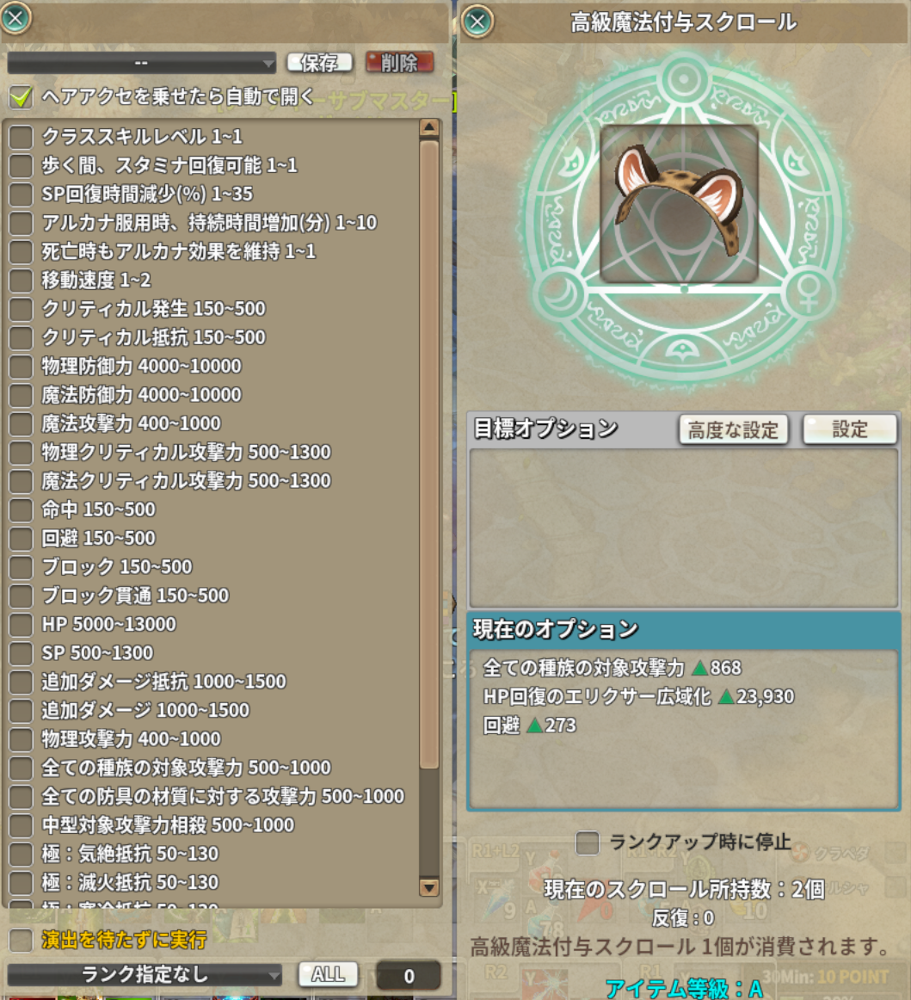

# ヘアエンチャント（hair_enchant）

> ヘアアクセサリーの魔法付与を、希望オプション・目標ランク・リピート回数を決めて回せるようにする

| 項目 | 内容 |
| --- | --- |
| 設定キー | `hair_enchant` / `hair_enchant_auto_open` / `hair_enchant_presets` |
| ソース | [core.lua](core.lua) / [window.lua](window.lua) / [run.lua](run.lua) |
| 設定画面 | 「フレーム関連」セクション（ON/OFF と自動で開くか） |
| 保存先 | プリセットは `mini_addons.json` の `hair_enchant_presets`（配列） |

## ファイル

| ファイル | 内容 |
| --- | --- |
| [core.lua](core.lua) | 定数（刻み・上限・監視の打ち切り）・前方宣言・素の窓との同期（案内文 / ボタンの見た目 / 「ランクアップ時に停止」の有効無効）・「高度な設定」ボタンの設置と開閉 |
| [window.lua](window.lua) | 自前の窓の中身を組む（希望オプションのチェック・目標ランク・リピート回数）とプリセットの保存 / 読込 / 削除 |
| [run.lua](run.lua) | 連続付与の実行。素の「마법 부여」ボタンを回している間だけ「停止」として働かせ、結果を見て次を撃つ |

## 使い方

1. 素の付与ウィンドウを開くと、「設定」の左隣に **「高度な設定」** ボタンが出ます（押すたびに開閉）。
   `hair_enchant_auto_open` が ON なら、ヘアアクセを乗せた時点で自動で開きます。
2. 希望オプションにチェックを入れ、必要なら**目標ランク**とリピート回数を決めます。
   `ALL` ボタンで手持ちの魔法付与スクロールの数を入れられます。
3. 素の付与ボタンで開始。回している間は同じボタンが「停止」になります。

プリセットはドロップリストから選ぶと**その場で読み込みます**（読込ボタンはありません）。

## しくみ

* 停止判定はアイテムの実データ（`obj["HatPropName_1..3"]`）を読むので、合図には
  `HIGH_HAIRENCHANT_SUCEECD` を使います（`SUCEECD_RESULT` は表示用の値を受けるだけで、
  実データの更新とは別のため、古い状態を見て当たりを潰す恐れがある）。
* 「演出を待たずに実行」が OFF のときは `_HIGH_HAIRENCHANT_SUCCESS`（HoldUI が解けた合図）で
  次を撃ちます。1 回あたり演出のぶん譲る代わりに、素の見た目を崩しません。
* 選べるオプションはランクで変わる（一部は B・A でしか出ない）ため、ランクが上がったら
  窓を組み直します。組み直しても**チェック・リピート回数・目標ランク**は引き継ぎます。
* `HAIR_ENCHANT_TICK`（0.1 秒）は「撃つ間隔」ではなく**結果が返ったかを見にいく間隔**です。
  実際に次を撃つのは素の結果が返ってからなので、空撃ちはしません。
* **前の結果が届いたかは「オプションの指紋」で見ます**（`FIRED_FP`）。撃つ前に
  `HatPropName_1..3` / `HatPropValue_1..3` を控え、それが変わるまで次へ進みません
  （「演出を待たずに実行」が ON のときだけ。OFF のときは HoldUI が解ける合図で足ります）。
* **停止判定は「振った結果」に対してだけ行います**（`ROLLED`）。停止判定はアイテムに
  今付いているものを読むので、1 発も撃っていない間に見ると**元から付いていたオプションを
  指して止まります**。回し始めの 1 回目と、「続けますか？」で「はい」を押した直後
  （既に 1 発撃った後に `OK_BTN` を通り直す）が該当し、実際に「1 回で止まる」形で報告されました。
  はい の経路は撃った指紋を `PENDING_FP` で `OK_BTN` へ渡します（呼び出しから戻った後に
  立て直す形だと、`RunUpdateScript` がその場で 1 回走ったときに間に合いません）。

## 注意

* **チェックのイベントで渡ってくる `ctrl` / `str` を当てにしないこと。** 押した行とは
  別の行のコントロールがイベントを受け取ることがあり（スキル錬成の一覧で実機のログから
  確認）、名前や引数から希望オプションを決めると**画面に入っているのに表には無い**
  チェックができます。こちらは件数を出す場所が無いので、
  **「希望オプションが出ても止まらない」**という一番分かりにくい形で出ます。
  `g.hair_enchant_sync_from_screen()` で一覧全体を画面から読み直し、
  チェックしたとき・回し始める前・保存する前に必ず通します。
  あわせて**行の送りを 25 → 32 へ広げました**（チェックボックスの高さは 22）。
* **`auto_run` は立てないこと。** 素が自前の連続処理を始めてしまい、二重に撃ちます。
  ボタンの表示と State が欲しいときだけ、素の関数を呼ぶ間だけ立ててすぐ戻します。
* **`SetColorTone` は使わないこと。** キャプションを持つコントロールでは元の見た目に戻せません。
  灰色にするときはキャプションを控えて色タグ付きの文字列と入れ替えます。
* 素の「ランクアップ時に停止」チェックは**素のフレームの持ち物**です。灰色にしたときは必ず戻すこと。
* プリセットの**オプションはクラス名で保存**します。画面のチェックの番号は並び順とランクに依存するため、
  番号で保存すると別のオプションを復元しかねません。
