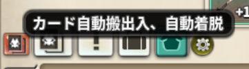
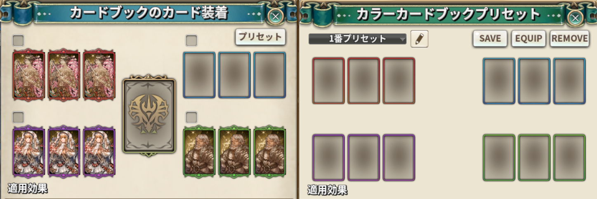

# Monster Card Changer

> モンスターカードプリセットを使いやすくします（カード自動着脱、自動搬出入）

| 項目 | 内容 |
| --- | --- |
| キー | `monster_card_changer` |
| ソース | [monster_card_changer.lua](monster_card_changer.lua) |
| 設定画面 | なし（カードプリセット画面を丸ごと差し替えます） |

## 何をするアドオンか

ゲーム標準のモンスターカードプリセットは 4 枠しかなく、装備するカードを
インベントリに持っていないと使えません。このアドオンは

1. プリセットを**アドオン側で 10 個持つ**（名前も付けられる）
2. **チーム倉庫を開いていれば、必要なカードを自動で出し入れする**

ことで、カードをインベントリに置きっぱなしにせずプリセットを切り替えられるようにします。

## 使い方

ON にして街に入ると、**インベントリに赤いカードボタン**が追加されます
（カードスロット画面の「適用」ボタンからも同じ画面が開きます）。



押すとカードプリセット画面が開き、ゲーム標準の UI が次のように差し替わります。
カードスロット画面の「プリセット」ボタンからも同じ画面を開け、**もう一度押すと
プリセット画面だけが閉じます**（カード装着の窓は開いたまま）。



| 追加ボタン | 動作 |
| --- | --- |
| ドロップリスト | 10 個のプリセットから 1 つ選ぶ |
| **`SAVE`** | **今装備しているカードを、選択中のプリセットに保存する**（確認あり） |
| **`EQUIP`** | **選択中のプリセットの内容に装備を切り替える** |
| **`REMOVE`** | 今装備しているカードをすべて外す |

プリセット名はゲーム標準の名前変更操作でそのまま変えられます。

### 倉庫を開いているとき

**チーム倉庫（`accountwarehouse`）を開いた状態**で実行すると、搬出入まで自動で行います。

| ボタン | 倉庫を開いているときの動作 |
| --- | --- |
| `EQUIP` | 足りないカードを**倉庫から取り出して**から装備する |
| `REMOVE` | 外したカードを**倉庫へ預ける** |

実行中は `[MCC]動作中。バグ防止の為他の動作は行わないでください` と通知が出ます。
終わると `[MCC]End of Operation` と表示され、画面が自動で閉じます。

### 色ごとの保護

カードスロット画面に、**赤・青・紫・緑**の 4 つのチェックボックスが追加されます。
チェックを入れた色のカードは `EQUIP` / `REMOVE` の対象から外れ、
**外されず、上書きもされずにそのまま残ります**。

チェックボックスには「保護」のラベルが付き、**チェックを入れるとラベルが黄色になり、
その色の 3 枠が灰色になります**。どの枠が守られているかが画面から分かるようにするためです。

この設定は**キャラクター（ログイン名）ごと**に保存されます。

## しくみ

* プリセットは 10 個 × 12 枠で、各枠に `{ card_id, card_exp, card_lv }` を持ちます。
* **12 枠は 3 枠ずつ赤・青・紫・緑に対応します**（1〜3 が赤、4〜6 が青、7〜9 が紫、10〜12 が緑）。
  素の `CARD_SLOT_GET_GROUP_NAME` と同じ並びです。
* 適用は、ゲーム側のプリセット枠 **0 番を作業用に借りて**アドオンの内容を流し込み
  （`SetCardPreset(0, ...)`）、`SCR_TX_APPLY_CARD_PRESET` を実行する形です。
  * **借りるのは `EQUIP` / `REMOVE` を押したときだけ**です。画面を開いたりプリセットを
    選び直しただけではサーバーへ書き込みません（`SetCardPreset` は素の `SAVE` ボタンと
    同じサーバー保存なので、開くたびに呼ぶとゲーム標準のプリセットを潰します）。
  * **書き込みの直後に適用を送ってはいけません。** `SetCardPreset` は送るだけで、
    サーバー側の保存が確定するまで時間がかかります（実機で 5 秒では足りないことが
    ありました）。確定前に適用が届くと、サーバーは古い作業用プリセットを適用します。
    空なら**1 枚も装備されません**。
  * 確定したかどうかは `RequestCardPreset` で問い合わせ直し、`GetCardPresetInfo` の
    中身が書いた内容と一致するかで見ます。`GetCardPresetInfo` が更新されるのは
    サーバーが `CARD_PRESET_LOAD` で返してきたときだけなので、これは**サーバー側の
    状態の確認**になっています。一致するまで 1.5 秒間隔で問い合わせ直し、
    15 秒で諦めます（**諦めたときは適用しません**）。
  * 適用したあとは、`GETMYCARD_INFO`（実際に装備しているカード）が意図した 12 枠に
    なるまで待ってから終わります。ここを待たないと、CC Helper 連携が倉庫と
    インベントリを先に閉じてしまいます。
* **`SCR_TX_APPLY_CARD_PRESET` は 12 枠を丸ごと差し替える命令**で、一部の枠だけ適用する
  手段は素にもありません。そのため色の保護は、**保護した色の枠に「今装備しているカード」を
  書き戻す**ことで成立させています。
### 着脱の費用（調査済み・繰り返さないこと）

**モンスターカード（赤・青・紫・緑）の着脱に費用はかかりません。** 費用がかかるのは
レジェンドカードだけです。

素のコードは紛らわしいので注意してください。**どちらも当てにしないこと。**

* `inventory.lua` / `monstercardslot.lua` の `SCR_TX_UNEQUIP_CARD_SLOT` に付いている
  `-- 1을 arg list로 넘기면 5tp 소모후 카드 레벨 하락 안함`（5TP 消費）というコメントは
  **古く、実際とは違います**
* `sharedconst.ies` の `CONSUME_SILVER_WHEN_UNEQUIP_MONSTER_CARD`（400）も、
  モンスターカードでは実際には請求されません

そのため「プリセット一括適用（通信 1 回）をやめて 1 枠ずつ着脱する」に変える理由は
**費用の面では存在しません**。1 回で済む通信が最大 24 回に増えるだけなので、
現行のプリセット方式のままにしています。

* カードは ClassID とレベルの両方が一致するものを先に押さえ、**余ったぶんは ClassID だけで**
  拾います（カードレベルの取得元が食い違っても 1 枚も拾えない、という止まり方をしないため）。
* 倉庫からの取り出しは `TakeItemFromWarehouse_List` で一括、
  預け入れは 0.2 秒間隔で 1 枚ずつです。どちらも**手元に届くまで待ちます**
  （最大 10 秒。届かなければ打ち切って通知します）。

## 保存先

`../addons/_nexus_addons_p/<アカウントID>/monster_card_changer.json`

```json
{
  "presets": [ { "name": "...", "slots": [ { "card_id": 0, "card_exp": 0, "card_lv": 0 }, ... ] } ],
  "<キャラ名>": { "red": 0, "blue": 0, "purple": 0, "green": 0 }
}
```

## 注意

* **街（`City`）でしか動きません。**
* 処理中に他の操作をすると失敗することがあります。通知が出ている間は待ってください。
* `SAVE` は**今装備しているカードを保存する**だけです。プリセットを手で組むことはできません。
* OFF にすると、差し替えたボタン類をすべて取り除いてゲーム標準の UI に戻します。
* **ゲーム標準のカードプリセット 1 番を作業用に使います。** `EQUIP` / `REMOVE` を押すと
  1 番の中身が書き換わるので、標準のプリセット 1 番は使わないでください
  （素には空き番号が無く、一括適用にはプリセットを 1 つ借りるしかありません）。
* 本家 Nexus Addons など、同名の旧初期化関数（`MONSTERCARD_CHANGE_ON_INIT`）を持つ
  アドオンが読み込まれている場合は、競合を避けるため初期化をスキップします。
