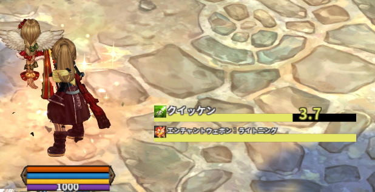
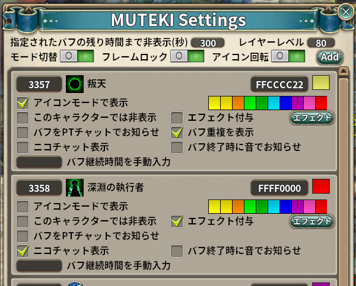
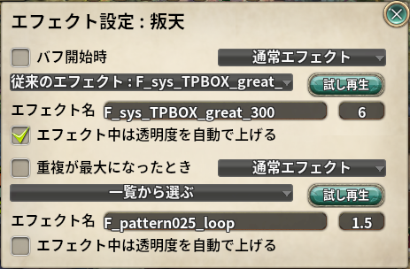

# Muteki

> バフ表示をわかりやすく

| 項目 | 内容 |
| --- | --- |
| キー | `muteki` |
| ソース | [muteki.lua](muteki.lua) |
| 設定画面 | あり（アドオン一覧の歯車ボタン） |
| 原作者 | writ312 さん |

## 何をするアドオンか

**「今どうしても切らしたくないバフ」だけを大きく表示する**アドオンです。
バフ欄のアイコンは小さくて残り数秒を見落としがちなので、
登録したバフだけを**残り時間ゲージ**または**大きな丸アイコン**で別枠に出します。

## 使い方

### バフを登録する

| 方法 | 手順 |
| --- | --- |
| バフ欄から | **画面左上のバフスロットを左クリック**すると `MUTEKIに<バフ名>を追加しますか？` と確認が出ます |
| 一覧から | 設定画面の右上にある **`Add`** ボタンでバフ一覧を開いて選ぶ（ボタンにカーソルを乗せると「バフ追加」と出ます） |
| ID から | 同じバフ一覧の**左上にある数字の入力欄**に ID を入れて **Enter**（入力欄にカーソルを乗せると「バフIDで直接追加」と出ます） |

**登録解除は、表示中のアイコンを右クリック**します。

### 表示のされ方

| 表示形式 | 内容 |
| --- | --- |
| **ゲージモード**（既定） | 横 250px のバーで残り時間を表示。左にバフ名とアイコン、右に残り秒数 |
| **アイコンモード** | 50×50 の丸いアイコン。中央に残り秒数（60 秒以上は `n min` 表記） |



* 残り **10 秒以下でオレンジ**、**5 秒以下で赤**になります（アイコンモード）。
* 表示順は**残り時間の短い順**に自動で並び替わります。
* 「重複を表示」を ON にすると**スタック数**が出ます。
  最大スタックに達するとエフェクトと効果音が鳴り、数字が赤くなります。
* 残り時間が取れないバフ（時間 0 かつスタックあり）は無期限として扱い、ゲージは満タンのままです。

### 表示のタイミング

**残り時間が「非表示にする秒数」以下になったときだけ**表示されます（既定 300 秒）。
かけ直した直後は出ず、切れそうになると現れる、という動きです。

## 設定

アドオン一覧（メニューボタン → アドオン一覧）の歯車ボタンから開きます。

### 全体の設定



| 項目 | 既定値 | 説明 |
| --- | --- | --- |
| 指定されたバフの残り時間まで非表示(秒) | `300` | この秒数以下になったら表示する |
| モード切替 | 固定モード | ON = **追従モード**（自キャラに追従。常にロック）、OFF = 固定モード |
| フレームロック | ロック | 解除するとドラッグで移動できる。ロック中は `Muteki` の小さいタイトルだけ表示 |
| レイヤーレベル | `80` | 重ね順 |
| アイコン回転 | OFF | アイコンモードの丸アイコンを回転させる |

### バフごとの設定

| 項目 | 説明 |
| --- | --- |
| アイコンモードで表示 | そのバフをゲージではなく丸アイコンで出す |
| 現在の色 | ゲージと文字の色。**先頭 2 文字が濃淡（`AA` 薄い〜`FF` 濃い）、続く 6 文字が RGB** |
| このキャラクターでは非表示 | **キャラごと**に、そのバフの表示を止める |
| バフを PT チャットでお知らせ | 開始時に `<バフ名> start`、終了時に `<バフ名> end` をパーティーチャットへ送る |
| ニコチャット表示 | 同じ内容を画面に流す |
| エフェクト付与 | 開始時にキャラへエフェクトを出す。**どのエフェクトを出すかは右の `エフェクト` ボタンで選びます**（下記） |
| バフ重複を表示 | スタック数を数字で出す |
| バフ終了時に音でお知らせ | 終了時に効果音を鳴らす |
| デバフ継続時間を入力 | **キャラごと**に、デバフの継続時間を秒で手動指定する |
| （自動取得トグル） | ON で継続時間を自動取得。うまく取れないデバフは OFF にして手動入力する |
| バフ継続時間を手動入力 | **キャラごと**に、魔法陣など時間を取得できないバフの継続時間を指定する |
| スキル ID | **バフとスキルを紐づける**。継続時間を入れてあれば、そのスキルを使った瞬間から計測を始める |

`スキル追加` ボタンでスキル一覧から選ぶこともできます。

### エフェクトを選ぶ

バフごとの設定にある **`エフェクト`** ボタンで開きます。



| 項目 | 説明 |
| --- | --- |
| バフ開始時（チェック） | バフが付いた瞬間に出すエフェクト。**チェックは設定画面の「エフェクト付与」と同じ設定**です |
| 重複が最大になったとき（チェック） | スタックが最大に達したときに出すエフェクト（**重複するバフにだけ出ます**）。**チェックを外すとエフェクトだけ止まり、効果音は鳴ります**（「重複が最大になった」こと自体の知らせなので） |
| 種類 | **通常エフェクト**（キャラに出す）か **UIエフェクト**（枠の上に描く）を選びます（下記）。下の一覧には**選んだ種類の候補だけ**が出ます |
| 一覧から選ぶ | よく使いそうなエフェクトの候補。選ぶとその場で 1 回再生され、大きさもその目安に変わります |
| エフェクト名 | 現在の設定。一覧に無いエフェクトは**ここへ名前を入れて Enter**。空にすると何も出しません |
| （右端の数字） | **エフェクトの大きさ**。通常エフェクトは `1.0` が素の大きさ、UIエフェクトは `12` 前後が目安。数字を入れて Enter で、その場で再生して確かめられます。**数字以外や範囲外（0 以下 / 通常は 30 超・UI は 100 超）を入れると、その種類の既定へ戻します** |
| 試し再生 | いまの設定のエフェクトをその場で出す。**チェックが OFF でも出ます**（見てから決められるように） |
| エフェクト中は透明度を自動で上げる | 通常エフェクトのときだけ出るチェック（下記） |

* エフェクト名はクライアントの内部名です（例: `F_pc_level_up`）。
  **クライアントに無い名前を入れても、エラーにはならず何も出ません**。試し再生で確かめてください。
* 一覧の表示名（「レベルアップ」など）は**素のゲームでそのエフェクトが使われている場面**で、
  見た目そのものの説明ではありません。
* **大きさはエフェクトごとに手加減が要ります。** 従来の既定（`6.0`）は素の 6 倍で、
  別のエフェクトに変えると大きすぎることがあります。
* 何も設定していないときの既定は**従来どおり**で、開始時が `F_sys_TPBOX_great_300`（大きさ `6.0`）、
  重複が最大のときが `F_pattern025_loop`（大きさ `1.5`）、種類は「通常エフェクト」です。
  UIエフェクト側の既定は `UI_success002`（大きさ `12`）です。

#### 種類（通常エフェクト / UIエフェクト）

| 種類 | 内容 |
| --- | --- |
| **通常エフェクト**（既定） | キャラに出します。**システム設定の「自分のエフェクト透明度」に従います**（薄くしていれば薄い）。大きさは `1.0` が素の大きさ |
| **UIエフェクト** | Muteki の枠の上に描きます。**透明度の設定を一切受けません**。ただしキャラの位置ではなく枠の上に出ます。大きさの目安は `12` 前後で、**約 2 秒で止めます** |

* **使えるエフェクト名が種類ごとにまったく別です**（通常は `F_*`、UI は `UI_*` / `I_*` / `SYS_*`）。
  片方の名前をもう片方で出しても何も出ないので、**一覧には選んだ種類の候補だけ**を出します。
* **名前と大きさは種類ごとに別々に憶えます。** 種類を切り替えて戻しても、
  それぞれで選んだ設定はそのまま残ります。

#### エフェクト中は透明度を自動で上げる（通常エフェクトのとき）

システム設定の **「自分のエフェクト透明度」** を下げていると、**Muteki のエフェクトも薄くなります**
（クライアントが自キャラに付いたエフェクトをまとめて薄くするため。Mini Addons の
「自分のエフェクト設定」で触っているのも同じ値です）。

このチェックを ON にすると、**エフェクトを出している間（約 1.5 秒）だけ透明度を最大へ戻し、
そのあと元の値に戻します**。

* **その間は自分の他のエフェクトも濃く見えます。** 他のエフェクトを薄くしたまま通知だけ見たいなら、
  種類を **UIエフェクト**にしてください。
* 戻す前にマップ移動やクライアント終了が起きても、**次の起動時に元の値へ戻します**
  （戻す値は設定 JSON に控えています）。

## しくみ

* `BUFF_ADD` / `BUFF_UPDATE` / `BUFF_REMOVE` を購読し、登録済みのバフだけを描画します。
* 表示の更新は 0.1 秒間隔です。残り時間が 0 になった時点で枠を破棄します。
* `ICON_USE` をフックしており、**スキルと紐づけたバフ**はスキル使用時に計測を開始します
  （バフが付いたことをクライアントが検知できないケースへの対処）。
* エフェクトは `effect.PlayActorEffect` で自キャラへ出します（`lifeTime` は 1.0 固定、
  `scale` は設定の大きさ）。素のこの関数は**解決できないエフェクト名を渡されても
  黙って何も出しません**（エラーにならないので、出ないときは名前を疑う）。
  既定の `F_sys_TPBOX_great_300` は muteki2ex 由来の名前です。
  出ないときはまず**エフェクト透明度**を疑い（上記のチェック）、次に名前を疑ってください。
* 「UIエフェクト」は `control:PlayUIEffect` で、専用のフレーム（`muteki_ui_effect`）の中へ描きます。
  バフのゲージが並ぶ枠は、出すバフが無い間は大きさ 0 なので描き先には使えません。
* **`PlayUIEffect` には「何秒で終わる」という指定がありません。** ループ指定のエフェクトは
  止めるまで出っぱなしになるので、出した 2 秒後に `StopUIEffect` で止めています
  （素も同じで、アドオンごとに決め打ちの秒数で止めています。
  例: `aether_gem_reinforce` の `SUCCESS_EFFECT_DURATION`）。
* 「キャラに出す(濃く)」は `config.GetMyEffectTransparency` で今の値を控えてから
  `config.SetMyEffectTransparency(255)` し、`lifeTime` + 0.5 秒後に戻します。
  **控えは `g` ではなく設定 JSON に置きます**（`g` はマップ移動で作り直されるため、
  上げた直後に移動すると戻す値を見失う）。
* **オーバーロード（バフ `4483` / `4757`）は特別扱い**で、バフが切れたあとの
  クールタイム 20 秒 → 50 秒を継続して表示します。マップ移動をまたいでも復元されます。
* フレームは ESC で消えない土台（`g.create_persistent_frame`）で作ります。

## 保存先

`../addons/_nexus_addons_p/<アカウントID>/muteki.json`

```json
{
  "etc": { "mode": "fixed", "layer_lv": 80, "hide_time": 300,
           "rotate": 0, "lock": 1, "x": 480, "y": 640,
           "transparency_backup": null },
  "buff_list": {
    "<バフID>": { "color": "FFCCCC22", "circle_icon": 0, "count_display": 0,
                  "pt_chat": 0, "nico_chat": 0, "effect_check": 0, "end_sound": 0,
                  "effect_mode": "actor", "effect_force": 0,
                  "effect_name": "F_sys_TPBOX_great_300", "effect_scale": 6.0,
                  "effect_ui_name": "UI_success002", "effect_ui_scale": 12,
                  "over_effect_check": 1, "over_effect_mode": "actor", "over_effect_force": 0,
                  "over_effect_name": "F_pattern025_loop", "over_effect_scale": 1.5,
                  "over_effect_ui_name": "UI_success002", "over_effect_ui_scale": 12,
                  "not_notify": { "<CID>": 0 },
                  "buffs":   { "<CID>": { ... } },
                  "debuffs": { "<CID>": { ... } } }
  }
}
```

初回のみ、旧 `muteki2ex` アドオンの `../addons/muteki2ex/settings_2510.json` から引き継ぎます
（このとき、`system_option` に記録のあるキャラのぶんだけを拾います）。

## 注意

* **追従モードではフレームを移動できません**（常にロックされます）。
* PT チャットへの通知は**実際にパーティーチャットへ発言します**。使う場所に注意してください。
* 「エフェクト中は透明度を自動で上げる」を ON にすると、**その 1.5 秒の間は自分の他のエフェクトも
  濃く見えます**。自分のエフェクトを薄くしたまま通知だけ見たいなら「UIエフェクト」を選んでください。
* 手動入力の継続時間は**スキルレベルなどで変わります**。キャラごとに調整が必要です。
* 本家 Nexus Addons など、同名の旧初期化関数（`MUTEKI2EX_ON_INIT`）を持つ
  アドオンが読み込まれている場合は、競合を避けるため初期化をスキップします。
* 派生版では、ESC キーで表示が消えてしまう不具合を修正済みです（v1.0.1）。
