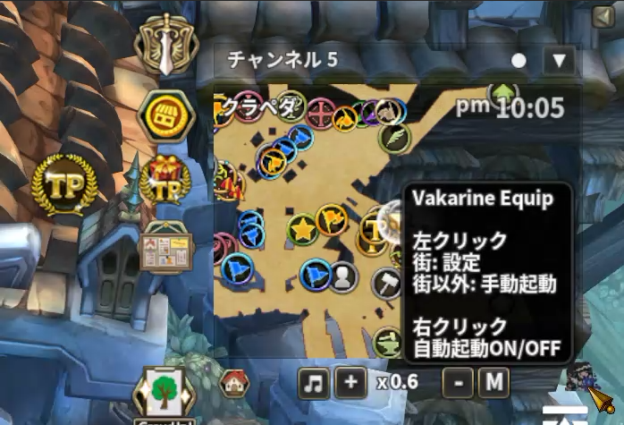
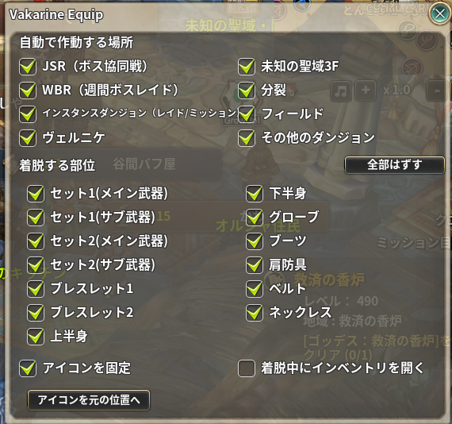

# Vakarine Equip

> ヴァカリネの恩恵を 5 箇所装着している場合、レイドなどで装備を脱着します

| 項目 | 内容 |
| --- | --- |
| キー | `vakarine_equip` |
| ソース | [vakarine_equip.lua](vakarine_equip.lua) |
| 設定画面 | あり（ボタンを街で左クリック、またはアドオン一覧の歯車ボタン） |

## 何をするアドオンか

**ヴァカリネの恩恵（`vakarine_bless`）**は 5 部位以上そろうと効果が変わるため、
場面によって「4 部位に落としたい／5 部位に戻したい」ことがあります。

このアドオンは、指定した装備部位を**いったん外して同じものを着け直す**ことで、
恩恵の判定をやり直します。あわせて HP 状態の表示と、指定バフの自動削除も行います。

## 使い方

ON にすると画面右上にヴァカリネのアイコンボタンが出ます。
**アイコンが白ければ自動起動 ON、灰色なら OFF** です。



| 場所 | 左クリック | 右クリック |
| --- | --- | --- |
| 街 | **設定画面を開く** | 自動起動の ON/OFF 切り替え |
| 街以外 | **手動で脱着を実行** | 自動起動の ON/OFF 切り替え |

右クリック時に **左 SHIFT を押しながら**にすると、バフ自動削除の設定リストが開きます。

ボタンはドラッグで移動でき、位置は保存されます（設定で固定も可）。

### 自動起動する条件

自動起動が ON のキャラで、次をすべて満たすと**マップに入った時点で自動実行**します。

1. ヴァカリネの恩恵が**5 部位以上**装着されている
2. **いま居る場所が、設定の「自動で作動する場所」でチェックされている**
3. 設定で**脱着する部位を 1 つ以上**チェックしている

手動実行（街以外での左クリック）は、場所の条件を無視して動きます
（部位を 1 つもチェックしていない場合は何もしません）。

### 場所の判定

**細かいものから順**に見て、最初に当たった 1 つの種別で決まります。ボス協同戦も
週間ボスレイドも `MapType` は `Instance` なので、先にキーワードで拾わないと
「インスタンスダンジョン」に飲み込まれて個別のチェックが効かなくなります。

| 順 | 種別 | 判定 | 既定 |
| --- | --- | --- | --- |
| 1 | ヴェルニケ | `map_id == 8022` | ON |
| 2 | 未知の聖域 3F | `map_id == 11244` | ON |
| 3 | 分裂 | `map_id == 11227` | OFF |
| 4 | JSR（ボス協同戦） | Keyword `FieldBossMap` | ON |
| 5 | WBR（週間ボスレイド） | Keyword `WeeklyBossMap` | ON |
| 6 | インスタンスダンジョン | `MapType == "Instance"` | ON |
| 7 | フィールド | `MapType == "Field"` | OFF |
| 8 | その他のダンジョン | `MapType == "Dungeon"` | OFF |

どれにも当たらない場所では自動起動しません（街もここに入ります）。

実機で確認した対応は次のとおりです。通常のレイドは `IsRaidField` で、
`FieldBossMap` も `WeeklyBossMap` も付かないため区別できます。

| マップ | map_id | MapType | Keyword |
| --- | --- | --- | --- |
| ボス協同戦 `field_d_cathedral_78_1` | 11219 | Instance | `FieldBossMap` |
| 週間ボスレイド `weekly_d_underfortress_68_1` | 11205 | Instance | `WeeklyBossMap` |
| ズメイ `Raid_Zmei` | 11291 | Instance | `IsRaidField;NoTrade;NoWarp;HealControl` |
| ヴェルニケ `d_solo_dungeon` | 8022 | **Dungeon** | `solo_dungeon` |
| フィールド `ep13_f_siauliai_1` | 11209 | Field | `None` |

ヴェルニケと未知の聖域 3F は `MapType` が `Dungeon` でキーワードからは辿れないため、
マップ ID で持っています。

### 脱着の順番

1. サブ武器（`RH_SUB`）を先に外す
2. 設定でチェックした部位を**すべて外す**
3. **武器（`RH` → `LH` → `RH_SUB` → `LH_SUB`）**を着け直す
4. 武器と首飾り以外の防具・装飾を着け直す
5. **最後に首飾り**を着ける。このとき、インベントリに
   **アニマス（`NECK04_103`）があればそちらを優先して装着**する

終わると `[VE]End of Operation` が通知に出ます。
実行中は UI がロックされ（最大 10 秒で自動解除）、インベントリが自動で開閉します。

### HP 状態の表示

自分の HP バーの上に、状態と HP 割合が表示されます。

| 表示 | 条件 |
| --- | --- |
| 緑 `Perfect` | HP 100% |
| 赤 `Revenge` | 恩恵 5 部位なら **HP 45% 以下**、そうでなければ **35% 以下** |

## 設定

街でボタンを左クリック（またはアドオン一覧の歯車ボタン）で開きます。



| 項目 | 既定値 | 説明 |
| --- | --- | --- |
| 自動で作動する場所（8 個） | 上の表のとおり | **チェックした場所でだけ**自動起動する |
| 各装備部位のチェック（13 個） | すべて OFF | **脱着する部位**。`RH_SUB` と `LH_SUB` は連動して切り替わる |
| チェックするとフレーム固定 | ON | ボタンのドラッグ移動を禁止する |
| 着脱中にインベントリを開く | OFF | 着脱そのものには**必要ありません**。持ち物が多いほど、開く分だけ着脱の開始が遅くなります |
| フレーム初期位置 | — | ボタンの保存位置を破棄する |

装備部位の設定は**キャラクター（CID）ごと**、それ以外はアカウント共通です。

### バフ自動削除リスト（ボタン右クリック + 左 SHIFT）

バフ一覧が開き、チェックしたバフを**付いた瞬間に自動で解除**します。
右上のチェックボックスで機能全体の ON/OFF を切り替えます（既定は OFF）。

削除が働くのは**ヴァカリネの恩恵が 5 部位そろっているとき**だけです。

## 保存先

`../addons/_nexus_addons_p/<アカウントID>/vakarine_equip.json`

```json
{
  "buffid": { "<バフID>": true },
  "delay": 0.1,
  "maps": { "jsr": 1, "wbr": 1, "instance": 1, "velnike": 1,
            "sanctuary": 1, "split": 0, "field": 0, "dungeon": 0 },
  "x": 0, "y": 0, "move": 1,
  "auto_remove": 0,
  "open_inventory": 0,
  "chars": { "<CID>": { "use": 0, "RH": 0, "LH": 0, "RH_SUB": 0, "LH_SUB": 0,
                        "RING1": 0, "RING2": 0, "SHIRT": 0, "PANTS": 0,
                        "GLOVES": 0, "BOOTS": 0, "SHOULDER": 0, "BELT": 0, "NECK": 0 } }
}
```

`delay` は**装備を着け直す間隔**（秒）で、設定画面からは変更できません。
外れたかどうかの確認はこれとは別に細かく行うので、`delay` を伸ばしても
「脱ぐ」側が遅くなることはありません。

`open_inventory` は着脱中にインベントリを開くかどうか（既定 0 = 開かない）。

## 注意

* **脱着中に他の操作をすると失敗します。**UI ロックが掛かっている間は待ってください。
* 脱着対象は「今装備しているものを同じ枠へ戻す」処理です。別の装備に持ち替える機能ではありません。
* アニマスを持っている場合、首飾りは**アニマスに置き換わります**（元の首飾りには戻りません）。
* バフの自動削除はサーバーへ解除要求を送ります。使いどころを誤ると自分の不利になります。
